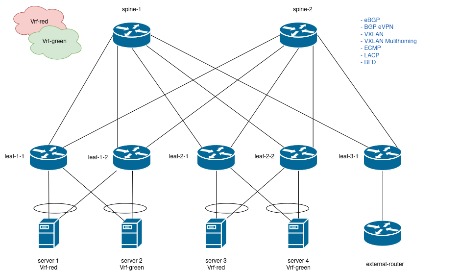
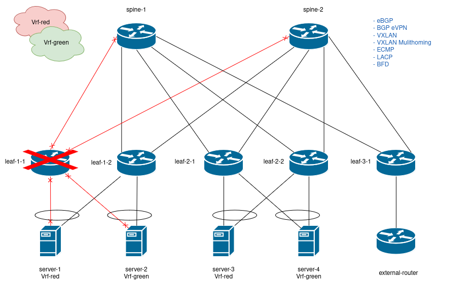
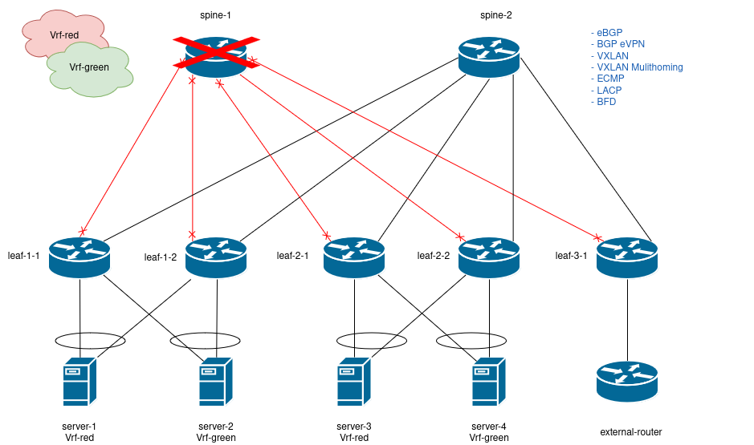
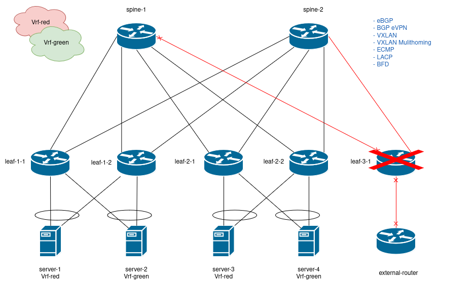
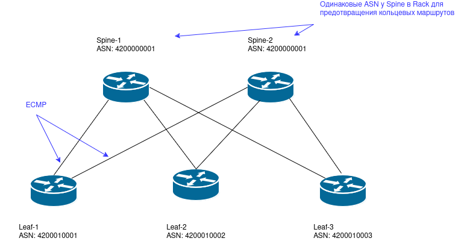
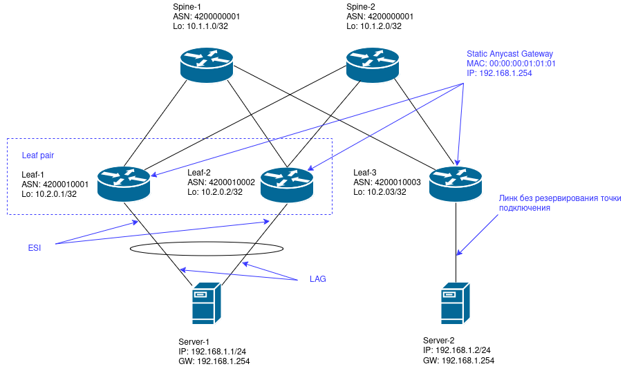
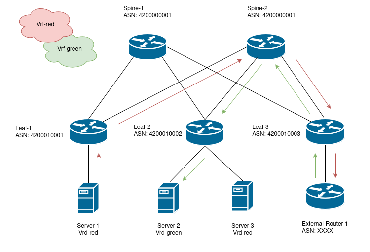

# Курсовая работа

## Проектирование сетевой фабрики на основне VXLAN EVPN

[Презентация](presentation.odp)

### Цели проекта:

Необходимо обеспечить:

- L2/L3 связанность между серверами в разных стойках датацентра;
- Обеспечить возможность добавления новых стоек с серверами;
- Возможность дианамической миграции виртуальных машин;
- Отказоусточивость, отказ одного из устройств не приводит к полной потере связи;
- Изоляцию сетей клиентов;

### Что планировалось:

- До начала курса были не систематизированные знания о VXLAN;
- Курс позволил систематизировать знания;
- Время выполнения проекта составило 8 часов;

### Используемые технологии:

- eBGP - для обмена маршрутной информацией в underlay сети;
- BGP EVPN - для обмена маршрутной информацией в overlay;
- VXLAN - для обеспечения сетевой связанности в overlay;
- VXLAN Multihoming - для резервирования в точках подключения клиентов;
- ECMP - для балансировки нагрузки между линками leaf и spine;
- LACP - для подключения клиентов;
- BFD - для раннего обнаружения потери связности между маршрутизаторами;

### Что получилось:



Конфигурации устройств:

[leaf-1-1](config/leaf-1-1.conf)

[leaf-1-2](config/leaf-1-2.conf)

[leaf-2-1](config/leaf-2-1.conf)

[leaf-2-2](config/leaf-2-2.conf)

[leaf-3-1](config/leaf-3-1.conf)

[spine-1](config/spine-1.conf)

[spine-2](config/spine-2.conf)

[external-router](config/external-router.conf)

#### Проверка отказоустойчивости

##### Отказ одного из leaf



Отказ одного из leaf приводит к:

- Удалению одного из линков в агрегации;
- Деградации скорости подключения;
- Полной потери связи не происходит;

##### Отказ одного из spine



Отказ одного из spine приводит к:

- Деградации скорости подключения;
- Полной потери связи не происходит;

##### Отказ border leaf



При отказе border leaf происходит потеря связи с внешними ресурсами. Для парирования такого рода ошибок требуется добавить еще один border leaf с независимым внешним подключением (конифгурации для border leaf будут аналогичными).

### Архитектура:

#### Обмен маршрутной информацией в underlay сети

В технологии VXLAN EVPN требуется обеспечить BGP связанность между устройствами для обмена EVPN маршрутами в overlay. Поэтому логично будет использовать технологию BGP для построения как overlay так и underlay сети.

##### iBGP технология:

- Подразумевает поддержание связанности между всеми устройствами в POD;
- При добавлении нового устройства, необходимо добавить его в BGP конфигурацию leaf и spine в POD;
- Высокая утилизация программных ресурсов для поддержания полной связанности;

##### iBGP технология с Router Reflector:

- Leaf поднимают iBGP соседство только со Spine;
- Высокая утилизация программных ресурсов Spine (в случае использования spine как Router Reflector);
- Появление еще одного типа устройства в POD (в случае использования сервервов как Router Reflector);

##### eBGP технология:



- Подразумевает связанность leaf только со spine-ами;
- При добавлении нового leaf, требуется добавить его только в BGP конфигурацию spine-ов;
- Требуется аллокация ASN из private диапазона;
- Возможность образования кольцевых маршрутов;

С учетом всех плюсов и минусов была выбрана технология eBGP. Номера автономных систем назначаются из private диапазона 4200000000..4294967294

Для обеспечения балансировки нагрузки на линки между leaf и spine была включена технология ECMP;

##### Предотвращение образования кольцевых маршрутов

Существует два способа предотвращения образования кольцевых маршрутов:

- Фильтрация маршрутов с помощью правил BGP;
- Аллокация одного ASN для всех spine;

Был выбран второй вариант для простоты конфигурации.

###### Пример конфигурации leaf:

```
router bgp <leaf ASN>
  router-id <leaf loopback address>
  maximum-paths 128
  neighbor SPINE peer group
  neighbor SPINE send-community extended
  neighbor <spine address> peer group SPINE
  neighbor <spine address> remote-as <spine ASN>
  redistribute connected
  address-family evpn
    neighbor <spine address> activate
```

`leaf ASN` - номер автономной системы локального leaf;
`leaf loopback address` - адрес loopback интерфейса leaf;
`spine address` - адрес интерфейса удаленного spine;
`spine ASN` - номер автономной системы удаленного leaf;

###### Пример конфигурации spine:

```
router bgp <spine ASN>
  router-id <spine loopback address>
  maximum-paths 128
  neighbor LEAF peer group
  neighbor LEAF send-community extended
  neighbor <leaf address> peer group LEAF
  neighbor <leaf address> remote-as <leaf ASN>
  address-family evpn
    neighbor <leaf address> activate
```

`leaf ASN` - номер автономной системы локального leaf;
`leaf loopback address` - адрес loopback интерфейса leaf;
`spine address` - адрес интерфейса удаленного spine;
`spine ASN` - номер автономной системы удаленного leaf;

#### Обеспечение отказоустойчивости

- Включение BFD на линках между leaf и spine с тайминагами 100 ms (keepalive) / 300 ms (hold);
- Установка BGP таймеров в значения 3 sec (keepalive) / 9 sec (hold);
- Установка LACP в 1 секунду (short timeout);

Было принятно решение отказаться от Micro BFD на LACP линках в сторону клиентов, так как не все сервера поддерживают BFD аппаратно, а программная реалзация будет потреблять ресурсы самого сервера.

С учетом всех таймеров, отказ одного из устройств или линков может быть обнаружен за 12 секунд:

- 3 секунды на обнаружения сбоя в агрегации LACP;
- 9 секунд для начала перестроения маршрутов в eBGP;

Пример конфигурации:

```
interface Ethernet1
   ...
   bfd interval 100 min-rx 100 multiplier 3
interface Port-Channel 1
   ...
   lacp rate fast
router bgp <ASN>
   ...
   timers bgp 3 9
```

#### Overlay



В overlay использована технология EVPN:

- В качества адреса VTEP используется Loopback;
- Каждый клиент находится в своей VRF;
- Используется технология Static Anycast Gateway (SAG) для миграции виртуалных машин между стойками;
- Для обеспечения отказоустойчивости точки подключения используется VXLAN Multihoming

##### Router Distingisher (RD)

В качестве RD используется адрес loopback leaf + VNI:

```
<leaf loopback>:<VNI>
```

Например:

```
vrf instance Vrf-red
ip routing
ip routing vrf Vrf-red
...
interface Loopback1
   ip address 1.1.1.1/32
interface Vxlan1
   vxlan source-interface Loopback1
   vxlan vrf Vrf-red vni 10000
...
router bgp 4200010001
  router-id 1.1.1.1
  vrf Vrf-red
    rd 1.1.1.1:10000
```

##### Route Target (RT)

В качестве RD используется ASN + VNI:

```
<ASN>:<VNI>
```

Например:

```
vrf instance Vrf-red
ip routing
ip routing vrf Vrf-red
...
interface Loopback1
   ip address 1.1.1.1/32
interface Vxlan1
   vxlan source-interface Loopback1
   vxlan vrf Vrf-red vni 10000
...
router bgp 4200010001
  router-id 1.1.1.1
  vrf Vrf-red
    address-family ipv4
       route-target import evpn 4200010002:10000
       route-target export evpn 4200010001:10000
```

##### Static Anycast Gateway (SAG)

Технология Static Anycast Gateway (SAG) используется для миграции виртуалных машин между стойками. Адрес SAG интерфейса должен:

- Находится в подсети overlay сети;
- Прописан в как маршрут по умолчанию на виртуальных машинах;
- MAC адрес SAG интерфейса должен быть уникальным;

Пример конфигурации SAG:

```
vlan 10
exit
ip virtual-router mac-address 00:00:00:01:01:01
...
interface Ethernet1
   description to-client-1
   switchport access vlan 10
...
interface Vlan10
   vrf Vrf-red
   ip address virtual 192.168.1.254/24
exit
```

`00:00:00:01:01:01` - MAC адрес виртуального SAG интерфейса, должен быть одинаковым на всех leaf;
`192.168.1.254/24` - IP адрес виртуального SAG интерфейса, должен быть одинаковым на всех leaf;

##### VXLAN Multihoming

Устройство leaf может стать точкой отказа в случае выхода из строя leaf. Для обеспечении отказоустойчивости leaf объединяется в leaf пару, а клиент подключается двумя линками к каждому из leaf. Технология VXLAN Multihoming позволяет объединить в ESI больше одного устройства, однако не все производители поддерживают больше двух устройств в данной конфигурации. Чтобы избежать проблем с оборудованием ограничимся двумя устройствами в ESI.

Пример конфигурации VXLAN Multihoming (конфигурации для каждого leaf из пары будут симметричны):

```
vlan 10
exit
interface Port-Channel 1
  description to-client-1-1
  evpn ethernet-segment
    identifier 0000:0000:5014:0007:0000
    route-target import 50:14:00:07:00:00
  exit
  lacp system-id 000.000.011
  switchport access vlan 10
exit
interface Port-Channel 2
  description to-client-2-1
  evpn ethernet-segment
    identifier 0000:0000:5014:0008:0000
    route-target import 50:14:00:08:00:00
  exit
  lacp system-id 000.000.012
  switchport access vlan 10
exit

interface Ethernet 5
  description to-client-1-1
  channel-group 1 mode active
exit
interface Ethernet 6
  description to-client-1-2
  channel-group 1 mode active
exit
```

##### Подключение внешнего маршрутизатора



- Связь с внешними ресурсами осуществляется через external-router;
- Маршруты /32 не анонсируются внешнему external-router;

Пример конфигурации:

```
ip routing
ip routing vrf Vrf-green
ip routing vrf Vrf-red
!
ip prefix-list VXLAN-TO-EXT seq 10 permit 0.0.0.0/0 le 31
!
route-map PERMIT permit 10
!
route-map VXLAN-TO-EXT-MAP permit 10
   match ip address prefix-list VXLAN-TO-EXT
!
router bgp 4200010005
   router-id 10.2.0.5
   timers bgp 3 9
   maximum-paths 128
   neighbor SPINE peer group
   neighbor SPINE bfd
   neighbor SPINE send-community extended
   neighbor SPINE maximum-routes 12000
   neighbor 10.4.1.8 peer group SPINE
   neighbor 10.4.1.8 remote-as 4200000001
   neighbor 10.4.2.8 peer group SPINE
   neighbor 10.4.2.8 remote-as 4200000002
   redistribute connected
   !
   address-family evpn
      neighbor 10.4.1.8 activate
      neighbor 10.4.2.8 activate
   !
   vrf Vrf-green
      rd 10.2.0.3:20000
      neighbor 10.4.3.3 remote-as 4200020001
      neighbor 10.4.3.3 route-map VXLAN-TO-EXT-MAP out
      neighbor 10.4.3.3 maximum-routes 12000
      redistribute connected
      !
      address-family ipv4
         route-target import evpn 4200010001:20000
         route-target import evpn 4200010002:20000
         route-target import evpn 4200010003:20000
         route-target import evpn 4200010004:20000
         route-target export evpn 4200010005:20000
         neighbor 10.4.3.3 activate
   !
   vrf Vrf-red
      rd 10.2.0.3:10000
      neighbor 10.4.3.1 remote-as 4200020001
      neighbor 10.4.3.1 route-map VXLAN-TO-EXT-MAP out
      neighbor 10.4.3.1 maximum-routes 12000
      redistribute connected
      !
      address-family ipv4
         route-target import evpn 4200010001:10000
         route-target import evpn 4200010002:10000
         route-target import evpn 4200010003:10000
         route-target import evpn 4200010004:10000
         route-target export evpn 4200010005:10000
         neighbor 10.4.3.1 activate
```

### Выводы

Технология VXLAN EVPN позволяет строить виртуальные overlay сети поверх L3 сетей и обеспечивает:

- L2/L3 связанность между серверами в разных стойках датацентра;
- Возможность добавления новых стоек с серверами;
- Возможность дианамической миграции виртуальных машин;
- Отказоусточивость, отказ одного из устройств не приводит к полной потере связи;
- Изоляцию сетей клиентов;
