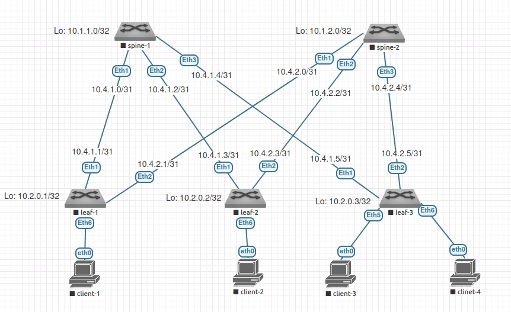

# Домашнее задание №1

## Проектирование адресного пространства

### Задачи:

- Соберете топологию CLOS, как на схеме:


- Распределите адресное пространство для Underlay сети
- План работы, адресное пространство, схема сети, настройки - зафиксированы в документации
- Документация оформлена на github в файле Readme.md(markdown). Каждая лабораторная работа находится в своей директории.

## Выполнение:

### Собранная схема сети



### Таблица адресов

| hostname | interface |   IP/MASK    | Description |
| :------: | :-------: | :----------: | :---------: |
|  leaf-1  | Loopback2 | 10.2.0.1/32  |             |
|  leaf-1  |  Eth1     | 10.4.1.1/31  | to-spine-1  |
|  leaf-1  |  Eth2     | 10.4.2.1/31  | to-spine-2  |
|          |           |              |             |
|  leaf-2  | Loopback2 | 10.2.0.2/32  |             |
|  leaf-2  |  Eth1     | 10.4.1.3/31  | to-spine-1  |
|  leaf-2  |  Eth2     | 10.4.2.3/31  | to-spine-2  |
|          |           |              |             |
|  leaf-3  | Loopback2 | 10.2.0.3/32  |             |
|  leaf-3  |  Eth1     | 10.4.1.5/31  | to-spine-1  |
|  leaf-3  |  Eth2     | 10.4.2.5/31  | to-spine-2  |
|          |           |              |             |
|  spine-1 | Loopback1 | 10.1.1.0/32  |             |
|  spine-1 |  Eth1     | 10.4.1.0/31  |  to-leaf-1  |
|  spine-1 |  Eth2     | 10.4.1.2/31  |  to-leaf-2  |
|  spine-1 |  Eth3     | 10.4.1.4/31  |  to-leaf-3  |
|          |           |              |             |
|  spine-2 | Loopback1 | 10.1.2.0/32  |             |
|  spine-2 |  Eth1     | 10.4.2.0/31  |  to-leaf-1  |
|  spine-2 |  Eth2     | 10.4.2.2/31  |  to-leaf-2  |
|  spine-2 |  Eth3     | 10.4.2.2/31  |  to-leaf-3  |

### Конфигурация оборудования

- #### [leaf-1](config/leaf-1.conf)

``` 
hostname leaf-1

interface Ethernet1
  description to-spine-1
  no switchport
  ip address 10.4.1.1/31
  no shutdown
exit
interface Ethernet 2
  description to-spine-2
  no switchport
  ip address 10.4.2.1/31
  no shutdown
exit
interface loopback 1
  ip address 10.2.0.1/32
exit
```

- #### [leaf-2](config/leaf-2.conf)

```
hostname leaf-2

interface Ethernet 1
  description to-spine-1
  no switchport
  ip address 10.4.1.3/31
  no shutdown
exit
interface Ethernet 2
  description to-spine-2
  no switchport
  ip address 10.4.2.3/31
  no shutdown
exit
interface loopback 1
  ip address 10.2.0.2/32
exit
```

- #### [leaf-3](config/leaf-3.conf)

```
hostname leaf-3

interface Ethernet 1
  description to-spine-1
  no switchport
  ip address 10.4.1.5/31
  no shutdown
exit
interface Ethernet 2
  description to-spine-2
  no switchport
  ip address 10.4.2.5/31
  no shutdown
exit
interface loopback 1
  ip address 10.2.0.3/32
exit
```

- #### [spine-1](config/spine-1.conf)

```
configure
hostname spine-1
interface Ethernet 1
  description to-leaf-1
  no switchport
  ip address 10.4.1.0/31
  no shutdown
exit
interface Ethernet 2
  description to-leaf-2
  no switchport
  ip address 10.4.1.2/31
  no shutdown
exit
interface Ethernet 3
  description to-leaf-3
  no switchport
  ip address 10.4.1.4/31
  no shutdown
exit
interface loopback 1
  ip address 10.1.1.0/32
```

- #### [spine-2](config/spine-2.conf)

```
hostname spine-2

interface Ethernet 1
  description to-leaf-1
  no switchport
  ip address 10.4.2.0/31
  no shutdown
exit
interface Ethernet 2
  description to-leaf-2
  no switchport
  ip address 10.4.2.2/31
  no shutdown
exit
interface Ethernet 3
  description to-leaf-3
  no switchport
  ip address 10.4.2.4/31
  no shutdown
exit
interface loopback 1
  ip address 10.1.2.0/32
exit
```

### Проверка доступности

- #### spine-1

~~~
spine-1#ping 10.4.1.1
PING 10.4.1.1 (10.4.1.1) 72(100) bytes of data.
80 bytes from 10.4.1.1: icmp_seq=1 ttl=64 time=60.2 ms
80 bytes from 10.4.1.1: icmp_seq=2 ttl=64 time=50.1 ms
80 bytes from 10.4.1.1: icmp_seq=3 ttl=64 time=40.6 ms
80 bytes from 10.4.1.1: icmp_seq=4 ttl=64 time=31.2 ms
80 bytes from 10.4.1.1: icmp_seq=5 ttl=64 time=31.0 ms

--- 10.4.1.1 ping statistics ---
5 packets transmitted, 5 received, 0% packet loss, time 45ms
rtt min/avg/max/mdev = 31.093/42.677/60.218/11.245 ms, pipe 5, ipg/ewma 11.291/50.695 ms
spine-1#ping 10.4.1.3
PING 10.4.1.3 (10.4.1.3) 72(100) bytes of data.
80 bytes from 10.4.1.3: icmp_seq=1 ttl=64 time=77.8 ms
80 bytes from 10.4.1.3: icmp_seq=2 ttl=64 time=71.0 ms
80 bytes from 10.4.1.3: icmp_seq=3 ttl=64 time=61.4 ms
80 bytes from 10.4.1.3: icmp_seq=4 ttl=64 time=48.3 ms
80 bytes from 10.4.1.3: icmp_seq=5 ttl=64 time=38.0 ms

--- 10.4.1.3 ping statistics ---
5 packets transmitted, 5 received, 0% packet loss, time 46ms
rtt min/avg/max/mdev = 38.016/59.339/77.899/14.573 ms, pipe 5, ipg/ewma 11.531/67.527 ms
spine-1#ping 10.4.1.5
PING 10.4.1.5 (10.4.1.5) 72(100) bytes of data.
80 bytes from 10.4.1.5: icmp_seq=1 ttl=64 time=127 ms
80 bytes from 10.4.1.5: icmp_seq=2 ttl=64 time=119 ms
80 bytes from 10.4.1.5: icmp_seq=3 ttl=64 time=110 ms
80 bytes from 10.4.1.5: icmp_seq=4 ttl=64 time=100 ms
80 bytes from 10.4.1.5: icmp_seq=5 ttl=64 time=92.9 ms

--- 10.4.1.5 ping statistics ---
5 packets transmitted, 5 received, 0% packet loss, time 43ms
rtt min/avg/max/mdev = 92.964/110.101/127.821/12.534 ms, pipe 5, ipg/ewma 10.949/118.049 ms
~~~

- #### spine-2

~~~
spine-2#ping 10.4.2.1
PING 10.4.2.1 (10.4.2.1) 72(100) bytes of data.
80 bytes from 10.4.2.1: icmp_seq=1 ttl=64 time=66.1 ms
80 bytes from 10.4.2.1: icmp_seq=2 ttl=64 time=57.5 ms
80 bytes from 10.4.2.1: icmp_seq=3 ttl=64 time=47.0 ms
80 bytes from 10.4.2.1: icmp_seq=4 ttl=64 time=45.8 ms
80 bytes from 10.4.2.1: icmp_seq=5 ttl=64 time=30.3 ms

--- 10.4.2.1 ping statistics ---
5 packets transmitted, 5 received, 0% packet loss, time 52ms
rtt min/avg/max/mdev = 30.304/49.394/66.156/12.089 ms, pipe 5, ipg/ewma 13.092/56.910 ms
spine-2#ping 10.4.2.3
PING 10.4.2.3 (10.4.2.3) 72(100) bytes of data.
80 bytes from 10.4.2.3: icmp_seq=1 ttl=64 time=8.96 ms
80 bytes from 10.4.2.3: icmp_seq=2 ttl=64 time=6.15 ms
80 bytes from 10.4.2.3: icmp_seq=3 ttl=64 time=7.45 ms
80 bytes from 10.4.2.3: icmp_seq=4 ttl=64 time=4.30 ms
80 bytes from 10.4.2.3: icmp_seq=5 ttl=64 time=5.53 ms

--- 10.4.2.3 ping statistics ---
5 packets transmitted, 5 received, 0% packet loss, time 37ms
rtt min/avg/max/mdev = 4.304/6.484/8.965/1.603 ms, ipg/ewma 9.490/7.647 ms
spine-2#ping 10.4.2.5
PING 10.4.2.5 (10.4.2.5) 72(100) bytes of data.
80 bytes from 10.4.2.5: icmp_seq=1 ttl=64 time=47.4 ms
80 bytes from 10.4.2.5: icmp_seq=2 ttl=64 time=40.3 ms
80 bytes from 10.4.2.5: icmp_seq=3 ttl=64 time=31.0 ms
80 bytes from 10.4.2.5: icmp_seq=4 ttl=64 time=21.4 ms
80 bytes from 10.4.2.5: icmp_seq=5 ttl=64 time=11.9 ms

--- 10.4.2.5 ping statistics ---
5 packets transmitted, 5 received, 0% packet loss, time 43ms
rtt min/avg/max/mdev = 11.906/30.439/47.463/12.742 ms, pipe 5, ipg/ewma 10.937/38.005 ms
~~~
