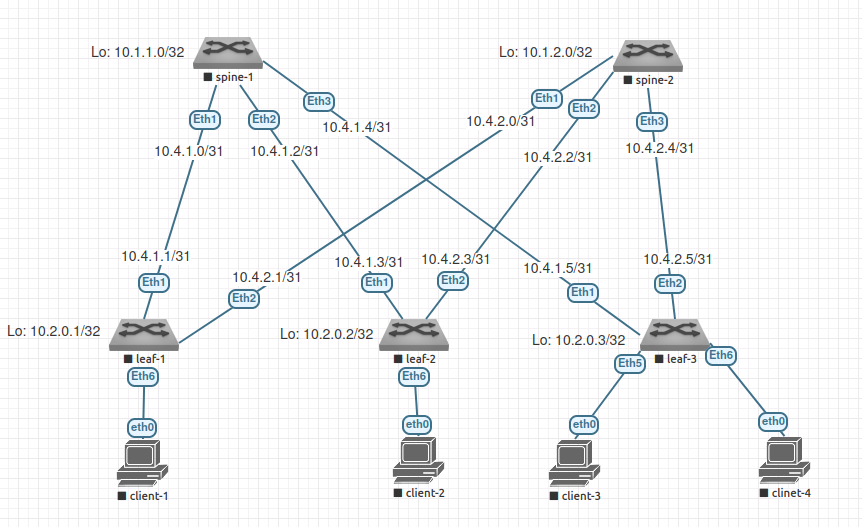

# Домашнее задание №2

## Underlay. OSPF

### Задачи:

- Настройте OSPF в Underlay сети, для IP связанности между всеми сетевыми устройствами
- Зафиксируете в документации - план работы, адресное пространство, схему сети, конфигурацию устройств
- Убедитесь в наличии IP связанности между устройствами в OSFP домене

## Выполнение:

### Собранная схема сети



### Таблица адресов

| hostname | interface |   IP/MASK    | Description |
| :------: | :-------: | :----------: | :---------: |
|  leaf-1  | Loopback2 | 10.2.0.1/32  |             |
|  leaf-1  |  Eth1     | 10.4.1.1/31  | to-spine-1  |
|  leaf-1  |  Eth2     | 10.4.2.1/31  | to-spine-2  |
|          |           |              |             |
|  leaf-2  | Loopback2 | 10.2.0.2/32  |             |
|  leaf-2  |  Eth1     | 10.4.1.3/31  | to-spine-1  |
|  leaf-2  |  Eth2     | 10.4.2.3/31  | to-spine-2  |
|          |           |              |             |
|  leaf-3  | Loopback2 | 10.2.0.3/32  |             |
|  leaf-3  |  Eth1     | 10.4.1.5/31  | to-spine-1  |
|  leaf-3  |  Eth2     | 10.4.2.5/31  | to-spine-2  |
|          |           |              |             |
|  spine-1 | Loopback1 | 10.1.1.0/32  |             |
|  spine-1 |  Eth1     | 10.4.1.0/31  |  to-leaf-1  |
|  spine-1 |  Eth2     | 10.4.1.2/31  |  to-leaf-2  |
|  spine-1 |  Eth3     | 10.4.1.4/31  |  to-leaf-3  |
|          |           |              |             |
|  spine-2 | Loopback1 | 10.1.2.0/32  |             |
|  spine-2 |  Eth1     | 10.4.2.0/31  |  to-leaf-1  |
|  spine-2 |  Eth2     | 10.4.2.2/31  |  to-leaf-2  |
|  spine-2 |  Eth3     | 10.4.2.2/31  |  to-leaf-3  |

### Конфигурация оборудования

- #### [leaf-1](config/leaf-1.conf)

```
hostname leaf-1

ip routing
router ospf 1000
  router-id 10.2.0.1
  point-to-point routes
  passive-interface default
  no passive-interface Ethernet 1
  no passive-interface Ethernet 2
  network 0.0.0.0/0 area 0.0.0.0
  bfd default
exit

interface Ethernet1
  description to-spine-1
  no switchport
  ip address 10.4.1.1/31
  no shutdown
  bfd interval 100 min-rx 100 multiplier 3
  ip ospf message-digest-key
  ip ospf message-digest-key 23 sha256 auth123
  ip ospf priority 0
exit
interface Ethernet 2
  description to-spine-2
  no switchport
  ip address 10.4.2.1/31
  no shutdown
  bfd interval 100 min-rx 100 multiplier 3
  ip ospf message-digest-key
  ip ospf message-digest-key 23 sha256 auth123
  ip ospf priority 0
exit
interface loopback 1
  ip address 10.2.0.1/32
exit
```

- #### [leaf-2](config/leaf-2.conf)

```
hostname leaf-2

ip routing
router ospf 1000
  router-id 10.2.0.2
  point-to-point routes
  passive-interface default
  no passive-interface Ethernet 1
  no passive-interface Ethernet 2
  network 0.0.0.0/0 area 0.0.0.0
  bfd default
exit

interface Ethernet 1
  description to-spine-1
  no switchport
  ip address 10.4.1.3/31
  no shutdown
  bfd interval 100 min-rx 100 multiplier 3
  ip ospf message-digest-key
  ip ospf message-digest-key 23 sha256 auth123
  ip ospf priority 0
exit
interface Ethernet 2
  description to-spine-2
  no switchport
  ip address 10.4.2.3/31
  no shutdown
  bfd interval 100 min-rx 100 multiplier 3
  ip ospf message-digest-key
  ip ospf message-digest-key 23 sha256 auth123
  ip ospf priority 0
exit
interface loopback 1
  ip address 10.2.0.2/32
exit
```

- #### [leaf-3](config/leaf-3.conf)

```
hostname leaf-3

ip routing
router ospf 1000
  router-id 10.2.0.3
  point-to-point routes
  passive-interface default
  no passive-interface Ethernet 1
  no passive-interface Ethernet 2
  network 0.0.0.0/0 area 0.0.0.0
  bfd default
exit

interface Ethernet 1
  description to-spine-1
  no switchport
  ip address 10.4.1.5/31
  no shutdown
  bfd interval 100 min-rx 100 multiplier 3
  ip ospf message-digest-key
  ip ospf message-digest-key 23 sha256 auth123
  ip ospf priority 0
exit
interface Ethernet 2
  description to-spine-2
  no switchport
  ip address 10.4.2.5/31
  no shutdown
  bfd interval 100 min-rx 100 multiplier 3
  ip ospf message-digest-key
  ip ospf message-digest-key 23 sha256 auth123
  ip ospf priority 0
exit
interface loopback 1
  ip address 10.2.0.3/32
exit
```

- #### [spine-1](config/spine-1.conf)

```
hostname spine-1

ip routing
router ospf 1000
  router-id 10.1.1.0
  point-to-point routes
  passive-interface default
  no passive-interface Ethernet 1
  no passive-interface Ethernet 2
  no passive-interface Ethernet 3
  network 0.0.0.0/0 area 0.0.0.0
  bfd default
exit

interface Ethernet 1
  description to-leaf-1
  no switchport
  ip address 10.4.1.0/31
  no shutdown
  bfd interval 100 min-rx 100 multiplier 3
  ip ospf authentication message-digest
  ip ospf message-digest-key 23 sha256 auth123
exit
interface Ethernet 2
  description to-leaf-2
  no switchport
  ip address 10.4.1.2/31
  no shutdown
  bfd interval 100 min-rx 100 multiplier 3
  ip ospf authentication message-digest
  ip ospf message-digest-key 23 sha256 auth123
exit
interface Ethernet 3
  description to-leaf-3
  no switchport
  ip address 10.4.1.4/31
  no shutdown
  bfd interval 100 min-rx 100 multiplier 3
  ip ospf authentication message-digest
  ip ospf message-digest-key 23 sha256 auth123
exit
interface loopback 1
  ip address 10.1.1.0/32
```

- #### [spine-2](config/spine-2.conf)

```
hostname spine-2

ip routing
router ospf 1000
  router-id 10.1.2.0
  point-to-point routes
  passive-interface default
  no passive-interface Ethernet 1
  no passive-interface Ethernet 2
  no passive-interface Ethernet 3
  network 0.0.0.0/0 area 0.0.0.0
  bfd default
exit

interface Ethernet 1
  description to-leaf-1
  no switchport
  ip address 10.4.2.0/31
  no shutdown
  bfd interval 100 min-rx 100 multiplier 3
  ip ospf authentication message-digest
  ip ospf message-digest-key 23 sha256 auth123
exit
interface Ethernet 2
  description to-leaf-2
  no switchport
  ip address 10.4.2.2/31
  no shutdown
  bfd interval 100 min-rx 100 multiplier 3
  ip ospf authentication message-digest
  ip ospf message-digest-key 23 sha256 auth123
exit
interface Ethernet 3
  description to-leaf-3
  no switchport
  ip address 10.4.2.4/31
  no shutdown
  bfd interval 100 min-rx 100 multiplier 3
  ip ospf authentication message-digest
  ip ospf message-digest-key 23 sha256 auth123
exit
interface loopback 1
  ip address 10.1.2.0/32
exit
```

### Проверка OSPF

- #### leaf-1

~~~
leaf-1#show ip ospf neighbor
Neighbor ID     Instance VRF      Pri State                  Dead Time   Address
     Interface
10.1.1.0        1000     default  1   FULL/DR                00:00:37    10.4.1.0   Ethernet1
10.1.2.0        1000     default  1   FULL/DR                00:00:34    10.4.2.0   Ethernet2
~~~

- #### leaf-2

~~~
leaf-2#show ip ospf neighbor
Neighbor ID     Instance VRF      Pri State                  Dead Time   Address
     Interface
10.1.1.0        1000     default  1   FULL/DR                00:00:30    10.4.1.2   Ethernet1
10.1.2.0        1000     default  1   FULL/DR                00:00:37    10.4.2.2   Ethernet2
~~~

- #### leaf-3

~~~
leaf-3#show ip ospf neighbor
Neighbor ID     Instance VRF      Pri State                  Dead Time   Address         Interface
10.1.1.0        1000     default  1   FULL/DR                00:00:36    10.4.1.4        Ethernet1
10.1.2.0        1000     default  1   FULL/DR                00:00:35    10.4.2.4        Ethernet2
~~~

- #### spine-1

~~~
spine-1#show ip ospf neighbor
Neighbor ID     Instance VRF      Pri State                  Dead Time   Address         Interface
10.2.0.1        1000     default  0   FULL/DROTHER           00:00:38    10.4.1.1        Ethernet1
10.2.0.2        1000     default  0   FULL/DROTHER           00:00:35    10.4.1.3        Ethernet2
10.2.0.3        1000     default  0   FULL/DROTHER           00:00:30    10.4.1.5        Ethernet3
~~~

- #### spine-2

~~~
spine-2#show ip ospf neighbor
Neighbor ID     Instance VRF      Pri State                  Dead Time   Address         Interface
10.2.0.1        1000     default  0   FULL/DROTHER           00:00:34    10.4.2.1        Ethernet1
10.2.0.2        1000     default  0   FULL/DROTHER           00:00:30    10.4.2.3        Ethernet2
10.2.0.3        1000     default  0   FULL/DROTHER           00:00:34    10.4.2.5        Ethernet3
~~~


### Проверка таблиц маршрутизации

- #### leaf-1

~~~
leaf-1#show ip route

VRF: default
Codes: C - connected, S - static, K - kernel,
       O - OSPF, IA - OSPF inter area, E1 - OSPF external type 1,
       E2 - OSPF external type 2, N1 - OSPF NSSA external type 1,
       N2 - OSPF NSSA external type2, B - BGP, B I - iBGP, B E - eBGP,
       R - RIP, I L1 - IS-IS level 1, I L2 - IS-IS level 2,
       O3 - OSPFv3, A B - BGP Aggregate, A O - OSPF Summary,
       NG - Nexthop Group Static Route, V - VXLAN Control Service,
       DH - DHCP client installed default route, M - Martian,
       DP - Dynamic Policy Route, L - VRF Leaked

Gateway of last resort is not set

 O        10.1.1.0/32 [110/20] via 10.4.1.0, Ethernet1
 O        10.1.2.0/32 [110/20] via 10.4.2.0, Ethernet2
 C        10.2.0.1/32 is directly connected, Loopback1
 O        10.2.0.2/32 [110/30] via 10.4.1.0, Ethernet1
                               via 10.4.2.0, Ethernet2
 O        10.2.0.3/32 [110/30] via 10.4.1.0, Ethernet1
                               via 10.4.2.0, Ethernet2
 C        10.4.1.0/31 is directly connected, Ethernet1
 O        10.4.1.2/31 [110/20] via 10.4.1.0, Ethernet1
 O        10.4.1.4/31 [110/20] via 10.4.1.0, Ethernet1
 C        10.4.2.0/31 is directly connected, Ethernet2
 O        10.4.2.2/31 [110/20] via 10.4.2.0, Ethernet2
 O        10.4.2.4/31 [110/20] via 10.4.2.0, Ethernet2
~~~

- #### leaf-2

~~~
leaf-2#show ip route

VRF: default
Codes: C - connected, S - static, K - kernel,
       O - OSPF, IA - OSPF inter area, E1 - OSPF external type 1,
       E2 - OSPF external type 2, N1 - OSPF NSSA external type 1,
       N2 - OSPF NSSA external type2, B - BGP, B I - iBGP, B E - eBGP,
       R - RIP, I L1 - IS-IS level 1, I L2 - IS-IS level 2,
       O3 - OSPFv3, A B - BGP Aggregate, A O - OSPF Summary,
       NG - Nexthop Group Static Route, V - VXLAN Control Service,
       DH - DHCP client installed default route, M - Martian,
       DP - Dynamic Policy Route, L - VRF Leaked

Gateway of last resort is not set

 O        10.1.1.0/32 [110/20] via 10.4.1.2, Ethernet1
 O        10.1.2.0/32 [110/20] via 10.4.2.2, Ethernet2
 O        10.2.0.1/32 [110/30] via 10.4.1.2, Ethernet1
                               via 10.4.2.2, Ethernet2
 C        10.2.0.2/32 is directly connected, Loopback1
 O        10.2.0.3/32 [110/30] via 10.4.1.2, Ethernet1
                               via 10.4.2.2, Ethernet2
 O        10.4.1.0/31 [110/20] via 10.4.1.2, Ethernet1
 C        10.4.1.2/31 is directly connected, Ethernet1
 O        10.4.1.4/31 [110/20] via 10.4.1.2, Ethernet1
 O        10.4.2.0/31 [110/20] via 10.4.2.2, Ethernet2
 C        10.4.2.2/31 is directly connected, Ethernet2
 O        10.4.2.4/31 [110/20] via 10.4.2.2, Ethernet2
~~~

- #### leaf-3

~~~
leaf-3#show ip route

VRF: default
Codes: C - connected, S - static, K - kernel,
       O - OSPF, IA - OSPF inter area, E1 - OSPF external type 1,
       E2 - OSPF external type 2, N1 - OSPF NSSA external type 1,
       N2 - OSPF NSSA external type2, B - BGP, B I - iBGP, B E - eBGP,
       R - RIP, I L1 - IS-IS level 1, I L2 - IS-IS level 2,
       O3 - OSPFv3, A B - BGP Aggregate, A O - OSPF Summary,
       NG - Nexthop Group Static Route, V - VXLAN Control Service,
       DH - DHCP client installed default route, M - Martian,
       DP - Dynamic Policy Route, L - VRF Leaked

Gateway of last resort is not set

 O        10.1.1.0/32 [110/20] via 10.4.1.4, Ethernet1
 O        10.1.2.0/32 [110/20] via 10.4.2.4, Ethernet2
 O        10.2.0.1/32 [110/30] via 10.4.1.4, Ethernet1
                               via 10.4.2.4, Ethernet2
 O        10.2.0.2/32 [110/30] via 10.4.1.4, Ethernet1
                               via 10.4.2.4, Ethernet2
 C        10.2.0.3/32 is directly connected, Loopback1
 O        10.4.1.0/31 [110/20] via 10.4.1.4, Ethernet1
 O        10.4.1.2/31 [110/20] via 10.4.1.4, Ethernet1
 C        10.4.1.4/31 is directly connected, Ethernet1
 O        10.4.2.0/31 [110/20] via 10.4.2.4, Ethernet2
 O        10.4.2.2/31 [110/20] via 10.4.2.4, Ethernet2
 C        10.4.2.4/31 is directly connected, Ethernet2
~~~

- #### spine-1

~~~
spine-1#show ip route

VRF: default
Codes: C - connected, S - static, K - kernel,
       O - OSPF, IA - OSPF inter area, E1 - OSPF external type 1,
       E2 - OSPF external type 2, N1 - OSPF NSSA external type 1,
       N2 - OSPF NSSA external type2, B - BGP, B I - iBGP, B E - eBGP,
       R - RIP, I L1 - IS-IS level 1, I L2 - IS-IS level 2,
       O3 - OSPFv3, A B - BGP Aggregate, A O - OSPF Summary,
       NG - Nexthop Group Static Route, V - VXLAN Control Service,
       DH - DHCP client installed default route, M - Martian,
       DP - Dynamic Policy Route, L - VRF Leaked

Gateway of last resort is not set

 C        10.1.1.0/32 is directly connected, Loopback1
 O        10.1.2.0/32 [110/30] via 10.4.1.1, Ethernet1
                               via 10.4.1.3, Ethernet2
                               via 10.4.1.5, Ethernet3
 O        10.2.0.1/32 [110/20] via 10.4.1.1, Ethernet1
 O        10.2.0.2/32 [110/20] via 10.4.1.3, Ethernet2
 O        10.2.0.3/32 [110/20] via 10.4.1.5, Ethernet3
 C        10.4.1.0/31 is directly connected, Ethernet1
 C        10.4.1.2/31 is directly connected, Ethernet2
 C        10.4.1.4/31 is directly connected, Ethernet3
 O        10.4.2.0/31 [110/20] via 10.4.1.1, Ethernet1
 O        10.4.2.2/31 [110/20] via 10.4.1.3, Ethernet2
 O        10.4.2.4/31 [110/20] via 10.4.1.5, Ethernet3
~~~

- #### spine-2

~~~
spine-2#show ip route

VRF: default
Codes: C - connected, S - static, K - kernel,
       O - OSPF, IA - OSPF inter area, E1 - OSPF external type 1,
       E2 - OSPF external type 2, N1 - OSPF NSSA external type 1,
       N2 - OSPF NSSA external type2, B - BGP, B I - iBGP, B E - eBGP,
       R - RIP, I L1 - IS-IS level 1, I L2 - IS-IS level 2,
       O3 - OSPFv3, A B - BGP Aggregate, A O - OSPF Summary,
       NG - Nexthop Group Static Route, V - VXLAN Control Service,
       DH - DHCP client installed default route, M - Martian,
       DP - Dynamic Policy Route, L - VRF Leaked

Gateway of last resort is not set

 O        10.1.1.0/32 [110/30] via 10.4.2.1, Ethernet1
                               via 10.4.2.3, Ethernet2
                               via 10.4.2.5, Ethernet3
 C        10.1.2.0/32 is directly connected, Loopback1
 O        10.2.0.1/32 [110/20] via 10.4.2.1, Ethernet1
 O        10.2.0.2/32 [110/20] via 10.4.2.3, Ethernet2
 O        10.2.0.3/32 [110/20] via 10.4.2.5, Ethernet3
 O        10.4.1.0/31 [110/20] via 10.4.2.1, Ethernet1
 O        10.4.1.2/31 [110/20] via 10.4.2.3, Ethernet2
 O        10.4.1.4/31 [110/20] via 10.4.2.5, Ethernet3
 C        10.4.2.0/31 is directly connected, Ethernet1
 C        10.4.2.2/31 is directly connected, Ethernet2
 C        10.4.2.4/31 is directly connected, Ethernet3
~~~

### Проверка доступности

- #### spine-1

~~~
spine-1#ping 10.1.2.0
PING 10.1.2.0 (10.1.2.0) 72(100) bytes of data.
80 bytes from 10.1.2.0: icmp_seq=1 ttl=63 time=10.7 ms
80 bytes from 10.1.2.0: icmp_seq=2 ttl=63 time=8.51 ms
80 bytes from 10.1.2.0: icmp_seq=3 ttl=63 time=7.61 ms
80 bytes from 10.1.2.0: icmp_seq=4 ttl=63 time=10.8 ms
80 bytes from 10.1.2.0: icmp_seq=5 ttl=63 time=12.1 ms

--- 10.1.2.0 ping statistics ---
5 packets transmitted, 5 received, 0% packet loss, time 46ms
rtt min/avg/max/mdev = 7.619/9.992/12.196/1.679 ms, pipe 2, ipg/ewma 11.505/10.452 m
s
spine-1#ping 10.2.0.1
PING 10.2.0.1 (10.2.0.1) 72(100) bytes of data.
80 bytes from 10.2.0.1: icmp_seq=1 ttl=64 time=4.29 ms
80 bytes from 10.2.0.1: icmp_seq=2 ttl=64 time=5.52 ms
80 bytes from 10.2.0.1: icmp_seq=3 ttl=64 time=9.28 ms
80 bytes from 10.2.0.1: icmp_seq=4 ttl=64 time=6.63 ms
80 bytes from 10.2.0.1: icmp_seq=5 ttl=64 time=3.53 ms

--- 10.2.0.1 ping statistics ---
5 packets transmitted, 5 received, 0% packet loss, time 40ms
rtt min/avg/max/mdev = 3.532/5.855/9.289/2.017 ms, ipg/ewma 10.070/5.038 ms
spine-1#ping 10.2.0.2
PING 10.2.0.2 (10.2.0.2) 72(100) bytes of data.
80 bytes from 10.2.0.2: icmp_seq=1 ttl=64 time=9.60 ms
80 bytes from 10.2.0.2: icmp_seq=2 ttl=64 time=106 ms

--- 10.2.0.2 ping statistics ---
5 packets transmitted, 5 received, 0% packet loss, time 31ms
rtt min/avg/max/mdev = 3.541/5.696/8.858/1.758 ms, ipg/ewma 7.987/5.388 ms
spine-1#ping 10.2.0.3
PING 10.2.0.3 (10.2.0.3) 72(100) bytes of data.
80 bytes from 10.2.0.3: icmp_seq=1 ttl=64 time=5.19 ms
80 bytes from 10.2.0.3: icmp_seq=2 ttl=64 time=11.2 ms
80 bytes from 10.2.0.3: icmp_seq=3 ttl=64 time=10.6 ms
80 bytes from 10.2.0.3: icmp_seq=4 ttl=64 time=6.14 ms
80 bytes from 10.2.0.3: icmp_seq=5 ttl=64 time=5.38 ms

--- 10.2.0.3 ping statistics ---
5 packets transmitted, 5 received, 0% packet loss, time 34ms
rtt min/avg/max/mdev = 5.193/7.726/11.246/2.663 ms, pipe 2, ipg/ewma 8.606/6.351 ms
~~~

- #### spine-2

~~~
spine-2#ping 10.1.1.0
PING 10.1.1.0 (10.1.1.0) 72(100) bytes of data.
80 bytes from 10.1.1.0: icmp_seq=1 ttl=63 time=8.50 ms
80 bytes from 10.1.1.0: icmp_seq=2 ttl=63 time=6.78 ms
80 bytes from 10.1.1.0: icmp_seq=3 ttl=63 time=12.4 ms
80 bytes from 10.1.1.0: icmp_seq=4 ttl=63 time=10.9 ms
80 bytes from 10.1.1.0: icmp_seq=5 ttl=63 time=12.5 ms

--- 10.1.1.0 ping statistics ---
5 packets transmitted, 5 received, 0% packet loss, time 38ms
rtt min/avg/max/mdev = 6.782/10.245/12.525/2.259 ms, pipe 2, ipg/ewma 9.650/9.511 ms
spine-2#ping 10.2.0.1
PING 10.2.0.1 (10.2.0.1) 72(100) bytes of data.
80 bytes from 10.2.0.1: icmp_seq=1 ttl=64 time=5.39 ms
80 bytes from 10.2.0.1: icmp_seq=2 ttl=64 time=3.49 ms
80 bytes from 10.2.0.1: icmp_seq=3 ttl=64 time=3.80 ms
80 bytes from 10.2.0.1: icmp_seq=4 ttl=64 time=4.51 ms
80 bytes from 10.2.0.1: icmp_seq=5 ttl=64 time=5.78 ms

--- 10.2.0.1 ping statistics ---
5 packets transmitted, 5 received, 0% packet loss, time 26ms
rtt min/avg/max/mdev = 3.490/4.597/5.781/0.887 ms, ipg/ewma 6.697/5.037 ms
spine-2#ping 10.2.0.2
PING 10.2.0.2 (10.2.0.2) 72(100) bytes of data.
80 bytes from 10.2.0.2: icmp_seq=1 ttl=64 time=6.02 ms
80 bytes from 10.2.0.2: icmp_seq=2 ttl=64 time=6.35 ms
80 bytes from 10.2.0.2: icmp_seq=3 ttl=64 time=6.91 ms
80 bytes from 10.2.0.2: icmp_seq=4 ttl=64 time=7.03 ms
80 bytes from 10.2.0.2: icmp_seq=5 ttl=64 time=9.63 ms

--- 10.2.0.2 ping statistics ---
5 packets transmitted, 5 received, 0% packet loss, time 28ms
rtt min/avg/max/mdev = 6.021/7.193/9.639/1.279 ms, ipg/ewma 7.101/6.698 ms
spine-2#ping 10.2.0.3
PING 10.2.0.3 (10.2.0.3) 72(100) bytes of data.
80 bytes from 10.2.0.3: icmp_seq=1 ttl=64 time=4.12 ms
80 bytes from 10.2.0.3: icmp_seq=2 ttl=64 time=5.88 ms
80 bytes from 10.2.0.3: icmp_seq=3 ttl=64 time=6.71 ms
80 bytes from 10.2.0.3: icmp_seq=4 ttl=64 time=7.37 ms
80 bytes from 10.2.0.3: icmp_seq=5 ttl=64 time=6.20 ms

--- 10.2.0.3 ping statistics ---
5 packets transmitted, 5 received, 0% packet loss, time 25ms
rtt min/avg/max/mdev = 4.124/6.061/7.379/1.094 ms, ipg/ewma 6.264/5.135 ms
~~~
