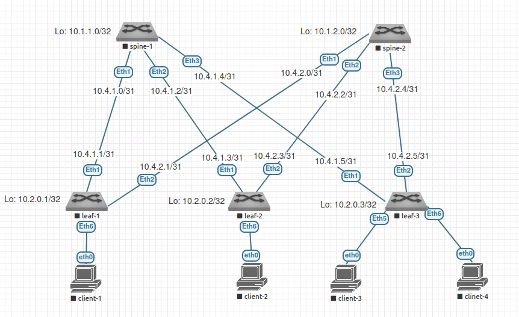

# Домашнее задание №4

## Underlay. eBGP

### Задачи:

- Настроите BGP в Underlay сети, для IP связанности между всеми сетевыми устройствами. iBGP или eBGP - решать вам!
- Зафиксируете в документации - план работы, адресное пространство, схему сети, конфигурацию устройств
- Убедитесь в наличии IP связанности между устройствами в BGP домене

## Выполнение:

### Собранная схема сети



### Таблица адресов

| hostname | interface |   IP/MASK    | Description |
| :------: | :-------: | :----------: | :---------: |
|  leaf-1  | Loopback1 | 10.2.0.1/32  |             |
|  leaf-1  |  Eth1     | 10.4.1.1/31  | to-spine-1  |
|  leaf-1  |  Eth2     | 10.4.2.1/31  | to-spine-2  |
|          |           |              |             |
|  leaf-2  | Loopback1 | 10.2.0.2/32  |             |
|  leaf-2  |  Eth1     | 10.4.1.3/31  | to-spine-1  |
|  leaf-2  |  Eth2     | 10.4.2.3/31  | to-spine-2  |
|          |           |              |             |
|  leaf-3  | Loopback1 | 10.2.0.3/32  |             |
|  leaf-3  |  Eth1     | 10.4.1.5/31  | to-spine-1  |
|  leaf-3  |  Eth2     | 10.4.2.5/31  | to-spine-2  |
|          |           |              |             |
|  spine-1 | Loopback1 | 10.1.1.0/32  |             |
|  spine-1 |  Eth1     | 10.4.1.0/31  |  to-leaf-1  |
|  spine-1 |  Eth2     | 10.4.1.2/31  |  to-leaf-2  |
|  spine-1 |  Eth3     | 10.4.1.4/31  |  to-leaf-3  |
|          |           |              |             |
|  spine-2 | Loopback1 | 10.1.2.0/32  |             |
|  spine-2 |  Eth1     | 10.4.2.0/31  |  to-leaf-1  |
|  spine-2 |  Eth2     | 10.4.2.2/31  |  to-leaf-2  |
|  spine-2 |  Eth3     | 10.4.2.2/31  |  to-leaf-3  |

### Таблица ASN

| hostname | Loopback address |  ASN       |
| :------: | :--------------: | :--------: |
|  leaf-1  | 10.2.0.1/32      | 4200010001 |
|  leaf-2  | 10.2.0.2/32      | 4200010002 |
|  leaf-3  | 10.2.0.3/32      | 4200010003 |
|  spine-1 | 10.1.1.0/32      | 4200000001 |
|  spine-2 | 10.1.2.0/32      | 4200000002 |

### Конфигурация оборудования

- #### [leaf-1](config/leaf-1.conf)

```
hostname leaf-1

ip routing

router bgp 4200010001
   router-id 10.2.0.1
   neighbor SPINE peer group
   neighbor SPINE bfd
   neighbor 10.4.1.0 remote-as 4200000001
   neighbor 10.4.1.0 peer group SPINE
   neighbor 10.4.2.0 remote-as 4200000002
   neighbor 10.4.2.0 peer group SPINE
   redistribute connected
   timers bgp 3 9
   bgp log-neighbor-changes
   maximum-paths 128
exit

interface Ethernet1
  description to-spine-1
  no switchport
  ip address 10.4.1.1/31
  no shutdown
  bfd interval 100 min-rx 100 multiplier 3
exit
interface Ethernet 2
  description to-spine-2
  no switchport
  ip address 10.4.2.1/31
  no shutdown
  bfd interval 100 min-rx 100 multiplier 3
exit
interface loopback 1
  ip address 10.2.0.1/32
exit
```

- #### [leaf-2](config/leaf-2.conf)

```
hostname leaf-2

ip routing

router bgp 4200010002
   router-id 10.2.0.2
   neighbor SPINE peer group
   neighbor SPINE bfd
   neighbor 10.4.1.2 remote-as 4200000001
   neighbor 10.4.1.2 peer group SPINE
   neighbor 10.4.2.2 remote-as 4200000002
   neighbor 10.4.2.2 peer group SPINE
   redistribute connected
   timers bgp 3 9
   bgp log-neighbor-changes
   maximum-paths 128
exit

interface Ethernet 1
  description to-spine-1
  no switchport
  ip address 10.4.1.3/31
  no shutdown
  bfd interval 100 min-rx 100 multiplier 3
exit
interface Ethernet 2
  description to-spine-2
  no switchport
  ip address 10.4.2.3/31
  no shutdown
  bfd interval 100 min-rx 100 multiplier 3
exit
interface loopback 1
  ip address 10.2.0.2/32
exit
```

- #### [leaf-3](config/leaf-3.conf)

```
hostname leaf-3

ip routing

router bgp 4200010003
   router-id 10.2.0.3
   neighbor SPINE peer group
   neighbor SPINE bfd
   neighbor 10.4.1.4 remote-as 4200000001
   neighbor 10.4.1.4 peer group SPINE
   neighbor 10.4.2.4 remote-as 4200000002
   neighbor 10.4.2.4 peer group SPINE
   redistribute connected
   timers bgp 3 9
   bgp log-neighbor-changes
   maximum-paths 128
exit

interface Ethernet 1
  description to-spine-1
  no switchport
  ip address 10.4.1.5/31
  no shutdown
  bfd interval 100 min-rx 100 multiplier 3
exit
interface Ethernet 2
  description to-spine-2
  no switchport
  ip address 10.4.2.5/31
  no shutdown
  bfd interval 100 min-rx 100 multiplier 3
exit
interface loopback 1
  ip address 10.2.0.3/32
exit
```

- #### [spine-1](config/spine-1.conf)

```
hostname spine-1

ip routing

router bgp 4200000001
   router-id 10.1.1.0
   neighbor LEAF peer group
   neighbor LEAF bfd
   neighbor 10.4.1.1 remote-as 4200010001
   neighbor 10.4.1.1 peer group LEAF
   neighbor 10.4.1.3 remote-as 4200010002
   neighbor 10.4.1.3 peer group LEAF
   neighbor 10.4.1.5 remote-as 4200010003
   neighbor 10.4.1.5 peer group LEAF
   redistribute connected
   timers bgp 3 9
   bgp log-neighbor-changes
exit

interface Ethernet 1
  description to-leaf-1
  no switchport
  ip address 10.4.1.0/31
  no shutdown
  bfd interval 100 min-rx 100 multiplier 3
exit
interface Ethernet 2
  description to-leaf-2
  no switchport
  ip address 10.4.1.2/31
  no shutdown
  bfd interval 100 min-rx 100 multiplier 3
exit
interface Ethernet 3
  description to-leaf-3
  no switchport
  ip address 10.4.1.4/31
  no shutdown
  bfd interval 100 min-rx 100 multiplier 3
exit
interface loopback 1
  ip address 10.1.1.0/32
```

- #### [spine-2](config/spine-2.conf)

```
hostname spine-2

ip routing

router bgp 4200000002
   router-id 10.1.2.0
   neighbor LEAF peer group
   neighbor LEAF bfd
   neighbor 10.4.2.1 remote-as 4200010001
   neighbor 10.4.2.1 peer group LEAF
   neighbor 10.4.2.3 remote-as 4200010002
   neighbor 10.4.2.3 peer group LEAF
   neighbor 10.4.2.5 remote-as 4200010003
   neighbor 10.4.2.5 peer group LEAF
   redistribute connected
   timers bgp 3 9
   bgp log-neighbor-changes
exit

interface Ethernet 1
  description to-leaf-1
  no switchport
  ip address 10.4.2.0/31
  no shutdown
  bfd interval 100 min-rx 100 multiplier 3
exit
interface Ethernet 2
  description to-leaf-2
  no switchport
  ip address 10.4.2.2/31
  no shutdown
  bfd interval 100 min-rx 100 multiplier 3
exit
interface Ethernet 3
  description to-leaf-3
  no switchport
  ip address 10.4.2.4/31
  no shutdown
  bfd interval 100 min-rx 100 multiplier 3
exit
interface loopback 1
  ip address 10.1.2.0/32
exit
```

### Проверка eBGP

- #### leaf-1

~~~
leaf-1#show ip bgp summary
BGP summary information for VRF default
Router identifier 10.2.0.1, local AS number 4200010001
Neighbor Status Codes: m - Under maintenance
  Neighbor         V  AS           MsgRcvd   MsgSent  InQ OutQ  Up/Down State   PfxRcd PfxAcc
  10.4.1.0         4  4200000001       312       310    0    0 00:13:54 Estab   8      8
  10.4.2.0         4  4200000002       174       206    0    0 00:06:51 Estab   8      8
~~~

- #### leaf-2

~~~
leaf-2#show ip bgp summary
BGP summary information for VRF default
Router identifier 10.2.0.2, local AS number 4200010002
Neighbor Status Codes: m - Under maintenance
  Neighbor         V  AS           MsgRcvd   MsgSent  InQ OutQ  Up/Down State   PfxRcd PfxAcc
  10.4.1.2         4  4200000001       337       335    0    0 00:16:28 Estab   9      9
  10.4.2.2         4  4200000002       227       254    0    0 00:09:24 Estab   9      9
~~~

- #### leaf-3

~~~
leaf-3#show ip bgp summary
BGP summary information for VRF default
Router identifier 10.2.0.3, local AS number 4200010003
Neighbor Status Codes: m - Under maintenance
  Neighbor         V  AS           MsgRcvd   MsgSent  InQ OutQ  Up/Down State   PfxRcd PfxAcc
  10.4.1.4         4  4200000001       360       357    0    0 00:17:37 Estab   9      9
  10.4.2.4         4  4200000002       250       279    0    0 00:10:35 Estab   9      9
~~~

- #### spine-1

~~~
spine-1#show ip bgp summary
BGP summary information for VRF default
Router identifier 10.1.1.0, local AS number 4200000001
Neighbor Status Codes: m - Under maintenance
  Neighbor         V  AS           MsgRcvd   MsgSent  InQ OutQ  Up/Down State   PfxRcd PfxAcc
  10.4.1.1         4  4200010001       188       189    0    0 00:09:06 Estab   6      6
  10.4.1.3         4  4200010002       187       189    0    0 00:09:04 Estab   6      6
  10.4.1.5         4  4200010003       185       189    0    0 00:09:02 Estab   6      6
~~~

- #### spine-2

~~~
spine-2#show ip bgp summary
BGP summary information for VRF default
Router identifier 10.1.2.0, local AS number 4200000002
Neighbor Status Codes: m - Under maintenance
  Neighbor         V  AS           MsgRcvd   MsgSent  InQ OutQ  Up/Down State   PfxRcd PfxAcc
  10.4.2.1         4  4200010001        26        25    0    0 00:00:53 Estab   8      8
  10.4.2.3         4  4200010002        27        28    0    0 00:00:51 Estab   8      8
  10.4.2.5         4  4200010003        26        26    0    0 00:00:50 Estab   8      8
spine-2#
~~~


### Проверка таблиц маршрутизации

- #### leaf-1

~~~
leaf-1#show ip route

VRF: default
Codes: C - connected, S - static, K - kernel,
       O - OSPF, IA - OSPF inter area, E1 - OSPF external type 1,
       E2 - OSPF external type 2, N1 - OSPF NSSA external type 1,
       N2 - OSPF NSSA external type2, B - BGP, B I - iBGP, B E - eBGP,
       R - RIP, I L1 - IS-IS level 1, I L2 - IS-IS level 2,
       O3 - OSPFv3, A B - BGP Aggregate, A O - OSPF Summary,
       NG - Nexthop Group Static Route, V - VXLAN Control Service,
       DH - DHCP client installed default route, M - Martian,
       DP - Dynamic Policy Route, L - VRF Leaked

Gateway of last resort is not set

 B E      10.1.1.0/32 [200/0] via 10.4.1.0, Ethernet1
 B E      10.1.2.0/32 [200/0] via 10.4.2.0, Ethernet2
 C        10.2.0.1/32 is directly connected, Loopback1
 B E      10.2.0.2/32 [200/0] via 10.4.1.0, Ethernet1
                              via 10.4.2.0, Ethernet2
 B E      10.2.0.3/32 [200/0] via 10.4.1.0, Ethernet1
                              via 10.4.2.0, Ethernet2
 C        10.4.1.0/31 is directly connected, Ethernet1
 B E      10.4.1.2/31 [200/0] via 10.4.1.0, Ethernet1
 B E      10.4.1.4/31 [200/0] via 10.4.1.0, Ethernet1
 C        10.4.2.0/31 is directly connected, Ethernet2
 B E      10.4.2.2/31 [200/0] via 10.4.2.0, Ethernet2
 B E      10.4.2.4/31 [200/0] via 10.4.2.0, Ethernet2
~~~

- #### leaf-2

~~~
leaf-2#show ip route

VRF: default
Codes: C - connected, S - static, K - kernel,
       O - OSPF, IA - OSPF inter area, E1 - OSPF external type 1,
       E2 - OSPF external type 2, N1 - OSPF NSSA external type 1,
       N2 - OSPF NSSA external type2, B - BGP, B I - iBGP, B E - eBGP,
       R - RIP, I L1 - IS-IS level 1, I L2 - IS-IS level 2,
       O3 - OSPFv3, A B - BGP Aggregate, A O - OSPF Summary,
       NG - Nexthop Group Static Route, V - VXLAN Control Service,
       DH - DHCP client installed default route, M - Martian,
       DP - Dynamic Policy Route, L - VRF Leaked

Gateway of last resort is not set

 B E      10.1.1.0/32 [200/0] via 10.4.1.2, Ethernet1
 B E      10.1.2.0/32 [200/0] via 10.4.2.2, Ethernet2
 B E      10.2.0.1/32 [200/0] via 10.4.1.2, Ethernet1
                              via 10.4.2.2, Ethernet2
 C        10.2.0.2/32 is directly connected, Loopback1
 B E      10.2.0.3/32 [200/0] via 10.4.1.2, Ethernet1
                              via 10.4.2.2, Ethernet2
 B E      10.4.1.0/31 [200/0] via 10.4.1.2, Ethernet1
 C        10.4.1.2/31 is directly connected, Ethernet1
 B E      10.4.1.4/31 [200/0] via 10.4.1.2, Ethernet1
 B E      10.4.2.0/31 [200/0] via 10.4.2.2, Ethernet2
 C        10.4.2.2/31 is directly connected, Ethernet2
 B E      10.4.2.4/31 [200/0] via 10.4.2.2, Ethernet2
~~~

- #### leaf-3

~~~
leaf-3#show ip route

VRF: default
Codes: C - connected, S - static, K - kernel,
       O - OSPF, IA - OSPF inter area, E1 - OSPF external type 1,
       E2 - OSPF external type 2, N1 - OSPF NSSA external type 1,
       N2 - OSPF NSSA external type2, B - BGP, B I - iBGP, B E - eBGP,
       R - RIP, I L1 - IS-IS level 1, I L2 - IS-IS level 2,
       O3 - OSPFv3, A B - BGP Aggregate, A O - OSPF Summary,
       NG - Nexthop Group Static Route, V - VXLAN Control Service,
       DH - DHCP client installed default route, M - Martian,
       DP - Dynamic Policy Route, L - VRF Leaked

Gateway of last resort is not set

 B E      10.1.1.0/32 [200/0] via 10.4.1.4, Ethernet1
 B E      10.1.2.0/32 [200/0] via 10.4.2.4, Ethernet2
 B E      10.2.0.1/32 [200/0] via 10.4.1.4, Ethernet1
                              via 10.4.2.4, Ethernet2
 B E      10.2.0.2/32 [200/0] via 10.4.1.4, Ethernet1
                              via 10.4.2.4, Ethernet2
 C        10.2.0.3/32 is directly connected, Loopback1
 B E      10.4.1.0/31 [200/0] via 10.4.1.4, Ethernet1
 B E      10.4.1.2/31 [200/0] via 10.4.1.4, Ethernet1
 C        10.4.1.4/31 is directly connected, Ethernet1
 B E      10.4.2.0/31 [200/0] via 10.4.2.4, Ethernet2
 B E      10.4.2.2/31 [200/0] via 10.4.2.4, Ethernet2
 C        10.4.2.4/31 is directly connected, Ethernet2
~~~

- #### spine-1

~~~
spine-1#show ip route

VRF: default
Codes: C - connected, S - static, K - kernel,
       O - OSPF, IA - OSPF inter area, E1 - OSPF external type 1,
       E2 - OSPF external type 2, N1 - OSPF NSSA external type 1,
       N2 - OSPF NSSA external type2, B - BGP, B I - iBGP, B E - eBGP,
       R - RIP, I L1 - IS-IS level 1, I L2 - IS-IS level 2,
       O3 - OSPFv3, A B - BGP Aggregate, A O - OSPF Summary,
       NG - Nexthop Group Static Route, V - VXLAN Control Service,
       DH - DHCP client installed default route, M - Martian,
       DP - Dynamic Policy Route, L - VRF Leaked

Gateway of last resort is not set

 C        10.1.1.0/32 is directly connected, Loopback1
 B E      10.1.2.0/32 [200/0] via 10.4.1.1, Ethernet1
                              via 10.4.1.3, Ethernet2
                              via 10.4.1.5, Ethernet3
 B E      10.2.0.1/32 [200/0] via 10.4.1.1, Ethernet1
 B E      10.2.0.2/32 [200/0] via 10.4.1.3, Ethernet2
 B E      10.2.0.3/32 [200/0] via 10.4.1.5, Ethernet3
 C        10.4.1.0/31 is directly connected, Ethernet1
 C        10.4.1.2/31 is directly connected, Ethernet2
 C        10.4.1.4/31 is directly connected, Ethernet3
 B E      10.4.2.0/31 [200/0] via 10.4.1.1, Ethernet1
 B E      10.4.2.2/31 [200/0] via 10.4.1.3, Ethernet2
 B E      10.4.2.4/31 [200/0] via 10.4.1.5, Ethernet3
~~~

- #### spine-2

~~~
spine-2#show ip route

VRF: default
Codes: C - connected, S - static, K - kernel,
       O - OSPF, IA - OSPF inter area, E1 - OSPF external type 1,
       E2 - OSPF external type 2, N1 - OSPF NSSA external type 1,
       N2 - OSPF NSSA external type2, B - BGP, B I - iBGP, B E - eBGP,
       R - RIP, I L1 - IS-IS level 1, I L2 - IS-IS level 2,
       O3 - OSPFv3, A B - BGP Aggregate, A O - OSPF Summary,
       NG - Nexthop Group Static Route, V - VXLAN Control Service,
       DH - DHCP client installed default route, M - Martian,
       DP - Dynamic Policy Route, L - VRF Leaked

Gateway of last resort is not set

 B E      10.1.1.0/32 [200/0] via 10.4.2.1, Ethernet1
                              via 10.4.2.3, Ethernet2
                              via 10.4.2.5, Ethernet3
 C        10.1.2.0/32 is directly connected, Loopback1
 B E      10.2.0.1/32 [200/0] via 10.4.2.1, Ethernet1
 B E      10.2.0.2/32 [200/0] via 10.4.2.3, Ethernet2
 B E      10.2.0.3/32 [200/0] via 10.4.2.5, Ethernet3
 B E      10.4.1.0/31 [200/0] via 10.4.2.1, Ethernet1
 B E      10.4.1.2/31 [200/0] via 10.4.2.3, Ethernet2
 B E      10.4.1.4/31 [200/0] via 10.4.2.5, Ethernet3
 C        10.4.2.0/31 is directly connected, Ethernet1
 C        10.4.2.2/31 is directly connected, Ethernet2
 C        10.4.2.4/31 is directly connected, Ethernet3
~~~

### Проверка доступности

- #### spine-1

~~~
spine-1#ping 10.2.0.1
PING 10.2.0.1 (10.2.0.1) 72(100) bytes of data.
80 bytes from 10.2.0.1: icmp_seq=1 ttl=64 time=5.16 ms
80 bytes from 10.2.0.1: icmp_seq=2 ttl=64 time=8.70 ms
80 bytes from 10.2.0.1: icmp_seq=3 ttl=64 time=8.88 ms
80 bytes from 10.2.0.1: icmp_seq=4 ttl=64 time=6.01 ms
80 bytes from 10.2.0.1: icmp_seq=5 ttl=64 time=15.4 ms

--- 10.2.0.1 ping statistics ---
5 packets transmitted, 5 received, 0% packet loss, time 29ms
rtt min/avg/max/mdev = 5.169/8.852/15.483/3.622 ms, ipg/ewma 7.336/7.203 ms
spine-1#ping 10.2.0.2
PING 10.2.0.2 (10.2.0.2) 72(100) bytes of data.
80 bytes from 10.2.0.2: icmp_seq=1 ttl=64 time=6.10 ms
80 bytes from 10.2.0.2: icmp_seq=2 ttl=64 time=7.87 ms
80 bytes from 10.2.0.2: icmp_seq=3 ttl=64 time=7.19 ms
80 bytes from 10.2.0.2: icmp_seq=4 ttl=64 time=8.31 ms
80 bytes from 10.2.0.2: icmp_seq=5 ttl=64 time=8.82 ms

--- 10.2.0.2 ping statistics ---
5 packets transmitted, 5 received, 0% packet loss, time 30ms
rtt min/avg/max/mdev = 6.101/7.661/8.824/0.952 ms, ipg/ewma 7.644/6.936 ms
spine-1#ping 10.2.0.3
PING 10.2.0.3 (10.2.0.3) 72(100) bytes of data.
80 bytes from 10.2.0.3: icmp_seq=1 ttl=64 time=3.90 ms
80 bytes from 10.2.0.3: icmp_seq=2 ttl=64 time=3.62 ms
80 bytes from 10.2.0.3: icmp_seq=3 ttl=64 time=4.95 ms
80 bytes from 10.2.0.3: icmp_seq=4 ttl=64 time=5.05 ms
80 bytes from 10.2.0.3: icmp_seq=5 ttl=64 time=4.76 ms

--- 10.2.0.3 ping statistics ---
5 packets transmitted, 5 received, 0% packet loss, time 22ms
rtt min/avg/max/mdev = 3.622/4.461/5.051/0.583 ms, ipg/ewma 5.674/4.215 ms
~~~

- #### spine-2

~~~
spine-2#ping 10.2.0.1
PING 10.2.0.1 (10.2.0.1) 72(100) bytes of data.
80 bytes from 10.2.0.1: icmp_seq=1 ttl=64 time=15.7 ms
80 bytes from 10.2.0.1: icmp_seq=2 ttl=64 time=8.19 ms
80 bytes from 10.2.0.1: icmp_seq=3 ttl=64 time=3.86 ms
80 bytes from 10.2.0.1: icmp_seq=4 ttl=64 time=7.06 ms
80 bytes from 10.2.0.1: icmp_seq=5 ttl=64 time=4.43 ms

--- 10.2.0.1 ping statistics ---
5 packets transmitted, 5 received, 0% packet loss, time 64ms
rtt min/avg/max/mdev = 3.869/7.855/15.708/4.242 ms, pipe 2, ipg/ewma 16.221/11.591 ms
spine-2#ping 10.2.0.2
PING 10.2.0.2 (10.2.0.2) 72(100) bytes of data.
80 bytes from 10.2.0.2: icmp_seq=1 ttl=64 time=4.64 ms
80 bytes from 10.2.0.2: icmp_seq=2 ttl=64 time=15.1 ms
80 bytes from 10.2.0.2: icmp_seq=3 ttl=64 time=7.71 ms
80 bytes from 10.2.0.2: icmp_seq=4 ttl=64 time=5.30 ms
80 bytes from 10.2.0.2: icmp_seq=5 ttl=64 time=17.2 ms

--- 10.2.0.2 ping statistics ---
5 packets transmitted, 5 received, 0% packet loss, time 30ms
rtt min/avg/max/mdev = 4.642/10.021/17.247/5.204 ms, pipe 2, ipg/ewma 7.656/7.468 ms
spine-2#ping 10.2.0.3
PING 10.2.0.3 (10.2.0.3) 72(100) bytes of data.
80 bytes from 10.2.0.3: icmp_seq=1 ttl=64 time=4.64 ms
80 bytes from 10.2.0.3: icmp_seq=2 ttl=64 time=7.50 ms
80 bytes from 10.2.0.3: icmp_seq=3 ttl=64 time=5.23 ms
80 bytes from 10.2.0.3: icmp_seq=4 ttl=64 time=6.31 ms
80 bytes from 10.2.0.3: icmp_seq=5 ttl=64 time=10.6 ms

--- 10.2.0.3 ping statistics ---
5 packets transmitted, 5 received, 0% packet loss, time 29ms
rtt min/avg/max/mdev = 4.643/6.879/10.691/2.143 ms, ipg/ewma 7.351/5.879 ms
~~~
