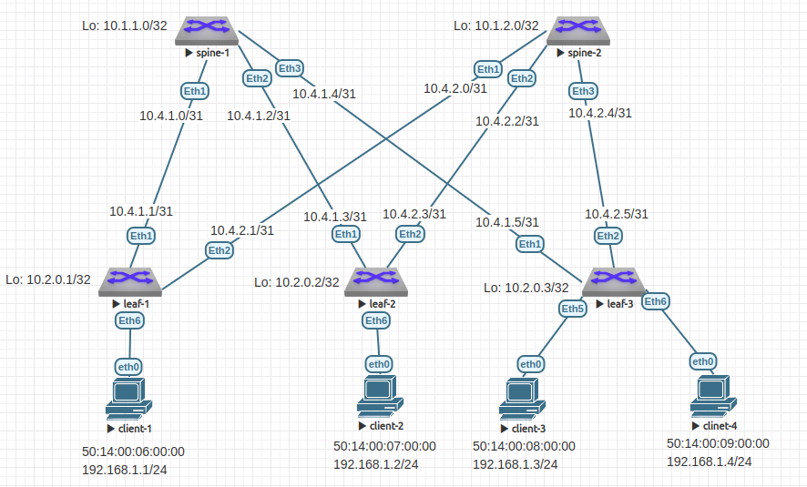

# Домашнее задание №5

## VxLAN. L2 VNI

### Задачи:

- Настроите BGP peering между Leaf и Spine в AF l2vpn evpn
- Настроите связанность между клиентами в первой зоне и убедитесь в её наличии
- Зафиксируете в документации - план работы, адресное пространство, схему сети, конфигурацию устройств

## Выполнение:

### Собранная схема сети



### Таблица адресов

| hostname | interface |   IP/MASK    | Description |
| :------: | :-------: | :----------: | :---------: |
|  leaf-1  | Loopback1 | 10.2.0.1/32  |             |
|  leaf-1  |  Eth1     | 10.4.1.1/31  | to-spine-1  |
|  leaf-1  |  Eth2     | 10.4.2.1/31  | to-spine-2  |
|          |           |              |             |
|  leaf-2  | Loopback1 | 10.2.0.2/32  |             |
|  leaf-2  |  Eth1     | 10.4.1.3/31  | to-spine-1  |
|  leaf-2  |  Eth2     | 10.4.2.3/31  | to-spine-2  |
|          |           |              |             |
|  leaf-3  | Loopback1 | 10.2.0.3/32  |             |
|  leaf-3  |  Eth1     | 10.4.1.5/31  | to-spine-1  |
|  leaf-3  |  Eth2     | 10.4.2.5/31  | to-spine-2  |
|          |           |              |             |
|  spine-1 | Loopback1 | 10.1.1.0/32  |             |
|  spine-1 |  Eth1     | 10.4.1.0/31  |  to-leaf-1  |
|  spine-1 |  Eth2     | 10.4.1.2/31  |  to-leaf-2  |
|  spine-1 |  Eth3     | 10.4.1.4/31  |  to-leaf-3  |
|          |           |              |             |
|  spine-2 | Loopback1 | 10.1.2.0/32  |             |
|  spine-2 |  Eth1     | 10.4.2.0/31  |  to-leaf-1  |
|  spine-2 |  Eth2     | 10.4.2.2/31  |  to-leaf-2  |
|  spine-2 |  Eth3     | 10.4.2.2/31  |  to-leaf-3  |

### Таблица ASN

| hostname | Loopback address |  ASN       |
| :------: | :--------------: | :--------: |
|  leaf-1  | 10.2.0.1/32      | 4200010001 |
|  leaf-2  | 10.2.0.2/32      | 4200010002 |
|  leaf-3  | 10.2.0.3/32      | 4200010003 |
|  spine-1 | 10.1.1.0/32      | 4200000001 |
|  spine-2 | 10.1.2.0/32      | 4200000002 |

### Taблица адресов клиентов

| hostname   |     MAC           | Address        | VLAN | VNI   | Attached to |
| :--------: | :---------------: | :------------: | :--: | :---: | :---------: |
|  client-1  | 50:14:00:06:00:00 | 192.168.1.1/24 |   10 | 10010 | leaf-1      |
|  client-2  | 50:14:00:07:00:00 | 192.168.1.2/24 |   10 | 10010 | leaf-2      |
|  client-3  | 50:14:00:08:00:00 | 192.168.1.3/24 |   10 | 10010 | leaf-3      |
|  client-4  | 50:14:00:09:00:00 | 192.168.1.4/24 |   10 | 10010 | leaf-3      |


### Конфигурация оборудования

- #### [leaf-1](config/leaf-1.conf)

```
hostname leaf-1

ip routing
service routing protocols model multi-agent

vlan 10
exit

router bgp 4200010001
  router-id 10.2.0.1
  neighbor 10.4.1.0 remote-as 4200000001
  neighbor 10.4.1.0 bfd
  neighbor 10.4.1.0 send-community extended
  neighbor 10.4.2.0 remote-as 4200000002
  neighbor 10.4.2.0 bfd
  neighbor 10.4.2.0 send-community extended
  redistribute connected
  timers bgp 3 9
  bgp log-neighbor-changes
  maximum-paths 128

  address-family evpn
      neighbor 10.4.1.0 activate
      neighbor 10.4.2.0 activate
  exit

  vlan 10
    rd 10.2.0.1:10
    route-target export 4200010001:10010
    route-target import 4200010002:10010
    route-target import 4200010003:10010
    redistribute learned
  exit
exit

interface Ethernet1
  description to-spine-1
  no switchport
  ip address 10.4.1.1/31
  no shutdown
  bfd interval 100 min-rx 100 multiplier 3
exit
interface Ethernet 2
  description to-spine-2
  no switchport
  ip address 10.4.2.1/31
  no shutdown
  bfd interval 100 min-rx 100 multiplier 3
exit
interface Ethernet 6
  description to-client-1
  switchport access vlan 10
exit
interface loopback 1
  ip address 10.2.0.1/32
exit
interface Vxlan1
   vxlan udp-port 4789
   vxlan source-interface Loopback1
   vxlan vlan 10 vni 10010
exit
```

- #### [leaf-2](config/leaf-2.conf)

```
hostname leaf-2

vlan 10
exit

ip routing
service routing protocols model multi-agent

router bgp 4200010002
   router-id 10.2.0.2
   neighbor 10.4.1.2 remote-as 4200000001
   neighbor 10.4.1.2 bfd
   neighbor 10.4.1.2 send-community extended
   neighbor 10.4.2.2 remote-as 4200000002
   neighbor 10.4.2.2 bfd
   neighbor 10.4.2.2 send-community extended
   redistribute connected
   timers bgp 3 9
   bgp log-neighbor-changes
   maximum-paths 128

  address-family evpn
      neighbor 10.4.1.2 activate
      neighbor 10.4.2.2 activate
  exit

  vlan 10
    rd 10.2.0.2:10
    route-target export 4200010002:10010
    route-target import 4200010001:10010
    route-target import 4200010003:10010
    redistribute learned
  exit
exit

interface Ethernet 1
  description to-spine-1
  no switchport
  ip address 10.4.1.3/31
  no shutdown
  bfd interval 100 min-rx 100 multiplier 3
exit
interface Ethernet 2
  description to-spine-2
  no switchport
  ip address 10.4.2.3/31
  no shutdown
  bfd interval 100 min-rx 100 multiplier 3
exit
interface Ethernet 6
  description to-client-2
  switchport access vlan 10
exit
interface loopback 1
  ip address 10.2.0.2/32
exit
interface Vxlan1
  vxlan udp-port 4789
  vxlan source-interface Loopback1
  vxlan vlan 10 vni 10010
exit
```

- #### [leaf-3](config/leaf-3.conf)

```
hostname leaf-3

vlan 10
exit

ip routing
service routing protocols model multi-agent

router bgp 4200010003
   router-id 10.2.0.3
   neighbor 10.4.1.4 remote-as 4200000001
   neighbor 10.4.1.4 bfd
   neighbor 10.4.1.4 send-community extended
   neighbor 10.4.2.4 remote-as 4200000002
   neighbor 10.4.2.4 bfd
   neighbor 10.4.2.4 send-community extended
   redistribute connected
   timers bgp 3 9
   bgp log-neighbor-changes
   maximum-paths 128

  address-family evpn
    neighbor 10.4.1.4 activate
    neighbor 10.4.2.4 activate
  exit

  vlan 10
    rd 10.2.0.3:10
    route-target export 4200010003:10010
    route-target import 4200010001:10010
    route-target import 4200010002:10010
    redistribute learned
  exit
exit

interface Ethernet 1
  description to-spine-1
  no switchport
  ip address 10.4.1.5/31
  no shutdown
  bfd interval 100 min-rx 100 multiplier 3
exit
interface Ethernet 2
  description to-spine-2
  no switchport
  ip address 10.4.2.5/31
  no shutdown
  bfd interval 100 min-rx 100 multiplier 3
exit
interface Ethernet 5
  description to-client-3
  switchport access vlan 10
exit
interface Ethernet 6
  description to-client-4
  switchport access vlan 10
exit
interface loopback 1
  ip address 10.2.0.3/32
exit
interface Vxlan1
  vxlan udp-port 4789
  vxlan source-interface Loopback1
  vxlan vlan 10 vni 10010
exit
```

- #### [spine-1](config/spine-1.conf)

```
hostname spine-1

ip routing
service routing protocols model multi-agent

router bgp 4200000001
  router-id 10.1.1.0
  neighbor 10.4.1.1 remote-as 4200010001
  neighbor 10.4.1.1 bfd
  neighbor 10.4.1.3 remote-as 4200010002
  neighbor 10.4.1.3 bfd
  neighbor 10.4.1.5 remote-as 4200010003
  neighbor 10.4.1.5 bfd
  redistribute connected
  timers bgp 3 9
  bgp log-neighbor-changes
  maximum-paths 128

  address-family evpn
    neighbor 10.4.1.1 activate
    neighbor 10.4.1.1 send-community extended
    neighbor 10.4.1.3 activate
    neighbor 10.4.1.3 send-community extended
    neighbor 10.4.1.5 activate
    neighbor 10.4.1.5 send-community extended
  exit
exit

interface Ethernet 1
  description to-leaf-1
  no switchport
  ip address 10.4.1.0/31
  no shutdown
  bfd interval 100 min-rx 100 multiplier 3
exit
interface Ethernet 2
  description to-leaf-2
  no switchport
  ip address 10.4.1.2/31
  no shutdown
  bfd interval 100 min-rx 100 multiplier 3
exit
interface Ethernet 3
  description to-leaf-3
  no switchport
  ip address 10.4.1.4/31
  no shutdown
  bfd interval 100 min-rx 100 multiplier 3
exit
interface loopback 1
  ip address 10.1.1.0/32
```

- #### [spine-2](config/spine-2.conf)

```
hostname spine-2

ip routing
service routing protocols model multi-agent

router bgp 4200000002
  router-id 10.1.2.0
  neighbor 10.4.2.1 remote-as 4200010001
  neighbor 10.4.2.1 bfd
  neighbor 10.4.2.3 remote-as 4200010002
  neighbor 10.4.2.3 bfd
  neighbor 10.4.2.5 remote-as 4200010003
  neighbor 10.4.2.5 bfd
  redistribute connected
  timers bgp 3 9
  bgp log-neighbor-changes
  maximum-paths 128

  address-family evpn
    neighbor 10.4.2.1 activate
    neighbor 10.4.2.1 send-community extended
    neighbor 10.4.2.3 activate
    neighbor 10.4.2.3 send-community extended
    neighbor 10.4.2.5 activate
    neighbor 10.4.2.5 send-community extended
  exit
exit

interface Ethernet 1
  description to-leaf-1
  no switchport
  ip address 10.4.2.0/31
  no shutdown
  bfd interval 100 min-rx 100 multiplier 3
exit
interface Ethernet 2
  description to-leaf-2
  no switchport
  ip address 10.4.2.2/31
  no shutdown
  bfd interval 100 min-rx 100 multiplier 3
exit
interface Ethernet 3
  description to-leaf-3
  no switchport
  ip address 10.4.2.4/31
  no shutdown
  bfd interval 100 min-rx 100 multiplier 3
exit
interface loopback 1
  ip address 10.1.2.0/32
exit
```

### Проверка BGP EVPN

- #### leaf-1

~~~
leaf-1#show bgp evpn summary
BGP summary information for VRF default
Router identifier 10.2.0.1, local AS number 4200010001
Neighbor Status Codes: m - Under maintenance
  Neighbor         V  AS           MsgRcvd   MsgSent  InQ OutQ  Up/Down State   PfxRcd PfxAcc
  10.4.1.0         4  4200000001       767       776    0    0 00:02:15 Estab   5      5
  10.4.2.0         4  4200000002       764       749    0    0 00:02:09 Estab   5      5
~~~

- #### leaf-2

~~~
leaf-2#show bgp evpn summary
BGP summary information for VRF default
Router identifier 10.2.0.2, local AS number 4200010002
Neighbor Status Codes: m - Under maintenance
  Neighbor         V  AS           MsgRcvd   MsgSent  InQ OutQ  Up/Down State   PfxRcd PfxAcc
  10.4.1.2         4  4200000001       865       831    0    0 00:02:42 Estab   5      5
  10.4.2.2         4  4200000002       845       836    0    0 00:02:36 Estab   5      5
~~~

- #### leaf-3

~~~
leaf-3#show bgp evpn summary
BGP summary information for VRF default
Router identifier 10.2.0.3, local AS number 4200010003
Neighbor Status Codes: m - Under maintenance
  Neighbor         V  AS           MsgRcvd   MsgSent  InQ OutQ  Up/Down State   PfxRcd PfxAcc
  10.4.1.4         4  4200000001       894       893    0    0 00:03:43 Estab   4      4
  10.4.2.4         4  4200000002       996       983    0    0 00:03:36 Estab   4      4
~~~


### Проверка Type-2 маршрута

- #### leaf-1

~~~
leaf-1#show bgp evpn route-type mac-ip
BGP routing table information for VRF default
Router identifier 10.2.0.1, local AS number 4200010001
Route status codes: s - suppressed, * - valid, > - active, # - not installed, E - ECMP head, e - ECMP
                    S - Stale, c - Contributing to ECMP, b - backup
                    % - Pending BGP convergence
Origin codes: i - IGP, e - EGP, ? - incomplete
AS Path Attributes: Or-ID - Originator ID, C-LST - Cluster List, LL Nexthop - Link Local Nexthop

          Network                Next Hop              Metric  LocPref Weight  Path
 * >     RD: 10.2.0.1:10 mac-ip 5014.0006.0000
                                -                     -       -       0       i
 * >Ec   RD: 10.2.0.2:10 mac-ip 5014.0007.0000
                                10.2.0.2              -       100     0       4200000001 4200010002 i
 *  ec   RD: 10.2.0.2:10 mac-ip 5014.0007.0000
                                10.2.0.2              -       100     0       4200000002 4200010002 i
 * >Ec   RD: 10.2.0.3:10 mac-ip 5014.0008.0000
                                10.2.0.3              -       100     0       4200000001 4200010003 i
 *  ec   RD: 10.2.0.3:10 mac-ip 5014.0008.0000
                                10.2.0.3              -       100     0       4200000002 4200010003 i
 * >Ec   RD: 10.2.0.3:10 mac-ip 5014.0009.0000
                                10.2.0.3              -       100     0       4200000001 4200010003 i
 *  ec   RD: 10.2.0.3:10 mac-ip 5014.0009.0000
                                10.2.0.3              -       100     0       4200000002 4200010003 i
~~~

- #### leaf-2

~~~
leaf-2#show bgp evpn route-type mac-ip
BGP routing table information for VRF default
Router identifier 10.2.0.2, local AS number 4200010002
Route status codes: s - suppressed, * - valid, > - active, # - not installed, E - ECMP head, e - ECMP
                    S - Stale, c - Contributing to ECMP, b - backup
                    % - Pending BGP convergence
Origin codes: i - IGP, e - EGP, ? - incomplete
AS Path Attributes: Or-ID - Originator ID, C-LST - Cluster List, LL Nexthop - Link Local Nexthop

          Network                Next Hop              Metric  LocPref Weight  Path
 * >Ec   RD: 10.2.0.1:10 mac-ip 5014.0006.0000
                                10.2.0.1              -       100     0       4200000001 4200010001 i
 *  ec   RD: 10.2.0.1:10 mac-ip 5014.0006.0000
                                10.2.0.1              -       100     0       4200000002 4200010001 i
 * >     RD: 10.2.0.2:10 mac-ip 5014.0007.0000
                                -                     -       -       0       i
 * >Ec   RD: 10.2.0.3:10 mac-ip 5014.0008.0000
                                10.2.0.3              -       100     0       4200000001 4200010003 i
 *  ec   RD: 10.2.0.3:10 mac-ip 5014.0008.0000
                                10.2.0.3              -       100     0       4200000002 4200010003 i
 * >Ec   RD: 10.2.0.3:10 mac-ip 5014.0009.0000
                                10.2.0.3              -       100     0       4200000001 4200010003 i
 *  ec   RD: 10.2.0.3:10 mac-ip 5014.0009.0000
                                10.2.0.3              -       100     0       4200000002 4200010003 i
~~~

- #### leaf-3

~~~
leaf-3#show bgp evpn route-type mac-ip
BGP routing table information for VRF default
Router identifier 10.2.0.3, local AS number 4200010003
Route status codes: s - suppressed, * - valid, > - active, # - not installed, E - ECMP head, e - ECMP
                    S - Stale, c - Contributing to ECMP, b - backup
                    % - Pending BGP convergence
Origin codes: i - IGP, e - EGP, ? - incomplete
AS Path Attributes: Or-ID - Originator ID, C-LST - Cluster List, LL Nexthop - Link Local Nexthop

          Network                Next Hop              Metric  LocPref Weight  Path
 * >Ec   RD: 10.2.0.1:10 mac-ip 5014.0006.0000
                                10.2.0.1              -       100     0       4200000002 4200010001 i
 *  ec   RD: 10.2.0.1:10 mac-ip 5014.0006.0000
                                10.2.0.1              -       100     0       4200000001 4200010001 i
 * >Ec   RD: 10.2.0.2:10 mac-ip 5014.0007.0000
                                10.2.0.2              -       100     0       4200000002 4200010002 i
 *  ec   RD: 10.2.0.2:10 mac-ip 5014.0007.0000
                                10.2.0.2              -       100     0       4200000001 4200010002 i
 * >     RD: 10.2.0.3:10 mac-ip 5014.0008.0000
                                -                     -       -       0       i
 * >     RD: 10.2.0.3:10 mac-ip 5014.0009.0000
                                -                     -       -       0       i
~~~

### Проверка доступности

- #### client-1

~~~
vyos@client-1:~$ ping 192.168.1.2
PING 192.168.1.2 (192.168.1.2) 56(84) bytes of data.
64 bytes from 192.168.1.2: icmp_seq=1 ttl=64 time=37.9 ms
64 bytes from 192.168.1.2: icmp_seq=2 ttl=64 time=49.7 ms
64 bytes from 192.168.1.2: icmp_seq=3 ttl=64 time=240 ms
64 bytes from 192.168.1.2: icmp_seq=4 ttl=64 time=181 ms
64 bytes from 192.168.1.2: icmp_seq=5 ttl=64 time=55.5 ms

--- 192.168.1.2 ping statistics ---
5 packets transmitted, 5 received, 0% packet loss, time 4003ms
rtt min/avg/max/mdev = 37.922/112.734/239.812/82.007 ms
vyos@client-1:~$ ping 192.168.1.3
PING 192.168.1.3 (192.168.1.3) 56(84) bytes of data.
64 bytes from 192.168.1.3: icmp_seq=1 ttl=64 time=37.0 ms
64 bytes from 192.168.1.3: icmp_seq=2 ttl=64 time=74.4 ms
64 bytes from 192.168.1.3: icmp_seq=3 ttl=64 time=37.9 ms
64 bytes from 192.168.1.3: icmp_seq=4 ttl=64 time=28.0 ms
64 bytes from 192.168.1.3: icmp_seq=5 ttl=64 time=43.3 ms

--- 192.168.1.3 ping statistics ---
5 packets transmitted, 5 received, 0% packet loss, time 4007ms
rtt min/avg/max/mdev = 28.043/44.143/74.396/15.902 ms
vyos@client-1:~$ ping 192.168.1.4
PING 192.168.1.4 (192.168.1.4) 56(84) bytes of data.
64 bytes from 192.168.1.4: icmp_seq=1 ttl=64 time=38.0 ms
64 bytes from 192.168.1.4: icmp_seq=2 ttl=64 time=19.7 ms
64 bytes from 192.168.1.4: icmp_seq=3 ttl=64 time=40.0 ms
64 bytes from 192.168.1.4: icmp_seq=4 ttl=64 time=36.1 ms
64 bytes from 192.168.1.4: icmp_seq=5 ttl=64 time=27.4 ms

--- 192.168.1.4 ping statistics ---
5 packets transmitted, 5 received, 0% packet loss, time 4007ms
rtt min/avg/max/mdev = 19.692/32.252/40.038/7.618 ms
~~~

- #### client-2

~~~
vyos@client-2:~$ ping 192.168.1.1
PING 192.168.1.1 (192.168.1.1) 56(84) bytes of data.
64 bytes from 192.168.1.1: icmp_seq=1 ttl=64 time=42.2 ms
64 bytes from 192.168.1.1: icmp_seq=2 ttl=64 time=36.0 ms
64 bytes from 192.168.1.1: icmp_seq=3 ttl=64 time=23.5 ms
64 bytes from 192.168.1.1: icmp_seq=4 ttl=64 time=32.2 ms
64 bytes from 192.168.1.1: icmp_seq=5 ttl=64 time=25.0 ms

--- 192.168.1.1 ping statistics ---
5 packets transmitted, 5 received, 0% packet loss, time 4007ms
rtt min/avg/max/mdev = 23.523/31.799/42.246/6.951 ms
vyos@client-2:~$ ping 192.168.1.3
PING 192.168.1.3 (192.168.1.3) 56(84) bytes of data.
64 bytes from 192.168.1.3: icmp_seq=1 ttl=64 time=135 ms
64 bytes from 192.168.1.3: icmp_seq=2 ttl=64 time=21.1 ms
64 bytes from 192.168.1.3: icmp_seq=3 ttl=64 time=137 ms
64 bytes from 192.168.1.3: icmp_seq=4 ttl=64 time=32.8 ms
64 bytes from 192.168.1.3: icmp_seq=5 ttl=64 time=29.5 ms

--- 192.168.1.3 ping statistics ---
5 packets transmitted, 5 received, 0% packet loss, time 4004ms
rtt min/avg/max/mdev = 21.060/71.172/137.363/53.262 ms
vyos@client-2:~$ ping 192.168.1.4
PING 192.168.1.4 (192.168.1.4) 56(84) bytes of data.
64 bytes from 192.168.1.4: icmp_seq=1 ttl=64 time=66.8 ms
64 bytes from 192.168.1.4: icmp_seq=2 ttl=64 time=26.0 ms
64 bytes from 192.168.1.4: icmp_seq=3 ttl=64 time=26.6 ms
64 bytes from 192.168.1.4: icmp_seq=4 ttl=64 time=25.1 ms
64 bytes from 192.168.1.4: icmp_seq=5 ttl=64 time=43.4 ms

--- 192.168.1.4 ping statistics ---
5 packets transmitted, 5 received, 0% packet loss, time 4009ms
rtt min/avg/max/mdev = 25.069/37.571/66.815/16.131 ms
~~~

- #### client-3

~~~
vyos@client-3:~$ ping 192.168.1.1
PING 192.168.1.1 (192.168.1.1) 56(84) bytes of data.
64 bytes from 192.168.1.1: icmp_seq=1 ttl=64 time=31.4 ms
64 bytes from 192.168.1.1: icmp_seq=2 ttl=64 time=42.9 ms
64 bytes from 192.168.1.1: icmp_seq=3 ttl=64 time=25.9 ms
64 bytes from 192.168.1.1: icmp_seq=4 ttl=64 time=43.2 ms
64 bytes from 192.168.1.1: icmp_seq=5 ttl=64 time=112 ms

--- 192.168.1.1 ping statistics ---
5 packets transmitted, 5 received, 0% packet loss, time 4008ms
rtt min/avg/max/mdev = 25.893/51.089/112.113/31.229 ms
vyos@client-3:~$ ping 192.168.1.2
PING 192.168.1.2 (192.168.1.2) 56(84) bytes of data.
64 bytes from 192.168.1.2: icmp_seq=1 ttl=64 time=92.4 ms
64 bytes from 192.168.1.2: icmp_seq=2 ttl=64 time=61.0 ms
64 bytes from 192.168.1.2: icmp_seq=3 ttl=64 time=30.4 ms
64 bytes from 192.168.1.2: icmp_seq=4 ttl=64 time=796 ms
64 bytes from 192.168.1.2: icmp_seq=7 ttl=64 time=197 ms

--- 192.168.1.2 ping statistics ---
7 packets transmitted, 5 received, 28.5714% packet loss, time 6074ms
rtt min/avg/max/mdev = 30.389/235.370/796.419/286.054 ms
vyos@client-3:~$ ping 192.168.1.4
PING 192.168.1.4 (192.168.1.4) 56(84) bytes of data.
64 bytes from 192.168.1.4: icmp_seq=1 ttl=64 time=26.1 ms
64 bytes from 192.168.1.4: icmp_seq=2 ttl=64 time=7.60 ms
64 bytes from 192.168.1.4: icmp_seq=3 ttl=64 time=6.07 ms
64 bytes from 192.168.1.4: icmp_seq=4 ttl=64 time=6.13 ms
64 bytes from 192.168.1.4: icmp_seq=5 ttl=64 time=6.15 ms

--- 192.168.1.4 ping statistics ---
5 packets transmitted, 5 received, 0% packet loss, time 4007ms
rtt min/avg/max/mdev = 6.073/10.414/26.125/7.876 ms
~~~

- #### client-4

~~~
vyos@client-4:~$ ping 192.168.1.1
PING 192.168.1.1 (192.168.1.1) 56(84) bytes of data.
64 bytes from 192.168.1.1: icmp_seq=1 ttl=64 time=48.3 ms
64 bytes from 192.168.1.1: icmp_seq=2 ttl=64 time=20.2 ms
64 bytes from 192.168.1.1: icmp_seq=3 ttl=64 time=48.0 ms
64 bytes from 192.168.1.1: icmp_seq=4 ttl=64 time=45.4 ms
64 bytes from 192.168.1.1: icmp_seq=5 ttl=64 time=35.5 ms

--- 192.168.1.1 ping statistics ---
5 packets transmitted, 5 received, 0% packet loss, time 4007ms
rtt min/avg/max/mdev = 20.236/39.497/48.313/10.700 ms
vyos@client-4:~$ ping 192.168.1.2
PING 192.168.1.2 (192.168.1.2) 56(84) bytes of data.
64 bytes from 192.168.1.2: icmp_seq=1 ttl=64 time=47.4 ms
64 bytes from 192.168.1.2: icmp_seq=2 ttl=64 time=24.1 ms
64 bytes from 192.168.1.2: icmp_seq=3 ttl=64 time=33.5 ms
64 bytes from 192.168.1.2: icmp_seq=4 ttl=64 time=21.5 ms
64 bytes from 192.168.1.2: icmp_seq=5 ttl=64 time=60.1 ms

--- 192.168.1.2 ping statistics ---
5 packets transmitted, 5 received, 0% packet loss, time 4010ms
rtt min/avg/max/mdev = 21.543/37.339/60.120/14.563 ms
vyos@client-4:~$ ping 192.168.1.3
PING 192.168.1.3 (192.168.1.3) 56(84) bytes of data.
64 bytes from 192.168.1.3: icmp_seq=1 ttl=64 time=8.40 ms
64 bytes from 192.168.1.3: icmp_seq=2 ttl=64 time=13.2 ms
64 bytes from 192.168.1.3: icmp_seq=3 ttl=64 time=8.44 ms
64 bytes from 192.168.1.3: icmp_seq=4 ttl=64 time=126 ms
64 bytes from 192.168.1.3: icmp_seq=5 ttl=64 time=6.71 ms

--- 192.168.1.3 ping statistics ---
5 packets transmitted, 5 received, 0% packet loss, time 4006ms
rtt min/avg/max/mdev = 6.706/32.595/126.259/46.881 ms
~~~
