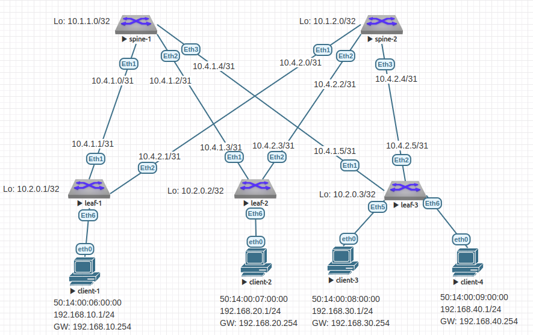

# Домашнее задание №6

## VxLAN. L3 VNI

### Задачи:

- Настроите каждого клиента в своем VNI
- Настроите маршрутизацию между клиентами.
- Зафиксируете в документации - план работы, адресное пространство, схему сети, конфигурацию устройств

## Выполнение:

### Собранная схема сети



### Таблица адресов

| hostname | interface |   IP/MASK    | Description |
| :------: | :-------: | :----------: | :---------: |
|  leaf-1  | Loopback1 | 10.2.0.1/32  |             |
|  leaf-1  |  Eth1     | 10.4.1.1/31  | to-spine-1  |
|  leaf-1  |  Eth2     | 10.4.2.1/31  | to-spine-2  |
|          |           |              |             |
|  leaf-2  | Loopback1 | 10.2.0.2/32  |             |
|  leaf-2  |  Eth1     | 10.4.1.3/31  | to-spine-1  |
|  leaf-2  |  Eth2     | 10.4.2.3/31  | to-spine-2  |
|          |           |              |             |
|  leaf-3  | Loopback1 | 10.2.0.3/32  |             |
|  leaf-3  |  Eth1     | 10.4.1.5/31  | to-spine-1  |
|  leaf-3  |  Eth2     | 10.4.2.5/31  | to-spine-2  |
|          |           |              |             |
|  spine-1 | Loopback1 | 10.1.1.0/32  |             |
|  spine-1 |  Eth1     | 10.4.1.0/31  |  to-leaf-1  |
|  spine-1 |  Eth2     | 10.4.1.2/31  |  to-leaf-2  |
|  spine-1 |  Eth3     | 10.4.1.4/31  |  to-leaf-3  |
|          |           |              |             |
|  spine-2 | Loopback1 | 10.1.2.0/32  |             |
|  spine-2 |  Eth1     | 10.4.2.0/31  |  to-leaf-1  |
|  spine-2 |  Eth2     | 10.4.2.2/31  |  to-leaf-2  |
|  spine-2 |  Eth3     | 10.4.2.2/31  |  to-leaf-3  |

### Таблица ASN

| hostname | Loopback address |  ASN       |
| :------: | :--------------: | :--------: |
|  leaf-1  | 10.2.0.1/32      | 4200010001 |
|  leaf-2  | 10.2.0.2/32      | 4200010002 |
|  leaf-3  | 10.2.0.3/32      | 4200010003 |
|  spine-1 | 10.1.1.0/32      | 4200000001 |
|  spine-2 | 10.1.2.0/32      | 4200000002 |

### Taблица адресов клиентов

| name       |     MAC           | Address        | VLAN | VNI   | Attached to |
| :--------: | :---------------: | :------------: | :--: | :---: | :---------: |
|  client-1  | 50:14:00:06:00:00 | 192.168.10.1/24|   10 | 10010 | leaf-1      |
|  client-2  | 50:14:00:07:00:00 | 192.168.20.1/24|   20 | 10020 | leaf-2      |
|  client-3  | 50:14:00:08:00:00 | 192.168.30.1/24|   30 | 10030 | leaf-3      |
|  client-4  | 50:14:00:09:00:00 | 192.168.40.1/24|   40 | 10040 | leaf-3      |

### Таблица VLAN VNI

| VLAN | VNI   | Type        |
| :--: | :---: | :---------: |
| 1000 | 10000 | L3VNI       |
|   10 | 10010 | L2VNI       |
|   20 | 10020 | L2VNI       |
|   30 | 10030 | L2VNI       |
|   40 | 10040 | L2VNI       |

### Адреса виртуальных шлюзов

| VLAN | VNI   | SAG IP            | SAG MAC           |
| :--: | :---: | :---------------: | :---------------: |
|   10 | 10010 | 192.168.10.254/24 | 00:00:00:01:01:01 |
|   20 | 10020 | 192.168.20.254/24 | 00:00:00:01:01:01 |
|   30 | 10030 | 192.168.30.254/24 | 00:00:00:01:01:01 |
|   40 | 10040 | 192.168.40.254/24 | 00:00:00:01:01:01 |

### Конфигурация оборудования

- #### [leaf-1](config/leaf-1.conf)

```
hostname leaf-1

ip routing
service routing protocols model multi-agent

vlan 10
exit
vlan 1000
exit

vrf instance Vrf-red
exit
ip routing vrf Vrf-red
ip virtual-router mac-address 00:00:00:01:01:01

router bgp 4200010001
  router-id 10.2.0.1
  neighbor SPINE peer group
  neighbor SPINE bfd
  neighbor SPINE send-community extended
  neighbor 10.4.1.0 remote-as 4200000001
  neighbor 10.4.1.0 peer group SPINE
  neighbor 10.4.2.0 remote-as 4200000002
  neighbor 10.4.2.0 peer group SPINE
  redistribute connected
  timers bgp 3 9
  bgp log-neighbor-changes
  maximum-paths 128

  address-family evpn
      neighbor 10.4.1.0 activate
      neighbor 10.4.2.0 activate
  exit

  vlan 10
    rd 10.2.0.1:10
    route-target export 4200010001:10010
    redistribute learned
  exit

  vlan 1000
    rd 10.2.0.1:1000
    route-target export 4200010001:10000
    route-target import 4200010002:10000
    route-target import 4200010003:10000
    redistribute learned
  exit

  vrf Vrf-red
    rd 10.2.0.1:1000
    redistribute connected
    address-family ipv4
      route-target export evpn 4200010001:10000
      route-target import evpn 4200010002:10000
      route-target import evpn 4200010003:10000
    exit
  exit
exit

interface Ethernet1
  description to-spine-1
  no switchport
  ip address 10.4.1.1/31
  no shutdown
  bfd interval 100 min-rx 100 multiplier 3
exit
interface Ethernet 2
  description to-spine-2
  no switchport
  ip address 10.4.2.1/31
  no shutdown
  bfd interval 100 min-rx 100 multiplier 3
exit
interface Ethernet 6
  description to-client-1
  switchport access vlan 10
exit
interface loopback 1
  ip address 10.2.0.1/32
exit
interface Vlan 10
  vrf Vrf-red
  ip address virtual 192.168.10.254/24
exit
interface Vxlan1
  vxlan udp-port 4789
  vxlan source-interface Loopback1
  vxlan vlan 10 vni 10010
  vxlan vrf Vrf-red vni 10000
exit
```

- #### [leaf-2](config/leaf-2.conf)

```
hostname leaf-2

ip routing
service routing protocols model multi-agent

vlan 20
exit
vlan 1000
exit

vrf instance Vrf-red
exit
ip routing vrf Vrf-red
ip virtual-router mac-address 00:00:00:01:01:01

router bgp 4200010002
  router-id 10.2.0.2
  neighbor SPINE peer group
  neighbor SPINE bfd
  neighbor SPINE send-community extended
  neighbor 10.4.1.2 remote-as 4200000001
  neighbor 10.4.1.2 peer group SPINE
  neighbor 10.4.2.2 remote-as 4200000002
  neighbor 10.4.2.2 peer group SPINE
  redistribute connected
  timers bgp 3 9
  bgp log-neighbor-changes
  maximum-paths 128

  address-family evpn
      neighbor 10.4.1.2 activate
      neighbor 10.4.2.2 activate
  exit

  vlan 20
    rd 10.2.0.2:20
    route-target export 4200010002:10020
    redistribute learned
  exit

  vlan 1000
    rd 10.2.0.2:1000
    route-target export 4200010002:10000
    route-target import 4200010001:10000
    route-target import 4200010003:10000
    redistribute learned
  exit

  vrf Vrf-red
    rd 10.2.0.2:1000
    redistribute connected
    address-family ipv4
      route-target export evpn 4200010002:10000
      route-target import evpn 4200010001:10000
      route-target import evpn 4200010003:10000
    exit
  exit

exit

interface Ethernet 1
  description to-spine-1
  no switchport
  ip address 10.4.1.3/31
  no shutdown
  bfd interval 100 min-rx 100 multiplier 3
exit
interface Ethernet 2
  description to-spine-2
  no switchport
  ip address 10.4.2.3/31
  no shutdown
  bfd interval 100 min-rx 100 multiplier 3
exit
interface Ethernet 6
  description to-client-2
  switchport access vlan 20
exit
interface loopback 1
  ip address 10.2.0.2/32
exit

interface Vlan 20
  vrf Vrf-red
  ip address virtual 192.168.20.254/24
exit

interface Vxlan1
  vxlan udp-port 4789
  vxlan source-interface Loopback1
  vxlan vlan 20 vni 10020
  vxlan vrf Vrf-red vni 10000
exit
```

- #### [leaf-3](config/leaf-3.conf)

```
hostname leaf-3

ip routing
service routing protocols model multi-agent

vlan 30
exit
vlan 40
exit
vlan 1000
exit

vrf instance Vrf-red
exit
ip routing vrf Vrf-red
ip virtual-router mac-address 00:00:00:01:01:01

router bgp 4200010003
  router-id 10.2.0.3
  neighbor SPINE peer group
  neighbor SPINE bfd
  neighbor SPINE send-community extended
  neighbor 10.4.1.4 remote-as 4200000001
  neighbor 10.4.1.4 peer group SPINE
  neighbor 10.4.2.4 remote-as 4200000002
  neighbor 10.4.2.4 peer group SPINE
  redistribute connected
  timers bgp 3 9
  bgp log-neighbor-changes
  maximum-paths 128

  address-family evpn
    neighbor 10.4.1.4 activate
    neighbor 10.4.2.4 activate
  exit

  vlan 30
    rd 10.2.0.3:30
    route-target export 4200010003:10030
    redistribute learned
  exit
  vlan 40
    rd 10.2.0.3:40
    route-target export 4200010003:10040
    redistribute learned
  exit

  vlan 1000
    rd 10.2.0.3:1000
    route-target export 4200010003:10000
    route-target import 4200010001:10000
    route-target import 4200010002:10000
    redistribute learned
  exit

  vrf Vrf-red
    rd 10.2.0.3:1000
    redistribute connected
    address-family ipv4
      route-target export evpn 4200010003:10000
      route-target import evpn 4200010001:10000
      route-target import evpn 4200010002:10000
    exit
  exit

exit

interface Ethernet 1
  description to-spine-1
  no switchport
  ip address 10.4.1.5/31
  no shutdown
  bfd interval 100 min-rx 100 multiplier 3
exit
interface Ethernet 2
  description to-spine-2
  no switchport
  ip address 10.4.2.5/31
  no shutdown
  bfd interval 100 min-rx 100 multiplier 3
exit
interface Ethernet 5
  description to-client-3
  switchport access vlan 30
exit
interface Ethernet 6
  description to-client-4
  switchport access vlan 40
exit
interface loopback 1
  ip address 10.2.0.3/32
exit
interface Vlan 30
  vrf Vrf-red
  ip address virtual 192.168.30.254/24
exit
interface Vlan 40
  vrf Vrf-red
  ip address virtual 192.168.40.254/24
exit
interface Vxlan1
  vxlan udp-port 4789
  vxlan source-interface Loopback1
  vxlan vlan 30 vni 10030
  vxlan vlan 40 vni 10040
  vxlan vrf Vrf-red vni 10000
exit
```

- #### [spine-1](config/spine-1.conf)

```
hostname spine-1

ip routing
service routing protocols model multi-agent

router bgp 4200000001
  router-id 10.1.1.0
  neighbor LEAF peer group
  neighbor LEAF bfd
  neighbor LEAF send-community extended
  neighbor 10.4.1.1 remote-as 4200010001
  neighbor 10.4.1.1 peer group LEAF
  neighbor 10.4.1.3 remote-as 4200010002
  neighbor 10.4.1.3 peer group LEAF
  neighbor 10.4.1.5 remote-as 4200010003
  neighbor 10.4.1.5 peer group LEAF
  redistribute connected
  timers bgp 3 9
  bgp log-neighbor-changes
  maximum-paths 128

  address-family evpn
    neighbor 10.4.1.1 activate
    neighbor 10.4.1.3 activate
    neighbor 10.4.1.5 activate
  exit
exit

interface Ethernet 1
  description to-leaf-1
  no switchport
  ip address 10.4.1.0/31
  no shutdown
  bfd interval 100 min-rx 100 multiplier 3
exit
interface Ethernet 2
  description to-leaf-2
  no switchport
  ip address 10.4.1.2/31
  no shutdown
  bfd interval 100 min-rx 100 multiplier 3
exit
interface Ethernet 3
  description to-leaf-3
  no switchport
  ip address 10.4.1.4/31
  no shutdown
  bfd interval 100 min-rx 100 multiplier 3
exit
interface loopback 1
  ip address 10.1.1.0/32
exit
end
```

- #### [spine-2](config/spine-2.conf)

```
hostname spine-2

ip routing
service routing protocols model multi-agent

router bgp 4200000002
  router-id 10.1.2.0
  neighbor LEAF peer group
  neighbor LEAF bfd
  neighbor LEAF send-community extended
  neighbor 10.4.2.1 remote-as 4200010001
  neighbor 10.4.2.1 peer group LEAF
  neighbor 10.4.2.3 remote-as 4200010002
  neighbor 10.4.2.3 peer group LEAF
  neighbor 10.4.2.5 remote-as 4200010003
  neighbor 10.4.2.5 peer group LEAF
  redistribute connected
  timers bgp 3 9
  bgp log-neighbor-changes
  maximum-paths 128

  address-family evpn
    neighbor 10.4.2.1 activate
    neighbor 10.4.2.3 activate
    neighbor 10.4.2.5 activate
  exit
exit

interface Ethernet 1
  description to-leaf-1
  no switchport
  ip address 10.4.2.0/31
  no shutdown
  bfd interval 100 min-rx 100 multiplier 3
exit
interface Ethernet 2
  description to-leaf-2
  no switchport
  ip address 10.4.2.2/31
  no shutdown
  bfd interval 100 min-rx 100 multiplier 3
exit
interface Ethernet 3
  description to-leaf-3
  no switchport
  ip address 10.4.2.4/31
  no shutdown
  bfd interval 100 min-rx 100 multiplier 3
exit
interface loopback 1
  ip address 10.1.2.0/32
exit
```

### Проверка BGP EVPN

- #### leaf-1

~~~
leaf-1#show bgp evpn summary
BGP summary information for VRF default
Router identifier 10.2.0.1, local AS number 4200010001
Neighbor Status Codes: m - Under maintenance
  Neighbor         V  AS           MsgRcvd   MsgSent  InQ OutQ  Up/Down State   PfxRcd PfxAcc
  10.4.1.0         4  4200000001       888       879    0    0 00:05:19 Estab   12     12
  10.4.2.0         4  4200000002       395       371    0    0 00:05:19 Estab   12     12
~~~

- #### leaf-2

~~~
leaf-2#show bgp evpn summary
BGP summary information for VRF default
Router identifier 10.2.0.2, local AS number 4200010002
Neighbor Status Codes: m - Under maintenance
  Neighbor         V  AS           MsgRcvd   MsgSent  InQ OutQ  Up/Down State   PfxRcd PfxAcc
  10.4.1.2         4  4200000001       972       966    0    0 00:01:39 Estab   12     12
  10.4.2.2         4  4200000002       546       534    0    0 00:01:39 Estab   12     12
~~~

- #### leaf-3

~~~
leaf-3#show bgp evpn summary
BGP summary information for VRF default
Router identifier 10.2.0.3, local AS number 4200010003
Neighbor Status Codes: m - Under maintenance
  Neighbor         V  AS           MsgRcvd   MsgSent  InQ OutQ  Up/Down State   PfxRcd PfxAcc
  10.4.1.4         4  4200000001       494       452    0    0 00:10:51 Estab   8      8
  10.4.2.4         4  4200000002       378       373    0    0 00:07:32 Estab   8      8
~~~


### Проверка EVPN маршрутов

- #### leaf-1

~~~
leaf-1#show bgp evpn
BGP routing table information for VRF default
Router identifier 10.2.0.1, local AS number 4200010001
Route status codes: s - suppressed, * - valid, > - active, # - not installed, E - ECMP head, e - ECMP
                    S - Stale, c - Contributing to ECMP, b - backup
                    % - Pending BGP convergence
Origin codes: i - IGP, e - EGP, ? - incomplete
AS Path Attributes: Or-ID - Originator ID, C-LST - Cluster List, LL Nexthop - Link Local Nexthop

          Network                Next Hop              Metric  LocPref Weight  Path
 * >     RD: 10.2.0.1:10 mac-ip 5014.0006.0000
                                -                     -       -       0       i
 * >     RD: 10.2.0.1:10 mac-ip 5014.0006.0000 192.168.10.1
                                -                     -       -       0       i
 * >Ec   RD: 10.2.0.2:20 mac-ip 5014.0007.0000
                                10.2.0.2              -       100     0       4200000002 4200010002 i
 *  ec   RD: 10.2.0.2:20 mac-ip 5014.0007.0000
                                10.2.0.2              -       100     0       4200000001 4200010002 i
 * >Ec   RD: 10.2.0.2:20 mac-ip 5014.0007.0000 192.168.20.1
                                10.2.0.2              -       100     0       4200000002 4200010002 i
 *  ec   RD: 10.2.0.2:20 mac-ip 5014.0007.0000 192.168.20.1
                                10.2.0.2              -       100     0       4200000001 4200010002 i
 * >Ec   RD: 10.2.0.3:30 mac-ip 5014.0008.0000
                                10.2.0.3              -       100     0       4200000001 4200010003 i
 *  ec   RD: 10.2.0.3:30 mac-ip 5014.0008.0000
                                10.2.0.3              -       100     0       4200000002 4200010003 i
 * >Ec   RD: 10.2.0.3:30 mac-ip 5014.0008.0000 192.168.30.1
                                10.2.0.3              -       100     0       4200000001 4200010003 i
 *  ec   RD: 10.2.0.3:30 mac-ip 5014.0008.0000 192.168.30.1
                                10.2.0.3              -       100     0       4200000002 4200010003 i
 * >Ec   RD: 10.2.0.3:40 mac-ip 5014.0009.0000
                                10.2.0.3              -       100     0       4200000001 4200010003 i
 *  ec   RD: 10.2.0.3:40 mac-ip 5014.0009.0000
                                10.2.0.3              -       100     0       4200000002 4200010003 i
 * >Ec   RD: 10.2.0.3:40 mac-ip 5014.0009.0000 192.168.40.1
                                10.2.0.3              -       100     0       4200000001 4200010003 i
 *  ec   RD: 10.2.0.3:40 mac-ip 5014.0009.0000 192.168.40.1
                                10.2.0.3              -       100     0       4200000002 4200010003 i
 * >     RD: 10.2.0.1:10 imet 10.2.0.1
                                -                     -       -       0       i
 * >Ec   RD: 10.2.0.2:20 imet 10.2.0.2
                                10.2.0.2              -       100     0       4200000002 4200010002 i
 *  ec   RD: 10.2.0.2:20 imet 10.2.0.2
                                10.2.0.2              -       100     0       4200000001 4200010002 i
 * >Ec   RD: 10.2.0.3:30 imet 10.2.0.3
                                10.2.0.3              -       100     0       4200000001 4200010003 i
 *  ec   RD: 10.2.0.3:30 imet 10.2.0.3
                                10.2.0.3              -       100     0       4200000002 4200010003 i
 * >Ec   RD: 10.2.0.3:40 imet 10.2.0.3
                                 10.2.0.3              -       100     0       4200000001 4200010003 i
 *  ec   RD: 10.2.0.3:40 imet 10.2.0.3
                                10.2.0.3              -       100     0       4200000002 4200010003 i
 * >     RD: 10.2.0.1:1000 ip-prefix 192.168.10.0/24
                                -                     -       -       0       i
 * >Ec   RD: 10.2.0.2:1000 ip-prefix 192.168.20.0/24
                                10.2.0.2              -       100     0       4200000002 4200010002 i
 *  ec   RD: 10.2.0.2:1000 ip-prefix 192.168.20.0/24
                                10.2.0.2              -       100     0       4200000001 4200010002 i
 * >Ec   RD: 10.2.0.3:1000 ip-prefix 192.168.30.0/24
                                10.2.0.3              -       100     0       4200000001 4200010003 i
 *  ec   RD: 10.2.0.3:1000 ip-prefix 192.168.30.0/24
                                10.2.0.3              -       100     0       4200000002 4200010003 i
 * >Ec   RD: 10.2.0.3:1000 ip-prefix 192.168.40.0/24
                                10.2.0.3              -       100     0       4200000001 4200010003 i
 *  ec   RD: 10.2.0.3:1000 ip-prefix 192.168.40.0/24
                                10.2.0.3              -       100     0       4200000002 4200010003 i
~~~

- #### leaf-2

~~~
leaf-2#show bgp evpn
BGP routing table information for VRF default
Router identifier 10.2.0.2, local AS number 4200010002
Route status codes: s - suppressed, * - valid, > - active, # - not installed, E - ECMP head, e - ECMP
                    S - Stale, c - Contributing to ECMP, b - backup
                    % - Pending BGP convergence
Origin codes: i - IGP, e - EGP, ? - incomplete
AS Path Attributes: Or-ID - Originator ID, C-LST - Cluster List, LL Nexthop - Link Local Nexthop

          Network                Next Hop              Metric  LocPref Weight  Path
 * >Ec   RD: 10.2.0.1:10 mac-ip 5014.0006.0000
                                10.2.0.1              -       100     0       4200000001 4200010001 i
 *  ec   RD: 10.2.0.1:10 mac-ip 5014.0006.0000
                                10.2.0.1              -       100     0       4200000002 4200010001 i
 * >Ec   RD: 10.2.0.1:10 mac-ip 5014.0006.0000 192.168.10.1
                                10.2.0.1              -       100     0       4200000002 4200010001 i
 *  ec   RD: 10.2.0.1:10 mac-ip 5014.0006.0000 192.168.10.1
                                10.2.0.1              -       100     0       4200000001 4200010001 i
 * >     RD: 10.2.0.2:20 mac-ip 5014.0007.0000
                                -                     -       -       0       i
 * >     RD: 10.2.0.2:20 mac-ip 5014.0007.0000 192.168.20.1
                                -                     -       -       0       i
 * >Ec   RD: 10.2.0.3:30 mac-ip 5014.0008.0000
                                10.2.0.3              -       100     0       4200000001 4200010003 i
 *  ec   RD: 10.2.0.3:30 mac-ip 5014.0008.0000
                                10.2.0.3              -       100     0       4200000002 4200010003 i
 * >Ec   RD: 10.2.0.3:30 mac-ip 5014.0008.0000 192.168.30.1
                                10.2.0.3              -       100     0       4200000001 4200010003 i
 *  ec   RD: 10.2.0.3:30 mac-ip 5014.0008.0000 192.168.30.1
                                10.2.0.3              -       100     0       4200000002 4200010003 i
 * >Ec   RD: 10.2.0.3:40 mac-ip 5014.0009.0000
                                10.2.0.3              -       100     0       4200000001 4200010003 i
 *  ec   RD: 10.2.0.3:40 mac-ip 5014.0009.0000
                                10.2.0.3              -       100     0       4200000002 4200010003 i
 * >Ec   RD: 10.2.0.3:40 mac-ip 5014.0009.0000 192.168.40.1
                                10.2.0.3              -       100     0       4200000001 4200010003 i
 *  ec   RD: 10.2.0.3:40 mac-ip 5014.0009.0000 192.168.40.1
                                10.2.0.3              -       100     0       4200000002 4200010003 i
 * >Ec   RD: 10.2.0.1:10 imet 10.2.0.1
                                10.2.0.1              -       100     0       4200000001 4200010001 i
 *  ec   RD: 10.2.0.1:10 imet 10.2.0.1
                                10.2.0.1              -       100     0       4200000002 4200010001 i
 * >     RD: 10.2.0.2:20 imet 10.2.0.2
                                -                     -       -       0       i
 * >Ec   RD: 10.2.0.3:30 imet 10.2.0.3
                                10.2.0.3              -       100     0       4200000001 4200010003 i
 *  ec   RD: 10.2.0.3:30 imet 10.2.0.3
                                10.2.0.3              -       100     0       4200000002 4200010003 i
 * >Ec   RD: 10.2.0.3:40 imet 10.2.0.3
                                10.2.0.3              -       100     0       4200000001 4200010003 i
 *  ec   RD: 10.2.0.3:40 imet 10.2.0.3
                                10.2.0.3              -       100     0       4200000002 4200010003 i
 * >Ec   RD: 10.2.0.1:1000 ip-prefix 192.168.10.0/24
                                 10.2.0.1              -       100     0       4200000001 4200010001 i
 *  ec   RD: 10.2.0.1:1000 ip-prefix 192.168.10.0/24
                                10.2.0.1              -       100     0       4200000002 4200010001 i
 * >     RD: 10.2.0.2:1000 ip-prefix 192.168.20.0/24
                                -                     -       -       0       i
 * >Ec   RD: 10.2.0.3:1000 ip-prefix 192.168.30.0/24
                                10.2.0.3              -       100     0       4200000001 4200010003 i
 *  ec   RD: 10.2.0.3:1000 ip-prefix 192.168.30.0/24
                                10.2.0.3              -       100     0       4200000002 4200010003 i
 * >Ec   RD: 10.2.0.3:1000 ip-prefix 192.168.40.0/24
                                10.2.0.3              -       100     0       4200000001 4200010003 i
 *  ec   RD: 10.2.0.3:1000 ip-prefix 192.168.40.0/24
                                10.2.0.3              -       100     0       4200000002 4200010003 i
~~~

- #### leaf-3

~~~
leaf-3#show bgp evpn
BGP routing table information for VRF default
Router identifier 10.2.0.3, local AS number 4200010003
Route status codes: s - suppressed, * - valid, > - active, # - not installed, E - ECMP head, e - ECMP
                    S - Stale, c - Contributing to ECMP, b - backup
                    % - Pending BGP convergence
Origin codes: i - IGP, e - EGP, ? - incomplete
AS Path Attributes: Or-ID - Originator ID, C-LST - Cluster List, LL Nexthop - Link Local Nexthop

          Network                Next Hop              Metric  LocPref Weight  Path
 * >Ec   RD: 10.2.0.1:10 mac-ip 5014.0006.0000
                                10.2.0.1              -       100     0       4200000002 4200010001 i
 *  ec   RD: 10.2.0.1:10 mac-ip 5014.0006.0000
                                10.2.0.1              -       100     0       4200000001 4200010001 i
 * >Ec   RD: 10.2.0.1:10 mac-ip 5014.0006.0000 192.168.10.1
                                10.2.0.1              -       100     0       4200000002 4200010001 i
 *  ec   RD: 10.2.0.1:10 mac-ip 5014.0006.0000 192.168.10.1
                                10.2.0.1              -       100     0       4200000001 4200010001 i
 * >Ec   RD: 10.2.0.2:20 mac-ip 5014.0007.0000
                                10.2.0.2              -       100     0       4200000002 4200010002 i
 *  ec   RD: 10.2.0.2:20 mac-ip 5014.0007.0000
                                10.2.0.2              -       100     0       4200000001 4200010002 i
 * >Ec   RD: 10.2.0.2:20 mac-ip 5014.0007.0000 192.168.20.1
                                10.2.0.2              -       100     0       4200000002 4200010002 i
 *  ec   RD: 10.2.0.2:20 mac-ip 5014.0007.0000 192.168.20.1
                                10.2.0.2              -       100     0       4200000001 4200010002 i
 * >     RD: 10.2.0.3:30 mac-ip 5014.0008.0000
                                -                     -       -       0       i
 * >     RD: 10.2.0.3:30 mac-ip 5014.0008.0000 192.168.30.1
                                -                     -       -       0       i
 * >     RD: 10.2.0.3:40 mac-ip 5014.0009.0000
                                -                     -       -       0       i
 * >     RD: 10.2.0.3:40 mac-ip 5014.0009.0000 192.168.40.1
                                -                     -       -       0       i
 * >Ec   RD: 10.2.0.1:10 imet 10.2.0.1
                                10.2.0.1              -       100     0       4200000002 4200010001 i
 *  ec   RD: 10.2.0.1:10 imet 10.2.0.1
                                10.2.0.1              -       100     0       4200000001 4200010001 i
 * >Ec   RD: 10.2.0.2:20 imet 10.2.0.2
                                10.2.0.2              -       100     0       4200000002 4200010002 i
 *  ec   RD: 10.2.0.2:20 imet 10.2.0.2
                                10.2.0.2              -       100     0       4200000001 4200010002 i
 * >     RD: 10.2.0.3:30 imet 10.2.0.3
                                -                     -       -       0       i
 * >     RD: 10.2.0.3:40 imet 10.2.0.3
                                -                     -       -       0       i
 * >Ec   RD: 10.2.0.1:1000 ip-prefix 192.168.10.0/24
                                10.2.0.1              -       100     0       4200000002 4200010001 i
 *  ec   RD: 10.2.0.1:1000 ip-prefix 192.168.10.0/24
                                10.2.0.1              -       100     0       4200000001 4200010001 i
 * >Ec   RD: 10.2.0.2:1000 ip-prefix 192.168.20.0/24
                                10.2.0.2              -       100     0       4200000002 4200010002 i
 *  ec   RD: 10.2.0.2:1000 ip-prefix 192.168.20.0/24
                                10.2.0.2              -       100     0       4200000001 4200010002 i
 * >     RD: 10.2.0.3:1000 ip-prefix 192.168.30.0/24
                                -                     -       -       0       i
 * >     RD: 10.2.0.3:1000 ip-prefix 192.168.40.0/24
                                -                     -       -       0       i
~~~

### Проверка доступности

- #### client-1

~~~
vyos@client-1:~$ ping 192.168.20.1
PING 192.168.20.1 (192.168.20.1) 56(84) bytes of data.
64 bytes from 192.168.20.1: icmp_seq=1 ttl=62 time=50.0 ms
64 bytes from 192.168.20.1: icmp_seq=2 ttl=62 time=28.1 ms
64 bytes from 192.168.20.1: icmp_seq=3 ttl=62 time=38.5 ms
64 bytes from 192.168.20.1: icmp_seq=4 ttl=62 time=22.9 ms
64 bytes from 192.168.20.1: icmp_seq=5 ttl=62 time=26.9 ms

--- 192.168.20.1 ping statistics ---
5 packets transmitted, 5 received, 0% packet loss, time 4007ms
rtt min/avg/max/mdev = 22.858/33.301/50.044/9.839 ms
vyos@client-1:~$ ping 192.168.30.1
PING 192.168.30.1 (192.168.30.1) 56(84) bytes of data.
64 bytes from 192.168.30.1: icmp_seq=1 ttl=62 time=32.9 ms
64 bytes from 192.168.30.1: icmp_seq=2 ttl=62 time=21.4 ms
64 bytes from 192.168.30.1: icmp_seq=3 ttl=62 time=28.4 ms
64 bytes from 192.168.30.1: icmp_seq=4 ttl=62 time=39.7 ms
64 bytes from 192.168.30.1: icmp_seq=5 ttl=62 time=41.8 ms

--- 192.168.30.1 ping statistics ---
5 packets transmitted, 5 received, 0% packet loss, time 4007ms
rtt min/avg/max/mdev = 21.433/32.848/41.793/7.446 ms
vyos@client-1:~$ ping 192.168.40.1
PING 192.168.40.1 (192.168.40.1) 56(84) bytes of data.
64 bytes from 192.168.40.1: icmp_seq=1 ttl=62 time=30.9 ms
64 bytes from 192.168.40.1: icmp_seq=2 ttl=62 time=43.5 ms
64 bytes from 192.168.40.1: icmp_seq=3 ttl=62 time=24.5 ms
64 bytes from 192.168.40.1: icmp_seq=4 ttl=62 time=36.9 ms
64 bytes from 192.168.40.1: icmp_seq=5 ttl=62 time=44.3 ms

--- 192.168.40.1 ping statistics ---
5 packets transmitted, 5 received, 0% packet loss, time 4007ms
rtt min/avg/max/mdev = 24.546/36.035/44.328/7.528 ms
~~~

- #### client-2

~~~
vyos@client-2# ping 192.168.10.1
PING 192.168.10.1 (192.168.10.1) 56(84) bytes of data.
64 bytes from 192.168.10.1: icmp_seq=1 ttl=62 time=129 ms
64 bytes from 192.168.10.1: icmp_seq=2 ttl=62 time=26.1 ms
64 bytes from 192.168.10.1: icmp_seq=3 ttl=62 time=84.3 ms
64 bytes from 192.168.10.1: icmp_seq=4 ttl=62 time=118 ms
64 bytes from 192.168.10.1: icmp_seq=5 ttl=62 time=79.7 ms

--- 192.168.10.1 ping statistics ---
5 packets transmitted, 5 received, 0% packet loss, time 4011ms
rtt min/avg/max/mdev = 26.057/87.303/128.863/35.956 ms
[edit]
vyos@client-2# ping 192.168.30.1
PING 192.168.30.1 (192.168.30.1) 56(84) bytes of data.
64 bytes from 192.168.30.1: icmp_seq=1 ttl=62 time=46.1 ms
64 bytes from 192.168.30.1: icmp_seq=2 ttl=62 time=35.1 ms
64 bytes from 192.168.30.1: icmp_seq=3 ttl=62 time=24.6 ms
64 bytes from 192.168.30.1: icmp_seq=4 ttl=62 time=38.6 ms
64 bytes from 192.168.30.1: icmp_seq=5 ttl=62 time=54.9 ms

--- 192.168.30.1 ping statistics ---
5 packets transmitted, 5 received, 0% packet loss, time 4006ms
rtt min/avg/max/mdev = 24.604/39.878/54.935/10.224 ms
[edit]
vyos@client-2# ping 192.168.40.1
PING 192.168.40.1 (192.168.40.1) 56(84) bytes of data.
64 bytes from 192.168.40.1: icmp_seq=1 ttl=62 time=43.1 ms
64 bytes from 192.168.40.1: icmp_seq=2 ttl=62 time=35.7 ms
64 bytes from 192.168.40.1: icmp_seq=3 ttl=62 time=27.5 ms
64 bytes from 192.168.40.1: icmp_seq=4 ttl=62 time=22.2 ms
64 bytes from 192.168.40.1: icmp_seq=5 ttl=62 time=28.6 ms

--- 192.168.40.1 ping statistics ---
5 packets transmitted, 5 received, 0% packet loss, time 4006ms
rtt min/avg/max/mdev = 22.151/31.416/43.092/7.266 ms
~~~

- #### client-3

~~~
vyos@client-3# ping 192.168.10.1
PING 192.168.10.1 (192.168.10.1) 56(84) bytes of data.
64 bytes from 192.168.10.1: icmp_seq=1 ttl=62 time=169 ms
64 bytes from 192.168.10.1: icmp_seq=2 ttl=62 time=41.4 ms
64 bytes from 192.168.10.1: icmp_seq=3 ttl=62 time=58.3 ms
64 bytes from 192.168.10.1: icmp_seq=4 ttl=62 time=88.3 ms
64 bytes from 192.168.10.1: icmp_seq=5 ttl=62 time=29.0 ms

--- 192.168.10.1 ping statistics ---
5 packets transmitted, 5 received, 0% packet loss, time 4006ms
rtt min/avg/max/mdev = 29.003/77.297/169.439/50.185 ms
[edit]
vyos@client-3# ping 192.168.20.1
PING 192.168.20.1 (192.168.20.1) 56(84) bytes of data.
64 bytes from 192.168.20.1: icmp_seq=1 ttl=62 time=47.6 ms
64 bytes from 192.168.20.1: icmp_seq=2 ttl=62 time=28.9 ms
64 bytes from 192.168.20.1: icmp_seq=3 ttl=62 time=71.1 ms
64 bytes from 192.168.20.1: icmp_seq=4 ttl=62 time=30.2 ms
64 bytes from 192.168.20.1: icmp_seq=5 ttl=62 time=39.5 ms

--- 192.168.20.1 ping statistics ---
5 packets transmitted, 5 received, 0% packet loss, time 4009ms
rtt min/avg/max/mdev = 28.874/43.465/71.104/15.403 ms
[edit]
vyos@client-3# ping 192.168.40.1
PING 192.168.40.1 (192.168.40.1) 56(84) bytes of data.
64 bytes from 192.168.40.1: icmp_seq=1 ttl=63 time=8.79 ms
64 bytes from 192.168.40.1: icmp_seq=2 ttl=63 time=17.5 ms
64 bytes from 192.168.40.1: icmp_seq=3 ttl=63 time=14.3 ms
64 bytes from 192.168.40.1: icmp_seq=4 ttl=63 time=19.4 ms
64 bytes from 192.168.40.1: icmp_seq=5 ttl=63 time=23.6 ms

--- 192.168.40.1 ping statistics ---
5 packets transmitted, 5 received, 0% packet loss, time 4012ms
rtt min/avg/max/mdev = 8.791/16.684/23.552/4.963 ms
~~~

- #### client-4

~~~
vyos@client-4# ping 192.168.10.1
PING 192.168.10.1 (192.168.10.1) 56(84) bytes of data.
64 bytes from 192.168.10.1: icmp_seq=1 ttl=62 time=74.7 ms
64 bytes from 192.168.10.1: icmp_seq=2 ttl=62 time=42.5 ms
64 bytes from 192.168.10.1: icmp_seq=3 ttl=62 time=31.6 ms
64 bytes from 192.168.10.1: icmp_seq=4 ttl=62 time=33.2 ms
64 bytes from 192.168.10.1: icmp_seq=5 ttl=62 time=25.8 ms

--- 192.168.10.1 ping statistics ---
5 packets transmitted, 5 received, 0% packet loss, time 4002ms
rtt min/avg/max/mdev = 25.752/41.543/74.651/17.409 ms
[edit]
vyos@client-4# ping 192.168.20.1
PING 192.168.20.1 (192.168.20.1) 56(84) bytes of data.
64 bytes from 192.168.20.1: icmp_seq=1 ttl=62 time=128 ms
64 bytes from 192.168.20.1: icmp_seq=2 ttl=62 time=22.1 ms
64 bytes from 192.168.20.1: icmp_seq=3 ttl=62 time=132 ms
64 bytes from 192.168.20.1: icmp_seq=4 ttl=62 time=76.4 ms
64 bytes from 192.168.20.1: icmp_seq=5 ttl=62 time=31.4 ms

--- 192.168.20.1 ping statistics ---
5 packets transmitted, 5 received, 0% packet loss, time 4008ms
rtt min/avg/max/mdev = 22.097/78.072/132.476/46.413 ms
[edit]
vyos@client-4# ping 192.168.30.1
PING 192.168.30.1 (192.168.30.1) 56(84) bytes of data.
64 bytes from 192.168.30.1: icmp_seq=1 ttl=63 time=12.5 ms
64 bytes from 192.168.30.1: icmp_seq=2 ttl=63 time=8.92 ms
64 bytes from 192.168.30.1: icmp_seq=3 ttl=63 time=94.3 ms
64 bytes from 192.168.30.1: icmp_seq=4 ttl=63 time=16.2 ms
64 bytes from 192.168.30.1: icmp_seq=5 ttl=63 time=11.2 ms

--- 192.168.30.1 ping statistics ---
5 packets transmitted, 5 received, 0% packet loss, time 4006ms
rtt min/avg/max/mdev = 8.919/28.634/94.294/32.913 ms
~~~
