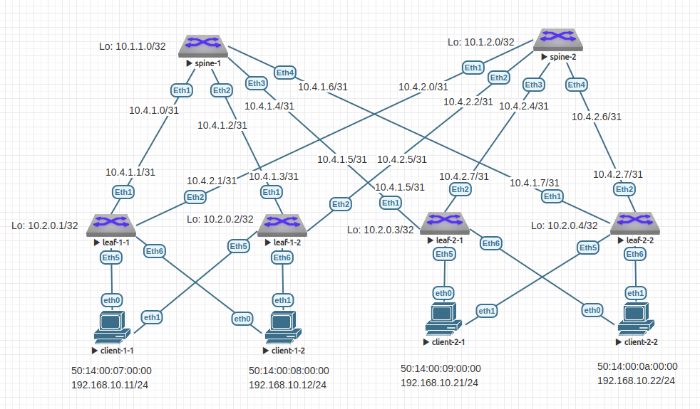

# Домашнее задание №7

## VxLAN. Multihoming.

### Задачи:

- Подключите клиентов 2-я линками к различным Leaf
- Настроите агрегированный канал со стороны клиента
- Настроите multihoming для работы в Overlay сети. Если используете Cisco NXOS - vPC, если иной вендор - то ESI LAG (либо MC-LAG с поддержкой VXLAN)

## Выполнение:

### Собранная схема сети



### Таблица адресов

| hostname   | interface |   IP/MASK    | Description  |
| :--------: | :-------: | :----------: | :----------: |
|  leaf-1-1  | Loopback1 | 10.2.0.1/32  |              |
|  leaf-1-1  |  Eth1     | 10.4.1.1/31  | to-spine-1   |
|  leaf-1-1  |  Eth2     | 10.4.2.1/31  | to-spine-2   |
|            |           |              |              |
|  leaf-1-2  | Loopback1 | 10.2.0.2/32  |              |
|  leaf-1-2  |  Eth1     | 10.4.1.3/31  | to-spine-1   |
|  leaf-1-2  |  Eth2     | 10.4.2.3/31  | to-spine-2   |
|            |           |              |              |
|  leaf-2-1  | Loopback1 | 10.2.0.3/32  |              |
|  leaf-2-1  |  Eth1     | 10.4.1.5/31  | to-spine-1   |
|  leaf-2-1  |  Eth2     | 10.4.2.5/31  | to-spine-2   |
|            |           |              |              |
|  leaf-2-   | Loopback1 | 10.2.0.4/32  |              |
|  leaf-2-   |  Eth1     | 10.4.1.7/31  | to-spine-1   |
|  leaf-2-   |  Eth2     | 10.4.2.7/31  | to-spine-2   |
|            |           |              |              |
|  spine-1   | Loopback1 | 10.1.1.0/32  |              |
|  spine-1   |  Eth1     | 10.4.1.0/31  |  to-leaf-1-1 |
|  spine-1   |  Eth2     | 10.4.1.2/31  |  to-leaf-1-2 |
|  spine-1   |  Eth3     | 10.4.1.4/31  |  to-leaf-2-1 |
|  spine-1   |  Eth4     | 10.4.1.6/31  |  to-leaf-2-2 |
|            |           |              |              |
|  spine-2   | Loopback1 | 10.1.2.0/32  |              |
|  spine-2   |  Eth1     | 10.4.2.0/31  |  to-leaf-1-1 |
|  spine-2   |  Eth2     | 10.4.2.2/31  |  to-leaf-1-2 |
|  spine-2   |  Eth3     | 10.4.2.4/31  |  to-leaf-2-1 |
|  spine-2   |  Eth4     | 10.4.2.6/31  |  to-leaf-2-2 |


### Таблица ASN

| hostname | Loopback address |  ASN       |
| :------: | :--------------: | :--------: |
|  leaf-1  | 10.2.0.1/32      | 4200010001 |
|  leaf-2  | 10.2.0.2/32      | 4200010002 |
|  leaf-3  | 10.2.0.3/32      | 4200010003 |
|  leaf-4  | 10.2.0.4/32      | 4200010004 |
|  spine-1 | 10.1.1.0/32      | 4200000001 |
|  spine-2 | 10.1.2.0/32      | 4200000002 |

### Taблица адресов клиентов

| name         |     MAC           | Address         | VLAN | VNI   | Attached to |
| :----------: | :---------------: | :-------------: | :--: | :---: | :---------: |
|  client-1-1  | 50:14:00:07:00:00 | 192.168.10.11/24|   10 | 10010 | leaf-1      |
|  client-1-2  | 50:14:00:08:00:00 | 192.168.10.12/24|   10 | 10010 | leaf-2      |
|  client-2-1  | 50:14:00:09:00:00 | 192.168.10.21/24|   10 | 10010 | leaf-3      |
|  client-2-2  | 50:14:00:0a:00:00 | 192.168.10.22/24|   10 | 10010 | leaf-3      |

### Таблица распределения ESI

| name         |     MAC           |     ESI                  |
| :----------: | :---------------: | :----------------------: |
|  client-1-1  | 50:14:00:07:00:00 | 0000:0000:5014:0007:0000 |
|  client-1-2  | 50:14:00:08:00:00 | 0000:0000:5014:0008:0000 |
|  client-2-1  | 50:14:00:09:00:00 | 0000:0000:5014:0009:0000 |
|  client-2-2  | 50:14:00:0a:00:00 | 0000:0000:5014:000a:0000 |

### Конфигурация оборудования

- #### [leaf-1-1](config/leaf-1-1.conf)

```
hostname leaf-1-1

ip routing
service routing protocols model multi-agent

vlan 10
exit

vrf instance Vrf-red
exit

router bgp 4200010001
  router-id 10.2.0.1
  neighbor SPINE peer group
  neighbor SPINE bfd
  neighbor SPINE send-community extended
  neighbor 10.4.1.0 remote-as 4200000001
  neighbor 10.4.1.0 peer group SPINE
  neighbor 10.4.2.0 remote-as 4200000002
  neighbor 10.4.2.0 peer group SPINE
  redistribute connected
  timers bgp 3 9
  bgp log-neighbor-changes
  maximum-paths 128

  address-family evpn
      neighbor 10.4.1.0 activate
      neighbor 10.4.2.0 activate
  exit

  vlan 10
    rd 10.2.0.1:10
    route-target export 4200010001:10010
    route-target import 4200010002:10010
    route-target import 4200010003:10010
    route-target import 4200010004:10010
    redistribute learned
  exit
exit

interface Ethernet1
  description to-spine-1
  no switchport
  ip address 10.4.1.1/31
  no shutdown
  bfd interval 100 min-rx 100 multiplier 3
exit
interface Ethernet 2
  description to-spine-2
  no switchport
  ip address 10.4.2.1/31
  no shutdown
  bfd interval 100 min-rx 100 multiplier 3
exit
interface Port-Channel 1
  description to-client-1-1
  evpn ethernet-segment
    identifier 0000:0000:5014:0007:0000
    route-target import 50:14:00:07:00:00
  exit
  lacp system-id 000.000.011
  switchport access vlan 10
exit
interface Port-Channel 2
  description to-client-2-1
  evpn ethernet-segment
    identifier 0000:0000:5014:0008:0000
    route-target import 50:14:00:08:00:00
  exit
  lacp system-id 000.000.012
  switchport access vlan 10
exit
interface Ethernet 5
  description to-client-1-1
  channel-group 1 mode active
exit
interface Ethernet 6
  description to-client-1-2
  channel-group 1 mode active
exit

interface loopback 1
  ip address 10.2.0.1/32
exit
interface Vlan 10
  vrf Vrf-red
exit
interface Vxlan1
  vxlan udp-port 4789
  vxlan source-interface Loopback1
  vxlan vlan 10 vni 10010
exit
```

- #### [leaf-1-2](config/leaf-1-2.conf)

```
hostname leaf-1-2

ip routing
service routing protocols model multi-agent

vlan 10
exit

vrf instance Vrf-red
exit

router bgp 4200010002
  router-id 10.2.0.2
  neighbor SPINE peer group
  neighbor SPINE bfd
  neighbor SPINE send-community extended
  neighbor 10.4.1.2 remote-as 4200000001
  neighbor 10.4.1.2 peer group SPINE
  neighbor 10.4.2.2 remote-as 4200000002
  neighbor 10.4.2.2 peer group SPINE
  redistribute connected
  timers bgp 3 9
  bgp log-neighbor-changes
  maximum-paths 128

  address-family evpn
      neighbor 10.4.1.2 activate
      neighbor 10.4.2.2 activate
  exit

  vlan 10
    rd 10.2.0.2:10
    route-target export 4200010002:10010
    route-target import 4200010001:10010
    route-target import 4200010003:10010
    route-target import 4200010004:10010
    redistribute learned
  exit
exit
interface Ethernet 1
  description to-spine-1
  no switchport
  ip address 10.4.1.3/31
  no shutdown
  bfd interval 100 min-rx 100 multiplier 3
exit
interface Ethernet 2
  description to-spine-2
  no switchport
  ip address 10.4.2.3/31
  no shutdown
  bfd interval 100 min-rx 100 multiplier 3
exit
interface Port-Channel 1
  description to-client-1-1
  evpn ethernet-segment
    identifier 0000:0000:5014:0007:0000
    route-target import 50:14:00:07:00:00
  exit
  switchport access vlan 10
  lacp system-id 000.000.011
exit
interface Port-Channel 2
  description to-client-2-1
  evpn ethernet-segment
    identifier 0000:0000:5014:0008:0000
    route-target import 50:14:00:08:00:00
  exit
  switchport access vlan 10
  lacp system-id 000.000.012
exit
interface Ethernet 5
  description to-client-1-1
  channel-group 1 mode active
exit
interface Ethernet 6
  description to-client-1-2
  channel-group 2 mode active
exit

interface loopback 1
  ip address 10.2.0.2/32
exit
interface Vlan 10
  vrf Vrf-red
exit
interface Vxlan1
  vxlan udp-port 4789
  vxlan source-interface Loopback1
  vxlan vlan 10 vni 10010
exit
```

- #### [leaf-2-1](config/leaf-2-1.conf)

```
hostname leaf-2-1

ip routing
service routing protocols model multi-agent

vlan 10
exit

vrf instance Vrf-red
exit

router bgp 4200010003
  router-id 10.2.0.3
  neighbor SPINE peer group
  neighbor SPINE bfd
  neighbor SPINE send-community extended
  neighbor 10.4.1.4 remote-as 4200000001
  neighbor 10.4.1.4 peer group SPINE
  neighbor 10.4.2.4 remote-as 4200000002
  neighbor 10.4.2.4 peer group SPINE
  redistribute connected
  timers bgp 3 9
  bgp log-neighbor-changes
  maximum-paths 128

  address-family evpn
    neighbor 10.4.1.4 activate
    neighbor 10.4.2.4 activate
  exit

  vlan 10
    rd 10.2.0.3:10
    route-target export 4200010003:10010
    route-target import 4200010001:10010
    route-target import 4200010002:10010
    route-target import 4200010004:10010
    redistribute learned
  exit

exit

interface Ethernet 1
  description to-spine-1
  no switchport
  ip address 10.4.1.5/31
  no shutdown
  bfd interval 100 min-rx 100 multiplier 3
exit
interface Ethernet 2
  description to-spine-2
  no switchport
  ip address 10.4.2.5/31
  no shutdown
  bfd interval 100 min-rx 100 multiplier 3
exit
interface Port-Channel 1
  description to-client-1-1
  evpn ethernet-segment
    identifier 0000:0000:5014:0009:0000
    route-target import 50:14:00:09:00:00
  exit
  switchport access vlan 10
  lacp system-id 000.000.011
exit
interface Port-Channel 2
  description to-client-2-1
  evpn ethernet-segment
    identifier 0000:0000:5014:000a:0000
    route-target import 50:14:00:0a:00:00
  exit
  switchport access vlan 10
  lacp system-id 000.000.012
exit
interface Ethernet 5
  description to-client-1-1
  channel-group 1 mode active
exit
interface Ethernet 6
  description to-client-1-2
  channel-group 2 mode active
exit
interface loopback 1
  ip address 10.2.0.3/32
exit
interface Vxlan1
  vxlan udp-port 4789
  vxlan source-interface Loopback1
  vxlan vlan 10 vni 10010
exit
```

- #### [leaf-2-2](config/leaf-2-2.conf)

```
hostname leaf-2-2

ip routing
service routing protocols model multi-agent

vlan 10
exit

vrf instance Vrf-red
exit

router bgp 4200010004
  router-id 10.2.0.4
  neighbor SPINE peer group
  neighbor SPINE bfd
  neighbor SPINE send-community extended
  neighbor 10.4.1.6 remote-as 4200000001
  neighbor 10.4.1.6 peer group SPINE
  neighbor 10.4.2.6 remote-as 4200000002
  neighbor 10.4.2.6 peer group SPINE
  redistribute connected
  timers bgp 3 9
  bgp log-neighbor-changes
  maximum-paths 128

  address-family evpn
    neighbor 10.4.1.6 activate
    neighbor 10.4.2.6 activate
  exit

  vlan 10
    rd 10.2.0.4:10
    route-target export 4200010004:10010
    route-target import 4200010001:10010
    route-target import 4200010002:10010
    route-target import 4200010003:10010
    redistribute learned
  exit
exit

interface Ethernet 1
  description to-spine-1
  no switchport
  ip address 10.4.1.7/31
  no shutdown
  bfd interval 100 min-rx 100 multiplier 3
exit
interface Ethernet 2
  description to-spine-2
  no switchport
  ip address 10.4.2.7/31
  no shutdown
  bfd interval 100 min-rx 100 multiplier 3
exit
interface Port-Channel 1
  description to-client-1-1
  evpn ethernet-segment
    identifier 0000:0000:5014:0009:0000
    route-target import 50:14:00:09:00:00
  exit
  switchport access vlan 10
  lacp system-id 000.000.011
exit
interface Port-Channel 2
  description to-client-2-1
  evpn ethernet-segment
    identifier 0000:0000:5014:000a:0000
    route-target import 50:14:00:0a:00:00
  exit
  switchport access vlan 10
  lacp system-id 000.000.012
exit
interface Ethernet 5
  description to-client-1-1
  channel-group 1 mode active
exit
interface Ethernet 6
  description to-client-1-2
  channel-group 2 mode active
exit
interface loopback 1
  ip address 10.2.0.4/32
exit
interface Vxlan1
  vxlan udp-port 4789
  vxlan source-interface Loopback1
  vxlan vlan 10 vni 10010
exit
```


- #### [spine-1](config/spine-1.conf)

```
hostname spine-1

ip routing
service routing protocols model multi-agent

router bgp 4200000001
  router-id 10.1.1.0
  neighbor LEAF peer group
  neighbor LEAF bfd
  neighbor LEAF send-community extended
  neighbor 10.4.1.1 remote-as 4200010001
  neighbor 10.4.1.1 peer group LEAF
  neighbor 10.4.1.3 remote-as 4200010002
  neighbor 10.4.1.3 peer group LEAF
  neighbor 10.4.1.5 remote-as 4200010003
  neighbor 10.4.1.5 peer group LEAF
  neighbor 10.4.1.7 remote-as 4200010004
  neighbor 10.4.1.7 peer group LEAF
  redistribute connected
  timers bgp 3 9
  bgp log-neighbor-changes
  maximum-paths 128

  address-family evpn
    neighbor 10.4.1.1 activate
    neighbor 10.4.1.3 activate
    neighbor 10.4.1.5 activate
    neighbor 10.4.1.7 activate
  exit
exit

interface Ethernet 1
  description to-leaf-1-1
  no switchport
  ip address 10.4.1.0/31
  no shutdown
  bfd interval 100 min-rx 100 multiplier 3
exit
interface Ethernet 2
  description to-leaf-1-2
  no switchport
  ip address 10.4.1.2/31
  no shutdown
  bfd interval 100 min-rx 100 multiplier 3
exit
interface Ethernet 3
  description to-leaf-2-1
  no switchport
  ip address 10.4.1.4/31
  no shutdown
  bfd interval 100 min-rx 100 multiplier 3
exit
interface Ethernet 4
  description to-leaf-2-2
  no switchport
  ip address 10.4.1.6/31
  no shutdown
  bfd interval 100 min-rx 100 multiplier 3
exit
interface loopback 1
  ip address 10.1.1.0/32
exit
end
```

- #### [spine-2](config/spine-2.conf)

```
hostname spine-2

ip routing
service routing protocols model multi-agent

router bgp 4200000002
  router-id 10.1.2.0
  neighbor LEAF peer group
  neighbor LEAF bfd
  neighbor LEAF send-community extended
  neighbor 10.4.2.1 remote-as 4200010001
  neighbor 10.4.2.1 peer group LEAF
  neighbor 10.4.2.3 remote-as 4200010002
  neighbor 10.4.2.3 peer group LEAF
  neighbor 10.4.2.5 remote-as 4200010003
  neighbor 10.4.2.5 peer group LEAF
  neighbor 10.4.2.7 remote-as 4200010004
  neighbor 10.4.2.7 peer group LEAF
  redistribute connected
  timers bgp 3 9
  bgp log-neighbor-changes
  maximum-paths 128

  address-family evpn
    neighbor 10.4.2.1 activate
    neighbor 10.4.2.3 activate
    neighbor 10.4.2.5 activate
    neighbor 10.4.2.7 activate
  exit
exit

interface Ethernet 1
  description to-leaf-1-1
  no switchport
  ip address 10.4.2.0/31
  no shutdown
  bfd interval 100 min-rx 100 multiplier 3
exit
interface Ethernet 2
  description to-leaf-1-2
  no switchport
  ip address 10.4.2.2/31
  no shutdown
  bfd interval 100 min-rx 100 multiplier 3
exit
interface Ethernet 3
  description to-leaf-2-1
  no switchport
  ip address 10.4.2.4/31
  no shutdown
  bfd interval 100 min-rx 100 multiplier 3
exit
interface Ethernet 4
  description to-leaf-2-2
  no switchport
  ip address 10.4.2.6/31
  no shutdown
  bfd interval 100 min-rx 100 multiplier 3
exit
interface loopback 1
  ip address 10.1.2.0/32
exit
end
```

### Проверка агрегированных портов

- #### leaf-1-1

~~~
leaf-1-1#show lacp neighbor
State: A = Active, P = Passive; S=ShortTimeout, L=LongTimeout;
       G = Aggregable, I = Individual; s+=InSync, s-=OutOfSync;
       C = Collecting, X = state machine expired,
       D = Distributing, d = default neighbor state
                 |                        Partner
 Port    Status  | Sys-id                    Port#   State     OperKey  PortPri
------ ----------|------------------------- ------- --------- --------- -------
Port Channel Port-Channel1:
 Et5     Bundled | FFFF,50-14-00-07-00-00        1   ALGs+CD    0x0009      255
Port Channel Port-Channel2:
 Et6     Bundled | FFFF,50-14-00-08-00-00        1   ALGs+CD    0x0009      255
~~~

- #### leaf-1-2

~~~
leaf-1-2#show lacp neighbor
State: A = Active, P = Passive; S=ShortTimeout, L=LongTimeout;
       G = Aggregable, I = Individual; s+=InSync, s-=OutOfSync;
       C = Collecting, X = state machine expired,
       D = Distributing, d = default neighbor state
                 |                        Partner
 Port    Status  | Sys-id                    Port#   State     OperKey  PortPri
------ ----------|------------------------- ------- --------- --------- -------
Port Channel Port-Channel1:
 Et5     Bundled | FFFF,50-14-00-07-00-00        2   ALGs+CD    0x0009      255
Port Channel Port-Channel2:
 Et6     Bundled | FFFF,50-14-00-08-00-00        2   ALGs+CD    0x0009      255
~~~

- #### leaf-2-1

~~~
leaf-2-1#show lacp neighbor
State: A = Active, P = Passive; S=ShortTimeout, L=LongTimeout;
       G = Aggregable, I = Individual; s+=InSync, s-=OutOfSync;
       C = Collecting, X = state machine expired,
       D = Distributing, d = default neighbor state
                 |                        Partner
 Port    Status  | Sys-id                    Port#   State     OperKey  PortPri
------ ----------|------------------------- ------- --------- --------- -------
Port Channel Port-Channel1:
 Et5     Bundled | FFFF,50-14-00-09-00-00        1   ALGs+CD    0x0009      255
Port Channel Port-Channel2:
 Et6     Bundled | FFFF,50-14-00-0a-00-00        1   ALGs+CD    0x0009      255
~~~

- #### leaf-2-2

~~~
leaf-2-2#show lacp neighbor
State: A = Active, P = Passive; S=ShortTimeout, L=LongTimeout;
       G = Aggregable, I = Individual; s+=InSync, s-=OutOfSync;
       C = Collecting, X = state machine expired,
       D = Distributing, d = default neighbor state
                 |                        Partner
 Port    Status  | Sys-id                    Port#   State     OperKey  PortPri
------ ----------|------------------------- ------- --------- --------- -------
Port Channel Port-Channel1:
 Et5     Bundled | FFFF,50-14-00-09-00-00        2   ALGs+CD    0x0009      255
Port Channel Port-Channel2:
 Et6     Bundled | FFFF,50-14-00-0a-00-00        2   ALGs+CD    0x0009      255
~~~

### Проверка BGP EVPN

- #### leaf-1-1

~~~
leaf-1-1#show bgp evpn
BGP routing table information for VRF default
Router identifier 10.2.0.1, local AS number 4200010001
Route status codes: s - suppressed, * - valid, > - active, # - not installed, E - ECMP head, e - ECMP
                    S - Stale, c - Contributing to ECMP, b - backup
                    % - Pending BGP convergence
Origin codes: i - IGP, e - EGP, ? - incomplete
AS Path Attributes: Or-ID - Originator ID, C-LST - Cluster List, LL Nexthop - Link Local Nexthop

          Network                Next Hop              Metric  LocPref Weight  Path
 * >     RD: 10.2.0.1:10 auto-discovery 0 0000:0000:5014:0007:0000
                                -                     -       -       0       i
 * >Ec   RD: 10.2.0.2:10 auto-discovery 0 0000:0000:5014:0007:0000
                                10.2.0.2              -       100     0       4200000002 4200010002 i
 *  ec   RD: 10.2.0.2:10 auto-discovery 0 0000:0000:5014:0007:0000
                                10.2.0.2              -       100     0       4200000001 4200010002 i
 * >     RD: 10.2.0.1:1 auto-discovery 0000:0000:5014:0007:0000
                                -                     -       -       0       i
 * >Ec   RD: 10.2.0.2:1 auto-discovery 0000:0000:5014:0007:0000
                                10.2.0.2              -       100     0       4200000001 4200010002 i
 *  ec   RD: 10.2.0.2:1 auto-discovery 0000:0000:5014:0007:0000
                                10.2.0.2              -       100     0       4200000002 4200010002 i
 * >     RD: 10.2.0.1:10 auto-discovery 0 0000:0000:5014:0008:0000
                                -                     -       -       0       i
 * >Ec   RD: 10.2.0.2:10 auto-discovery 0 0000:0000:5014:0008:0000
                                10.2.0.2              -       100     0       4200000001 4200010002 i
 *  ec   RD: 10.2.0.2:10 auto-discovery 0 0000:0000:5014:0008:0000
                                10.2.0.2              -       100     0       4200000002 4200010002 i
 * >     RD: 10.2.0.1:1 auto-discovery 0000:0000:5014:0008:0000
                                -                     -       -       0       i
 * >Ec   RD: 10.2.0.2:1 auto-discovery 0000:0000:5014:0008:0000
                                10.2.0.2              -       100     0       4200000001 4200010002 i
 *  ec   RD: 10.2.0.2:1 auto-discovery 0000:0000:5014:0008:0000
                                10.2.0.2              -       100     0       4200000002 4200010002 i
 * >Ec   RD: 10.2.0.3:10 auto-discovery 0 0000:0000:5014:0009:0000
                                10.2.0.3              -       100     0       4200000002 4200010003 i
 *  ec   RD: 10.2.0.3:10 auto-discovery 0 0000:0000:5014:0009:0000
                                10.2.0.3              -       100     0       4200000001 4200010003 i
 * >Ec   RD: 10.2.0.4:10 auto-discovery 0 0000:0000:5014:0009:0000
                                10.2.0.4              -       100     0       4200000001 4200010004 i
 *  ec   RD: 10.2.0.4:10 auto-discovery 0 0000:0000:5014:0009:0000
                                10.2.0.4              -       100     0       4200000002 4200010004 i
 * >Ec   RD: 10.2.0.3:1 auto-discovery 0000:0000:5014:0009:0000
                                10.2.0.3              -       100     0       4200000002 4200010003 i
 *  ec   RD: 10.2.0.3:1 auto-discovery 0000:0000:5014:0009:0000
                                10.2.0.3              -       100     0       4200000001 4200010003 i
 * >Ec   RD: 10.2.0.4:1 auto-discovery 0000:0000:5014:0009:0000
                                10.2.0.4              -       100     0       4200000002 4200010004 i
 *  ec   RD: 10.2.0.4:1 auto-discovery 0000:0000:5014:0009:0000
                                 10.2.0.4              -       100     0       4200000001 4200010004 i
 * >Ec   RD: 10.2.0.3:10 auto-discovery 0 0000:0000:5014:000a:0000
                                10.2.0.3              -       100     0       4200000001 4200010003 i
 *  ec   RD: 10.2.0.3:10 auto-discovery 0 0000:0000:5014:000a:0000
                                10.2.0.3              -       100     0       4200000002 4200010003 i
 * >Ec   RD: 10.2.0.4:10 auto-discovery 0 0000:0000:5014:000a:0000
                                10.2.0.4              -       100     0       4200000001 4200010004 i
 *  ec   RD: 10.2.0.4:10 auto-discovery 0 0000:0000:5014:000a:0000
                                10.2.0.4              -       100     0       4200000002 4200010004 i
 * >Ec   RD: 10.2.0.3:1 auto-discovery 0000:0000:5014:000a:0000
                                10.2.0.3              -       100     0       4200000001 4200010003 i
 *  ec   RD: 10.2.0.3:1 auto-discovery 0000:0000:5014:000a:0000
                                10.2.0.3              -       100     0       4200000002 4200010003 i
 * >Ec   RD: 10.2.0.4:1 auto-discovery 0000:0000:5014:000a:0000
                                10.2.0.4              -       100     0       4200000001 4200010004 i
 *  ec   RD: 10.2.0.4:1 auto-discovery 0000:0000:5014:000a:0000
                                10.2.0.4              -       100     0       4200000002 4200010004 i
 * >     RD: 10.2.0.1:10 mac-ip 5014.0007.0000
                                -                     -       -       0       i
 * >     RD: 10.2.0.1:10 mac-ip 5014.0008.0000
                                -                     -       -       0       i
 * >Ec   RD: 10.2.0.2:10 mac-ip 5014.0008.0000
                                10.2.0.2              -       100     0       4200000001 4200010002 i
 *  ec   RD: 10.2.0.2:10 mac-ip 5014.0008.0000
                                10.2.0.2              -       100     0       4200000002 4200010002 i
 * >Ec   RD: 10.2.0.3:10 mac-ip 5014.0009.0000
                                10.2.0.3              -       100     0       4200000002 4200010003 i
 *  ec   RD: 10.2.0.3:10 mac-ip 5014.0009.0000
                                10.2.0.3              -       100     0       4200000001 4200010003 i
 * >Ec   RD: 10.2.0.4:10 mac-ip 5014.0009.0000
                                10.2.0.4              -       100     0       4200000001 4200010004 i
 *  ec   RD: 10.2.0.4:10 mac-ip 5014.0009.0000
                                10.2.0.4              -       100     0       4200000002 4200010004 i
 * >Ec   RD: 10.2.0.3:10 mac-ip 5014.000a.0000
                                10.2.0.3              -       100     0       4200000001 4200010003 i
 *  ec   RD: 10.2.0.3:10 mac-ip 5014.000a.0000
                                10.2.0.3              -       100     0       4200000002 4200010003 i
 * >Ec   RD: 10.2.0.4:10 mac-ip 5014.000a.0000
                                10.2.0.4              -       100     0       4200000002 4200010004 i
 *  ec   RD: 10.2.0.4:10 mac-ip 5014.000a.0000
                                10.2.0.4              -       100     0       4200000001 4200010004 i
 * >     RD: 10.2.0.1:10 imet 10.2.0.1
                                -                     -       -       0       i
 * >Ec   RD: 10.2.0.2:10 imet 10.2.0.2
                                10.2.0.2              -       100     0       4200000001 4200010002 i
 *  ec   RD: 10.2.0.2:10 imet 10.2.0.2
                                10.2.0.2              -       100     0       4200000002 4200010002 i
 * >Ec   RD: 10.2.0.3:10 imet 10.2.0.3
                                10.2.0.3              -       100     0       4200000002 4200010003 i
 *  ec   RD: 10.2.0.3:10 imet 10.2.0.3
                                10.2.0.3              -       100     0       4200000001 4200010003 i
 * >Ec   RD: 10.2.0.4:10 imet 10.2.0.4
                                10.2.0.4              -       100     0       4200000001 4200010004 i
 *  ec   RD: 10.2.0.4:10 imet 10.2.0.4
                                10.2.0.4              -       100     0       4200000002 4200010004 i
 * >     RD: 10.2.0.1:1 ethernet-segment 0000:0000:5014:0007:0000 10.2.0.1
                                -                     -       -       0       i
 * >Ec   RD: 10.2.0.2:1 ethernet-segment 0000:0000:5014:0007:0000 10.2.0.2
                                10.2.0.2              -       100     0       4200000002 4200010002 i
 *  ec   RD: 10.2.0.2:1 ethernet-segment 0000:0000:5014:0007:0000 10.2.0.2
                                10.2.0.2              -       100     0       4200000001 4200010002 i
 * >     RD: 10.2.0.1:1 ethernet-segment 0000:0000:5014:0008:0000 10.2.0.1
                                -                     -       -       0       i
 * >Ec   RD: 10.2.0.2:1 ethernet-segment 0000:0000:5014:0008:0000 10.2.0.2
                                10.2.0.2              -       100     0       4200000001 4200010002 i
 *  ec   RD: 10.2.0.2:1 ethernet-segment 0000:0000:5014:0008:0000 10.2.0.2
                                10.2.0.2              -       100     0       4200000002 4200010002 i
 * >Ec   RD: 10.2.0.3:1 ethernet-segment 0000:0000:5014:0009:0000 10.2.0.3
                                10.2.0.3              -       100     0       4200000002 4200010003 i
 *  ec   RD: 10.2.0.3:1 ethernet-segment 0000:0000:5014:0009:0000 10.2.0.3
                                10.2.0.3              -       100     0       4200000001 4200010003 i
 * >Ec   RD: 10.2.0.4:1 ethernet-segment 0000:0000:5014:0009:0000 10.2.0.4
                                10.2.0.4              -       100     0       4200000002 4200010004 i
 *  ec   RD: 10.2.0.4:1 ethernet-segment 0000:0000:5014:0009:0000 10.2.0.4
                                10.2.0.4              -       100     0       4200000001 4200010004 i
 * >Ec   RD: 10.2.0.3:1 ethernet-segment 0000:0000:5014:000a:0000 10.2.0.3
                                10.2.0.3              -       100     0       4200000001 4200010003 i
 *  ec   RD: 10.2.0.3:1 ethernet-segment 0000:0000:5014:000a:0000 10.2.0.3
                                10.2.0.3              -       100     0       4200000002 4200010003 i
 * >Ec   RD: 10.2.0.4:1 ethernet-segment 0000:0000:5014:000a:0000 10.2.0.4
                                10.2.0.4              -       100     0       4200000001 4200010004 i
 *  ec   RD: 10.2.0.4:1 ethernet-segment 0000:0000:5014:000a:0000 10.2.0.4
                                10.2.0.4              -       100     0       4200000002 4200010004 i
~~~

- #### leaf-1-2

~~~
leaf-1-2#show bgp evpn
BGP routing table information for VRF default
Router identifier 10.2.0.2, local AS number 4200010002
Route status codes: s - suppressed, * - valid, > - active, # - not installed, E - ECMP head, e - ECMP
                    S - Stale, c - Contributing to ECMP, b - backup
                    % - Pending BGP convergence
Origin codes: i - IGP, e - EGP, ? - incomplete
AS Path Attributes: Or-ID - Originator ID, C-LST - Cluster List, LL Nexthop - Link Local Nexthop

          Network                Next Hop              Metric  LocPref Weight  Path
 * >Ec   RD: 10.2.0.1:10 auto-discovery 0 0000:0000:5014:0007:0000
                                10.2.0.1              -       100     0       4200000001 4200010001 i
 *  ec   RD: 10.2.0.1:10 auto-discovery 0 0000:0000:5014:0007:0000
                                10.2.0.1              -       100     0       4200000002 4200010001 i
 * >     RD: 10.2.0.2:10 auto-discovery 0 0000:0000:5014:0007:0000
                                -                     -       -       0       i
 * >Ec   RD: 10.2.0.1:1 auto-discovery 0000:0000:5014:0007:0000
                                10.2.0.1              -       100     0       4200000001 4200010001 i
 *  ec   RD: 10.2.0.1:1 auto-discovery 0000:0000:5014:0007:0000
                                10.2.0.1              -       100     0       4200000002 4200010001 i
 * >     RD: 10.2.0.2:1 auto-discovery 0000:0000:5014:0007:0000
                                -                     -       -       0       i
 * >Ec   RD: 10.2.0.1:10 auto-discovery 0 0000:0000:5014:0008:0000
                                10.2.0.1              -       100     0       4200000001 4200010001 i
 *  ec   RD: 10.2.0.1:10 auto-discovery 0 0000:0000:5014:0008:0000
                                10.2.0.1              -       100     0       4200000002 4200010001 i
 * >     RD: 10.2.0.2:10 auto-discovery 0 0000:0000:5014:0008:0000
                                -                     -       -       0       i
 * >Ec   RD: 10.2.0.1:1 auto-discovery 0000:0000:5014:0008:0000
                                10.2.0.1              -       100     0       4200000001 4200010001 i
 *  ec   RD: 10.2.0.1:1 auto-discovery 0000:0000:5014:0008:0000
                                10.2.0.1              -       100     0       4200000002 4200010001 i
 * >     RD: 10.2.0.2:1 auto-discovery 0000:0000:5014:0008:0000
                                -                     -       -       0       i
 * >Ec   RD: 10.2.0.3:10 auto-discovery 0 0000:0000:5014:0009:0000
                                10.2.0.3              -       100     0       4200000002 4200010003 i
 *  ec   RD: 10.2.0.3:10 auto-discovery 0 0000:0000:5014:0009:0000
                                10.2.0.3              -       100     0       4200000001 4200010003 i
 * >Ec   RD: 10.2.0.4:10 auto-discovery 0 0000:0000:5014:0009:0000
                                10.2.0.4              -       100     0       4200000001 4200010004 i
 *  ec   RD: 10.2.0.4:10 auto-discovery 0 0000:0000:5014:0009:0000
                                10.2.0.4              -       100     0       4200000002 4200010004 i
 * >Ec   RD: 10.2.0.3:1 auto-discovery 0000:0000:5014:0009:0000
                                10.2.0.3              -       100     0       4200000002 4200010003 i
 *  ec   RD: 10.2.0.3:1 auto-discovery 0000:0000:5014:0009:0000
                                10.2.0.3              -       100     0       4200000001 4200010003 i
 * >Ec   RD: 10.2.0.4:1 auto-discovery 0000:0000:5014:0009:0000
                                10.2.0.4              -       100     0       4200000001 4200010004 i
 *  ec   RD: 10.2.0.4:1 auto-discovery 0000:0000:5014:0009:0000
                                10.2.0.4              -       100     0       4200000002 4200010004 i
 * >Ec   RD: 10.2.0.3:10 auto-discovery 0 0000:0000:5014:000a:0000
                                10.2.0.3              -       100     0       4200000001 4200010003 i
 *  ec   RD: 10.2.0.3:10 auto-discovery 0 0000:0000:5014:000a:0000
                                10.2.0.3              -       100     0       4200000002 4200010003 i
 * >Ec   RD: 10.2.0.4:10 auto-discovery 0 0000:0000:5014:000a:0000
                                10.2.0.4              -       100     0       4200000001 4200010004 i
 *  ec   RD: 10.2.0.4:10 auto-discovery 0 0000:0000:5014:000a:0000
                                 10.2.0.4              -       100     0       4200000002 4200010004 i
 * >Ec   RD: 10.2.0.3:1 auto-discovery 0000:0000:5014:000a:0000
                                10.2.0.3              -       100     0       4200000001 4200010003 i
 *  ec   RD: 10.2.0.3:1 auto-discovery 0000:0000:5014:000a:0000
                                10.2.0.3              -       100     0       4200000002 4200010003 i
 * >Ec   RD: 10.2.0.4:1 auto-discovery 0000:0000:5014:000a:0000
                                10.2.0.4              -       100     0       4200000001 4200010004 i
 *  ec   RD: 10.2.0.4:1 auto-discovery 0000:0000:5014:000a:0000
                                10.2.0.4              -       100     0       4200000002 4200010004 i
 * >Ec   RD: 10.2.0.1:10 mac-ip 5014.0007.0000
                                10.2.0.1              -       100     0       4200000002 4200010001 i
 *  ec   RD: 10.2.0.1:10 mac-ip 5014.0007.0000
                                10.2.0.1              -       100     0       4200000001 4200010001 i
 * >Ec   RD: 10.2.0.1:10 mac-ip 5014.0008.0000
                                10.2.0.1              -       100     0       4200000002 4200010001 i
 *  ec   RD: 10.2.0.1:10 mac-ip 5014.0008.0000
                                10.2.0.1              -       100     0       4200000001 4200010001 i
 * >     RD: 10.2.0.2:10 mac-ip 5014.0008.0000
                                -                     -       -       0       i
 * >Ec   RD: 10.2.0.3:10 mac-ip 5014.0009.0000
                                10.2.0.3              -       100     0       4200000002 4200010003 i
 *  ec   RD: 10.2.0.3:10 mac-ip 5014.0009.0000
                                10.2.0.3              -       100     0       4200000001 4200010003 i
 * >Ec   RD: 10.2.0.4:10 mac-ip 5014.0009.0000
                                10.2.0.4              -       100     0       4200000001 4200010004 i
 *  ec   RD: 10.2.0.4:10 mac-ip 5014.0009.0000
                                10.2.0.4              -       100     0       4200000002 4200010004 i
 * >Ec   RD: 10.2.0.3:10 mac-ip 5014.000a.0000
                                10.2.0.3              -       100     0       4200000001 4200010003 i
 *  ec   RD: 10.2.0.3:10 mac-ip 5014.000a.0000
                                10.2.0.3              -       100     0       4200000002 4200010003 i
 * >Ec   RD: 10.2.0.4:10 mac-ip 5014.000a.0000
                                10.2.0.4              -       100     0       4200000002 4200010004 i
 *  ec   RD: 10.2.0.4:10 mac-ip 5014.000a.0000
                                10.2.0.4              -       100     0       4200000001 4200010004 i
 * >Ec   RD: 10.2.0.1:10 imet 10.2.0.1
                                10.2.0.1              -       100     0       4200000002 4200010001 i
 *  ec   RD: 10.2.0.1:10 imet 10.2.0.1
                                10.2.0.1              -       100     0       4200000001 4200010001 i
 * >     RD: 10.2.0.2:10 imet 10.2.0.2
                                -                     -       -       0       i
 * >Ec   RD: 10.2.0.3:10 imet 10.2.0.3
                                10.2.0.3              -       100     0       4200000002 4200010003 i
 *  ec   RD: 10.2.0.3:10 imet 10.2.0.3
                                10.2.0.3              -       100     0       4200000001 4200010003 i
 * >Ec   RD: 10.2.0.4:10 imet 10.2.0.4
                                10.2.0.4              -       100     0       4200000001 4200010004 i
 *  ec   RD: 10.2.0.4:10 imet 10.2.0.4
                                10.2.0.4              -       100     0       4200000002 4200010004 i
 * >Ec   RD: 10.2.0.1:1 ethernet-segment 0000:0000:5014:0007:0000 10.2.0.1
                                10.2.0.1              -       100     0       4200000002 4200010001 i
 *  ec   RD: 10.2.0.1:1 ethernet-segment 0000:0000:5014:0007:0000 10.2.0.1
                                10.2.0.1              -       100     0       4200000001 4200010001 i
 * >     RD: 10.2.0.2:1 ethernet-segment 0000:0000:5014:0007:0000 10.2.0.2
                                -                     -       -       0       i
 * >Ec   RD: 10.2.0.1:1 ethernet-segment 0000:0000:5014:0008:0000 10.2.0.1
                                10.2.0.1              -       100     0       4200000001 4200010001 i
 *  ec   RD: 10.2.0.1:1 ethernet-segment 0000:0000:5014:0008:0000 10.2.0.1
                                10.2.0.1              -       100     0       4200000002 4200010001 i
 * >     RD: 10.2.0.2:1 ethernet-segment 0000:0000:5014:0008:0000 10.2.0.2
                                -                     -       -       0       i
 * >Ec   RD: 10.2.0.3:1 ethernet-segment 0000:0000:5014:0009:0000 10.2.0.3
                                10.2.0.3              -       100     0       4200000001 4200010003 i
 *  ec   RD: 10.2.0.3:1 ethernet-segment 0000:0000:5014:0009:0000 10.2.0.3
                                10.2.0.3              -       100     0       4200000002 4200010003 i
 * >Ec   RD: 10.2.0.4:1 ethernet-segment 0000:0000:5014:0009:0000 10.2.0.4
                                10.2.0.4              -       100     0       4200000001 4200010004 i
 *  ec   RD: 10.2.0.4:1 ethernet-segment 0000:0000:5014:0009:0000 10.2.0.4
                                10.2.0.4              -       100     0       4200000002 4200010004 i
 * >Ec   RD: 10.2.0.3:1 ethernet-segment 0000:0000:5014:000a:0000 10.2.0.3
                                10.2.0.3              -       100     0       4200000001 4200010003 i
 *  ec   RD: 10.2.0.3:1 ethernet-segment 0000:0000:5014:000a:0000 10.2.0.3
                                10.2.0.3              -       100     0       4200000002 4200010003 i
 * >Ec   RD: 10.2.0.4:1 ethernet-segment 0000:0000:5014:000a:0000 10.2.0.4
                                10.2.0.4              -       100     0       4200000001 4200010004 i
 *  ec   RD: 10.2.0.4:1 ethernet-segment 0000:0000:5014:000a:0000 10.2.0.4
                                10.2.0.4              -       100     0       4200000002 4200010004 i
~~~

- #### leaf-2-1

~~~
leaf-2-1#show bgp evpn
BGP routing table information for VRF default
Router identifier 10.2.0.3, local AS number 4200010003
Route status codes: s - suppressed, * - valid, > - active, # - not installed, E - ECMP head, e - ECMP
                    S - Stale, c - Contributing to ECMP, b - backup
                    % - Pending BGP convergence
Origin codes: i - IGP, e - EGP, ? - incomplete
AS Path Attributes: Or-ID - Originator ID, C-LST - Cluster List, LL Nexthop - Link Local Nexthop

          Network                Next Hop              Metric  LocPref Weight  Path
 * >Ec   RD: 10.2.0.1:10 auto-discovery 0 0000:0000:5014:0007:0000
                                10.2.0.1              -       100     0       4200000001 4200010001 i
 *  ec   RD: 10.2.0.1:10 auto-discovery 0 0000:0000:5014:0007:0000
                                10.2.0.1              -       100     0       4200000002 4200010001 i
 * >Ec   RD: 10.2.0.2:10 auto-discovery 0 0000:0000:5014:0007:0000
                                10.2.0.2              -       100     0       4200000001 4200010002 i
 *  ec   RD: 10.2.0.2:10 auto-discovery 0 0000:0000:5014:0007:0000
                                10.2.0.2              -       100     0       4200000002 4200010002 i
 * >Ec   RD: 10.2.0.1:1 auto-discovery 0000:0000:5014:0007:0000
                                10.2.0.1              -       100     0       4200000001 4200010001 i
 *  ec   RD: 10.2.0.1:1 auto-discovery 0000:0000:5014:0007:0000
                                10.2.0.1              -       100     0       4200000002 4200010001 i
 * >Ec   RD: 10.2.0.2:1 auto-discovery 0000:0000:5014:0007:0000
                                10.2.0.2              -       100     0       4200000001 4200010002 i
 *  ec   RD: 10.2.0.2:1 auto-discovery 0000:0000:5014:0007:0000
                                10.2.0.2              -       100     0       4200000002 4200010002 i
 * >Ec   RD: 10.2.0.1:10 auto-discovery 0 0000:0000:5014:0008:0000
                                10.2.0.1              -       100     0       4200000001 4200010001 i
 *  ec   RD: 10.2.0.1:10 auto-discovery 0 0000:0000:5014:0008:0000
                                10.2.0.1              -       100     0       4200000002 4200010001 i
 * >Ec   RD: 10.2.0.2:10 auto-discovery 0 0000:0000:5014:0008:0000
                                10.2.0.2              -       100     0       4200000001 4200010002 i
 *  ec   RD: 10.2.0.2:10 auto-discovery 0 0000:0000:5014:0008:0000
                                10.2.0.2              -       100     0       4200000002 4200010002 i
 * >Ec   RD: 10.2.0.1:1 auto-discovery 0000:0000:5014:0008:0000
                                10.2.0.1              -       100     0       4200000001 4200010001 i
 *  ec   RD: 10.2.0.1:1 auto-discovery 0000:0000:5014:0008:0000
                                10.2.0.1              -       100     0       4200000002 4200010001 i
 * >Ec   RD: 10.2.0.2:1 auto-discovery 0000:0000:5014:0008:0000
                                10.2.0.2              -       100     0       4200000001 4200010002 i
 *  ec   RD: 10.2.0.2:1 auto-discovery 0000:0000:5014:0008:0000
                                10.2.0.2              -       100     0       4200000002 4200010002 i
 * >     RD: 10.2.0.3:10 auto-discovery 0 0000:0000:5014:0009:0000
                                -                     -       -       0       i
 * >Ec   RD: 10.2.0.4:10 auto-discovery 0 0000:0000:5014:0009:0000
                                10.2.0.4              -       100     0       4200000002 4200010004 i
 *  ec   RD: 10.2.0.4:10 auto-discovery 0 0000:0000:5014:0009:0000
                                10.2.0.4              -       100     0       4200000001 4
 * >     RD: 10.2.0.3:1 auto-discovery 0000:0000:5014:0009:0000
                                -                     -       -       0       i
 * >Ec   RD: 10.2.0.4:1 auto-discovery 0000:0000:5014:0009:0000
                                10.2.0.4              -       100     0       4200000002 4200010004 i
 *  ec   RD: 10.2.0.4:1 auto-discovery 0000:0000:5014:0009:0000
                                10.2.0.4              -       100     0       4200000001 4200010004 i
 * >     RD: 10.2.0.3:10 auto-discovery 0 0000:0000:5014:000a:0000
                                -                     -       -       0       i
 * >Ec   RD: 10.2.0.4:10 auto-discovery 0 0000:0000:5014:000a:0000
                                10.2.0.4              -       100     0       4200000001 4200010004 i
 *  ec   RD: 10.2.0.4:10 auto-discovery 0 0000:0000:5014:000a:0000
                                10.2.0.4              -       100     0       4200000002 4200010004 i
 * >     RD: 10.2.0.3:1 auto-discovery 0000:0000:5014:000a:0000
                                -                     -       -       0       i
 * >Ec   RD: 10.2.0.4:1 auto-discovery 0000:0000:5014:000a:0000
                                10.2.0.4              -       100     0       4200000001 4200010004 i
 *  ec   RD: 10.2.0.4:1 auto-discovery 0000:0000:5014:000a:0000
                                10.2.0.4              -       100     0       4200000002 4200010004 i
 * >Ec   RD: 10.2.0.1:10 mac-ip 5014.0007.0000
                                10.2.0.1              -       100     0       4200000002 4200010001 i
 *  ec   RD: 10.2.0.1:10 mac-ip 5014.0007.0000
                                10.2.0.1              -       100     0       4200000001 4200010001 i
 * >Ec   RD: 10.2.0.1:10 mac-ip 5014.0008.0000
                                10.2.0.1              -       100     0       4200000002 4200010001 i
 *  ec   RD: 10.2.0.1:10 mac-ip 5014.0008.0000
                                10.2.0.1              -       100     0       4200000001 4200010001 i
 * >Ec   RD: 10.2.0.2:10 mac-ip 5014.0008.0000
                                10.2.0.2              -       100     0       4200000002 4200010002 i
 *  ec   RD: 10.2.0.2:10 mac-ip 5014.0008.0000
                                10.2.0.2              -       100     0       4200000001 4200010002 i
 * >     RD: 10.2.0.3:10 mac-ip 5014.0009.0000
                                -                     -       -       0       i
 * >Ec   RD: 10.2.0.4:10 mac-ip 5014.0009.0000
                                10.2.0.4              -       100     0       4200000001 4200010004 i
 *  ec   RD: 10.2.0.4:10 mac-ip 5014.0009.0000
                                10.2.0.4              -       100     0       4200000002 4200010004 i
 * >     RD: 10.2.0.3:10 mac-ip 5014.000a.0000
                                -                     -       -       0       i
 * >Ec   RD: 10.2.0.4:10 mac-ip 5014.000a.0000
                                10.2.0.4              -       100     0       4200000002 4200010004 i
 *  ec   RD: 10.2.0.4:10 mac-ip 5014.000a.0000
                                10.2.0.4              -       100     0       4200000001 4200010004 i
 * >Ec   RD: 10.2.0.1:10 imet 10.2.0.1
                                10.2.0.1              -       100     0       4200000001 4200010001 i
 *  ec   RD: 10.2.0.1:10 imet 10.2.0.1
                                10.2.0.1              -       100     0       4200000002 4200010001 i
 * >Ec   RD: 10.2.0.2:10 imet 10.2.0.2
                                10.2.0.2              -       100     0       4200000001 4200010002 i
 *  ec   RD: 10.2.0.2:10 imet 10.2.0.2
                                10.2.0.2              -       100     0       4200000002 4200010002 i
 * >     RD: 10.2.0.3:10 imet 10.2.0.3
                                -                     -       -       0       i
 * >Ec   RD: 10.2.0.4:10 imet 10.2.0.4
                                10.2.0.4              -       100     0       4200000001 4200010004 i
 *  ec   RD: 10.2.0.4:10 imet 10.2.0.4
                                10.2.0.4              -       100     0       4200000002 4200010004 i
 * >Ec   RD: 10.2.0.1:1 ethernet-segment 0000:0000:5014:0007:0000 10.2.0.1
                                10.2.0.1              -       100     0       4200000002 4200010001 i
 *  ec   RD: 10.2.0.1:1 ethernet-segment 0000:0000:5014:0007:0000 10.2.0.1
                                10.2.0.1              -       100     0       4200000001 4200010001 i
 * >Ec   RD: 10.2.0.2:1 ethernet-segment 0000:0000:5014:0007:0000 10.2.0.2
                                10.2.0.2              -       100     0       4200000002 4200010002 i
 *  ec   RD: 10.2.0.2:1 ethernet-segment 0000:0000:5014:0007:0000 10.2.0.2
                                10.2.0.2              -       100     0       4200000001 4200010002 i
 * >Ec   RD: 10.2.0.1:1 ethernet-segment 0000:0000:5014:0008:0000 10.2.0.1
                                10.2.0.1              -       100     0       4200000001 4200010001 i
 *  ec   RD: 10.2.0.1:1 ethernet-segment 0000:0000:5014:0008:0000 10.2.0.1
                                10.2.0.1              -       100     0       4200000002 4200010001 i
 * >Ec   RD: 10.2.0.2:1 ethernet-segment 0000:0000:5014:0008:0000 10.2.0.2
                                10.2.0.2              -       100     0       4200000001 4200010002 i
 *  ec   RD: 10.2.0.2:1 ethernet-segment 0000:0000:5014:0008:0000 10.2.0.2
                                10.2.0.2              -       100     0       4200000002 4200010002 i
 * >     RD: 10.2.0.3:1 ethernet-segment 0000:0000:5014:0009:0000 10.2.0.3
                                -                     -       -       0       i
 * >Ec   RD: 10.2.0.4:1 ethernet-segment 0000:0000:5014:0009:0000 10.2.0.4
                                10.2.0.4              -       100     0       4200000002 4200010004 i
 *  ec   RD: 10.2.0.4:1 ethernet-segment 0000:0000:5014:0009:0000 10.2.0.4
                                10.2.0.4              -       100     0       4200000001 4200010004 i
 * >     RD: 10.2.0.3:1 ethernet-segment 0000:0000:5014:000a:0000 10.2.0.3
                                -                     -       -       0       i
 * >Ec   RD: 10.2.0.4:1 ethernet-segment 0000:0000:5014:000a:0000 10.2.0.4
                                10.2.0.4              -       100     0       4200000001 4200010004 i
 *  ec   RD: 10.2.0.4:1 ethernet-segment 0000:0000:5014:000a:0000 10.2.0.4
                                10.2.0.4              -       100     0       4200000002 4200010004 i
~~~

- #### leaf-2-2

~~~
leaf-2-2#show bgp evpn
BGP routing table information for VRF default
Router identifier 10.2.0.4, local AS number 4200010004
Route status codes: s - suppressed, * - valid, > - active, # - not installed, E - ECMP head, e - ECMP
                    S - Stale, c - Contributing to ECMP, b - backup
                    % - Pending BGP convergence
Origin codes: i - IGP, e - EGP, ? - incomplete
AS Path Attributes: Or-ID - Originator ID, C-LST - Cluster List, LL Nexthop - Link Local Nexthop

          Network                Next Hop              Metric  LocPref Weight  Path
 * >Ec   RD: 10.2.0.1:10 auto-discovery 0 0000:0000:5014:0007:0000
                                10.2.0.1              -       100     0       4200000001 4200010001 i
 *  ec   RD: 10.2.0.1:10 auto-discovery 0 0000:0000:5014:0007:0000
                                10.2.0.1              -       100     0       4200000002 4200010001 i
 * >Ec   RD: 10.2.0.2:10 auto-discovery 0 0000:0000:5014:0007:0000
                                10.2.0.2              -       100     0       4200000002 4200010002 i
 *  ec   RD: 10.2.0.2:10 auto-discovery 0 0000:0000:5014:0007:0000
                                10.2.0.2              -       100     0       4200000001 4200010002 i
 * >Ec   RD: 10.2.0.1:1 auto-discovery 0000:0000:5014:0007:0000
                                10.2.0.1              -       100     0       4200000001 4200010001 i
 *  ec   RD: 10.2.0.1:1 auto-discovery 0000:0000:5014:0007:0000
                                10.2.0.1              -       100     0       4200000002 4200010001 i
 * >Ec   RD: 10.2.0.2:1 auto-discovery 0000:0000:5014:0007:0000
                                10.2.0.2              -       100     0       4200000001 4200010002 i
 *  ec   RD: 10.2.0.2:1 auto-discovery 0000:0000:5014:0007:0000
                                10.2.0.2              -       100     0       4200000002 4200010002 i
 * >Ec   RD: 10.2.0.1:10 auto-discovery 0 0000:0000:5014:0008:0000
                                10.2.0.1              -       100     0       4200000001 4200010001 i
 *  ec   RD: 10.2.0.1:10 auto-discovery 0 0000:0000:5014:0008:0000
                                10.2.0.1              -       100     0       4200000002 4200010001 i
 * >Ec   RD: 10.2.0.2:10 auto-discovery 0 0000:0000:5014:0008:0000
                                10.2.0.2              -       100     0       4200000001 4200010002 i
 *  ec   RD: 10.2.0.2:10 auto-discovery 0 0000:0000:5014:0008:0000
                                10.2.0.2              -       100     0       4200000002 4200010002 i
 * >Ec   RD: 10.2.0.1:1 auto-discovery 0000:0000:5014:0008:0000
                                10.2.0.1              -       100     0       4200000001 4200010001 i
 *  ec   RD: 10.2.0.1:1 auto-discovery 0000:0000:5014:0008:0000
                                10.2.0.1              -       100     0       4200000002 4200010001 i
 * >Ec   RD: 10.2.0.2:1 auto-discovery 0000:0000:5014:0008:0000
                                10.2.0.2              -       100     0       4200000001 4200010002 i
 *  ec   RD: 10.2.0.2:1 auto-discovery 0000:0000:5014:0008:0000
                                10.2.0.2              -       100     0       4200000002 4200010002 i
 * >Ec   RD: 10.2.0.3:10 auto-discovery 0 0000:0000:5014:0009:0000
                                10.2.0.3              -       100     0       4200000002 4200010003 i
 *  ec   RD: 10.2.0.3:10 auto-discovery 0 0000:0000:5014:0009:0000
                                10.2.0.3              -       100     0       4200000001 4200010003 i
 * >     RD: 10.2.0.4:10 auto-discovery 0 0000:0000:5014:0009:0000
                                -                     -       -       0       i
 * >Ec   RD: 10.2.0.3:1 auto-discovery 0000:0000:5014:0009:0000
                                10.2.0.3              -       100     0       4200000002 4200010003 i
 *  ec   RD: 10.2.0.3:1 auto-discovery 0000:0000:5014:0009:0000
                                10.2.0.3              -       100     0       4200000001 4200010003 i
 * >     RD: 10.2.0.4:1 auto-discovery 0000:0000:5014:0009:0000
                                -                     -       -       0       i
 * >Ec   RD: 10.2.0.3:10 auto-discovery 0 0000:0000:5014:000a:0000
                                10.2.0.3              -       100     0       4200000001 4200010003 i
 *  ec   RD: 10.2.0.3:10 auto-discovery 0 0000:0000:5014:000a:0000
                                10.2.0.3              -       100     0       4200000002 4200010003 i
 * >     RD: 10.2.0.4:10 auto-discovery 0 0000:0000:5014:000a:0000
                                -                     -       -       0       i
 * >Ec   RD: 10.2.0.3:1 auto-discovery 0000:0000:5014:000a:0000
                                10.2.0.3              -       100     0       4200000001 4200010003 i
 *  ec   RD: 10.2.0.3:1 auto-discovery 0000:0000:5014:000a:0000
                                10.2.0.3              -       100     0       4200000002 4200010003 i
 * >     RD: 10.2.0.4:1 auto-discovery 0000:0000:5014:000a:0000
                                -                     -       -       0       i
 * >Ec   RD: 10.2.0.1:10 mac-ip 5014.0007.0000
                                10.2.0.1              -       100     0       4200000002 4200010001 i
 *  ec   RD: 10.2.0.1:10 mac-ip 5014.0007.0000
                                10.2.0.1              -       100     0       4200000001 4200010001 i
 * >Ec   RD: 10.2.0.1:10 mac-ip 5014.0008.0000
                                10.2.0.1              -       100     0       4200000002 4200010001 i
 *  ec   RD: 10.2.0.1:10 mac-ip 5014.0008.0000
                                10.2.0.1              -       100     0       4200000001 4200010001 i
 * >Ec   RD: 10.2.0.2:10 mac-ip 5014.0008.0000
                                10.2.0.2              -       100     0       4200000001 4200010002 i
 *  ec   RD: 10.2.0.2:10 mac-ip 5014.0008.0000
                                10.2.0.2              -       100     0       4200000002 4200010002 i
 * >Ec   RD: 10.2.0.3:10 mac-ip 5014.0009.0000
                                10.2.0.3              -       100     0       4200000001 4200010003 i
 *  ec   RD: 10.2.0.3:10 mac-ip 5014.0009.0000
                                10.2.0.3              -       100     0       4200000002 4200010003 i
 * >     RD: 10.2.0.4:10 mac-ip 5014.0009.0000
                                -                     -       -       0       i
 * >Ec   RD: 10.2.0.3:10 mac-ip 5014.000a.0000
                                10.2.0.3              -       100     0       4200000001 4200010003 i
 *  ec   RD: 10.2.0.3:10 mac-ip 5014.000a.0000
                                10.2.0.3              -       100     0       4200000002 4200010003 i
 * >     RD: 10.2.0.4:10 mac-ip 5014.000a.0000
                                -                     -       -       0       i
 * >Ec   RD: 10.2.0.1:10 imet 10.2.0.1
                                10.2.0.1              -       100     0       4200000001 4200010001 i
 *  ec   RD: 10.2.0.1:10 imet 10.2.0.1
                                10.2.0.1              -       100     0       4200000002 4200010001 i
 * >Ec   RD: 10.2.0.2:10 imet 10.2.0.2
                                10.2.0.2              -       100     0       4200000001 4200010002 i
 *  ec   RD: 10.2.0.2:10 imet 10.2.0.2
                                10.2.0.2              -       100     0       4200000002 4200010002 i
 * >Ec   RD: 10.2.0.3:10 imet 10.2.0.3
                                10.2.0.3              -       100     0       4200000001 4200010003 i
 *  ec   RD: 10.2.0.3:10 imet 10.2.0.3
                                10.2.0.3              -       100     0       4200000002 4200010003 i
 * >     RD: 10.2.0.4:10 imet 10.2.0.4
                                -                     -       -       0       i
 * >Ec   RD: 10.2.0.1:1 ethernet-segment 0000:0000:5014:0007:0000 10.2.0.1
                                10.2.0.1              -       100     0       4200000002 4200010001 i
 *  ec   RD: 10.2.0.1:1 ethernet-segment 0000:0000:5014:0007:0000 10.2.0.1
                                10.2.0.1              -       100     0       4200000001 4200010001 i
 * >Ec   RD: 10.2.0.2:1 ethernet-segment 0000:0000:5014:0007:0000 10.2.0.2
                                10.2.0.2              -       100     0       4200000002 4200010002 i
 *  ec   RD: 10.2.0.2:1 ethernet-segment 0000:0000:5014:0007:0000 10.2.0.2
                                10.2.0.2              -       100     0       4200000001 4200010002 i
 * >Ec   RD: 10.2.0.1:1 ethernet-segment 0000:0000:5014:0008:0000 10.2.0.1
                                10.2.0.1              -       100     0       4200000001 4200010001 i
 *  ec   RD: 10.2.0.1:1 ethernet-segment 0000:0000:5014:0008:0000 10.2.0.1
                                10.2.0.1              -       100     0       4200000002 4200010001 i
 * >Ec   RD: 10.2.0.2:1 ethernet-segment 0000:0000:5014:0008:0000 10.2.0.2
                                10.2.0.2              -       100     0       4200000001 4200010002 i
 *  ec   RD: 10.2.0.2:1 ethernet-segment 0000:0000:5014:0008:0000 10.2.0.2
                                10.2.0.2              -       100     0       4200000002 4200010002 i
 * >Ec   RD: 10.2.0.3:1 ethernet-segment 0000:0000:5014:0009:0000 10.2.0.3
                                10.2.0.3              -       100     0       4200000001 4200010003 i
 *  ec   RD: 10.2.0.3:1 ethernet-segment 0000:0000:5014:0009:0000 10.2.0.3
                                10.2.0.3              -       100     0       4200000002 4200010003 i
 * >     RD: 10.2.0.4:1 ethernet-segment 0000:0000:5014:0009:0000 10.2.0.4
                                -                     -       -       0       i
 * >Ec   RD: 10.2.0.3:1 ethernet-segment 0000:0000:5014:000a:0000 10.2.0.3
                                10.2.0.3              -       100     0       4200000001 4200010003 i
 *  ec   RD: 10.2.0.3:1 ethernet-segment 0000:0000:5014:000a:0000 10.2.0.3
                                10.2.0.3              -       100     0       4200000002 4200010003 i
 * >     RD: 10.2.0.4:1 ethernet-segment 0000:0000:5014:000a:0000 10.2.0.4
                                -                     -       -       0       i
~~~

### Проверка доступности

- #### client-1-1

~~~
vyos@client-1-1:~$ ping 192.168.10.12
PING 192.168.10.12 (192.168.10.12) 56(84) bytes of data.
64 bytes from 192.168.10.12: icmp_seq=1 ttl=64 time=12.3 ms
64 bytes from 192.168.10.12: icmp_seq=2 ttl=64 time=10.5 ms
64 bytes from 192.168.10.12: icmp_seq=3 ttl=64 time=23.3 ms
64 bytes from 192.168.10.12: icmp_seq=4 ttl=64 time=24.7 ms
64 bytes from 192.168.10.12: icmp_seq=5 ttl=64 time=34.8 ms

--- 192.168.10.12 ping statistics ---
5 packets transmitted, 5 received, 0% packet loss, time 4008ms
rtt min/avg/max/mdev = 10.512/21.104/34.802/8.884 ms
vyos@client-1-1:~$ ping 192.168.10.21
PING 192.168.10.21 (192.168.10.21) 56(84) bytes of data.
64 bytes from 192.168.10.21: icmp_seq=1 ttl=64 time=26.0 ms
64 bytes from 192.168.10.21: icmp_seq=2 ttl=64 time=29.8 ms
64 bytes from 192.168.10.21: icmp_seq=3 ttl=64 time=60.4 ms
64 bytes from 192.168.10.21: icmp_seq=4 ttl=64 time=33.2 ms
64 bytes from 192.168.10.21: icmp_seq=5 ttl=64 time=29.3 ms

--- 192.168.10.21 ping statistics ---
5 packets transmitted, 5 received, 0% packet loss, time 4010ms
rtt min/avg/max/mdev = 26.027/35.753/60.395/12.530 ms
vyos@client-1-1:~$ ping 192.168.10.22
PING 192.168.10.22 (192.168.10.22) 56(84) bytes of data.
64 bytes from 192.168.10.22: icmp_seq=1 ttl=64 time=91.5 ms
64 bytes from 192.168.10.22: icmp_seq=2 ttl=64 time=45.6 ms
64 bytes from 192.168.10.22: icmp_seq=3 ttl=64 time=17.7 ms
64 bytes from 192.168.10.22: icmp_seq=4 ttl=64 time=163 ms
64 bytes from 192.168.10.22: icmp_seq=5 ttl=64 time=43.5 ms

--- 192.168.10.22 ping statistics ---
5 packets transmitted, 5 received, 0% packet loss, time 5010ms
rtt min/avg/max/mdev = 17.710/65.691/163.211/49.099 ms
~~~

- #### client-1-2

~~~
vyos@client-1-2# ping 192.168.10.11
PING 192.168.10.11 (192.168.10.11) 56(84) bytes of data.
64 bytes from 192.168.10.11: icmp_seq=1 ttl=64 time=11.1 ms
64 bytes from 192.168.10.11: icmp_seq=2 ttl=64 time=267 ms
64 bytes from 192.168.10.11: icmp_seq=3 ttl=64 time=28.8 ms
64 bytes from 192.168.10.11: icmp_seq=4 ttl=64 time=137 ms
64 bytes from 192.168.10.11: icmp_seq=5 ttl=64 time=24.1 ms

--- 192.168.10.11 ping statistics ---
5 packets transmitted, 5 received, 0% packet loss, time 4008ms
rtt min/avg/max/mdev = 11.070/93.690/267.132/97.835 ms
[edit]
vyos@client-1-2# ping 192.168.10.21
PING 192.168.10.21 (192.168.10.21) 56(84) bytes of data.
64 bytes from 192.168.10.21: icmp_seq=1 ttl=64 time=65.2 ms
64 bytes from 192.168.10.21: icmp_seq=2 ttl=64 time=60.4 ms
64 bytes from 192.168.10.21: icmp_seq=3 ttl=64 time=61.6 ms
64 bytes from 192.168.10.21: icmp_seq=4 ttl=64 time=80.3 ms
64 bytes from 192.168.10.21: icmp_seq=5 ttl=64 time=61.7 ms

--- 192.168.10.21 ping statistics ---
5 packets transmitted, 5 received, 0% packet loss, time 4012ms
rtt min/avg/max/mdev = 60.377/65.862/80.348/7.422 ms
[edit]
vyos@client-1-2# ping 192.168.10.22
PING 192.168.10.22 (192.168.10.22) 56(84) bytes of data.
64 bytes from 192.168.10.22: icmp_seq=1 ttl=64 time=132 ms
64 bytes from 192.168.10.22: icmp_seq=2 ttl=64 time=30.1 ms
64 bytes from 192.168.10.22: icmp_seq=3 ttl=64 time=65.8 ms
64 bytes from 192.168.10.22: icmp_seq=4 ttl=64 time=57.7 ms
64 bytes from 192.168.10.22: icmp_seq=5 ttl=64 time=40.7 ms

--- 192.168.10.22 ping statistics ---
5 packets transmitted, 5 received, 0% packet loss, time 4003ms
rtt min/avg/max/mdev = 30.063/65.223/131.840/35.585 ms
~~~

- #### client-2-1

~~~
vyos@client-2-1# ping 192.168.10.11
PING 192.168.10.11 (192.168.10.11) 56(84) bytes of data.
64 bytes from 192.168.10.11: icmp_seq=1 ttl=64 time=25.4 ms
64 bytes from 192.168.10.11: icmp_seq=2 ttl=64 time=118 ms
64 bytes from 192.168.10.11: icmp_seq=3 ttl=64 time=80.0 ms
64 bytes from 192.168.10.11: icmp_seq=4 ttl=64 time=49.1 ms
64 bytes from 192.168.10.11: icmp_seq=5 ttl=64 time=62.7 ms

--- 192.168.10.11 ping statistics ---
5 packets transmitted, 5 received, 0% packet loss, time 4012ms
rtt min/avg/max/mdev = 25.407/66.995/117.804/31.052 ms
[edit]
vyos@client-2-1# ping 192.168.10.12
PING 192.168.10.12 (192.168.10.12) 56(84) bytes of data.
64 bytes from 192.168.10.12: icmp_seq=1 ttl=64 time=84.8 ms
64 bytes from 192.168.10.12: icmp_seq=2 ttl=64 time=52.7 ms
64 bytes from 192.168.10.12: icmp_seq=3 ttl=64 time=108 ms
64 bytes from 192.168.10.12: icmp_seq=4 ttl=64 time=76.7 ms
64 bytes from 192.168.10.12: icmp_seq=5 ttl=64 time=73.2 ms

--- 192.168.10.12 ping statistics ---
5 packets transmitted, 5 received, 0% packet loss, time 4007ms
rtt min/avg/max/mdev = 52.725/79.166/108.380/18.033 ms
[edit]
vyos@client-2-1# ping 192.168.10.22
PING 192.168.10.22 (192.168.10.22) 56(84) bytes of data.
64 bytes from 192.168.10.22: icmp_seq=1 ttl=64 time=6.55 ms
64 bytes from 192.168.10.22: icmp_seq=2 ttl=64 time=6.23 ms
64 bytes from 192.168.10.22: icmp_seq=3 ttl=64 time=16.7 ms
64 bytes from 192.168.10.22: icmp_seq=4 ttl=64 time=13.3 ms
64 bytes from 192.168.10.22: icmp_seq=5 ttl=64 time=32.0 ms

--- 192.168.10.22 ping statistics ---
5 packets transmitted, 5 received, 0% packet loss, time 4009ms
rtt min/avg/max/mdev = 6.227/14.959/32.037/9.427 ms
~~~

- #### client-2-2

~~~
vyos@vyos# ping 192.168.10.11
PING 192.168.10.11 (192.168.10.11) 56(84) bytes of data.
64 bytes from 192.168.10.11: icmp_seq=1 ttl=64 time=140 ms
64 bytes from 192.168.10.11: icmp_seq=2 ttl=64 time=64.0 ms
64 bytes from 192.168.10.11: icmp_seq=3 ttl=64 time=46.3 ms
64 bytes from 192.168.10.11: icmp_seq=4 ttl=64 time=63.9 ms
64 bytes from 192.168.10.11: icmp_seq=5 ttl=64 time=38.0 ms

--- 192.168.10.11 ping statistics ---
5 packets transmitted, 5 received, 0% packet loss, time 4010ms
rtt min/avg/max/mdev = 37.992/70.506/140.266/36.315 ms
[edit]
vyos@vyos# ping 192.168.10.12
PING 192.168.10.12 (192.168.10.12) 56(84) bytes of data.
64 bytes from 192.168.10.12: icmp_seq=1 ttl=64 time=47.9 ms
64 bytes from 192.168.10.12: icmp_seq=2 ttl=64 time=40.2 ms
64 bytes from 192.168.10.12: icmp_seq=3 ttl=64 time=98.0 ms
64 bytes from 192.168.10.12: icmp_seq=4 ttl=64 time=168 ms
64 bytes from 192.168.10.12: icmp_seq=5 ttl=64 time=1148 ms
64 bytes from 192.168.10.12: icmp_seq=6 ttl=64 time=221 ms

--- 192.168.10.12 ping statistics ---
6 packets transmitted, 6 received, 0% packet loss, time 5046ms
rtt min/avg/max/mdev = 40.220/287.264/1148.063/390.221 ms, pipe 2
[edit]
vyos@vyos# ping 192.168.10.21
PING 192.168.10.21 (192.168.10.21) 56(84) bytes of data.
64 bytes from 192.168.10.21: icmp_seq=1 ttl=64 time=108 ms
64 bytes from 192.168.10.21: icmp_seq=2 ttl=64 time=14.9 ms
64 bytes from 192.168.10.21: icmp_seq=3 ttl=64 time=13.3 ms
64 bytes from 192.168.10.21: icmp_seq=4 ttl=64 time=38.4 ms
64 bytes from 192.168.10.21: icmp_seq=5 ttl=64 time=19.0 ms
64 bytes from 192.168.10.21: icmp_seq=6 ttl=64 time=6.81 ms

--- 192.168.10.21 ping statistics ---
6 packets transmitted, 6 received, 0% packet loss, time 5010ms
rtt min/avg/max/mdev = 6.809/33.375/107.813/34.698 ms
[edit]
~~~
