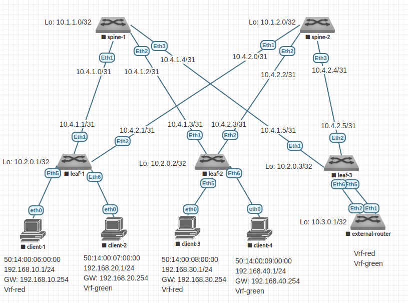

# Домашнее задание №8

## VxLAN. Routing.

### Задачи:

- Настройте клиентов в разных VRF;
- Подключите внешний роутер к пограничному leaf;
- Настройте связанность между VRF через внешний роутер;

## Выполнение:

### Собранная схема сети



### Таблица адресов

| hostname          | interface |   IP/MASK    | Description                  |
| :---------------: | :-------: | :----------: | :--------------------------: |
|  leaf-1           | Loopback1 | 10.2.0.1/32  |                              |
|  leaf-1           |  Eth1     | 10.4.1.1/31  | to-spine-1                   |
|  leaf-1           |  Eth2     | 10.4.2.1/31  | to-spine-2                   |
|                   |           |              |                              |
|  leaf-2           | Loopback1 | 10.2.0.2/32  |                              |
|  leaf-2           |  Eth1     | 10.4.1.3/31  | to-spine-1                   |
|  leaf-2           |  Eth2     | 10.4.2.3/31  | to-spine-2                   |
|                   |           |              |                              |
|  leaf-3           | Loopback1 | 10.2.0.3/32  |                              |
|  leaf-3           |  Eth1     | 10.4.1.5/31  | to-spine-1                   |
|  leaf-3           |  Eth2     | 10.4.2.5/31  | to-spine-2                   |
|  leaf-3           |  Eth5     | 10.4.3.0/31  | to-external-router-Vrf-red   |
|  leaf-3           |  Eth6     | 10.4.3.2/31  | to-external-router-Vrf-green |
|                   |           |              |                              |
|  external-router  | Loopback1 | 10.2.0.4/32  |                              |
|  external-router  |  Eth1     | 10.4.3.1/31  | to-leaf-3-Vrf-red            |
|  external-router  |  Eth2     | 10.4.3.3/31  | to-leaf-3-Vrf-green          |
|                   |           |              |                              |
|  spine-1          | Loopback1 | 10.1.1.0/32  |                              |
|  spine-1          |  Eth1     | 10.4.1.0/31  | to-leaf-1                    |
|  spine-1          |  Eth2     | 10.4.1.2/31  | to-leaf-2                    |
|  spine-1          |  Eth3     | 10.4.1.4/31  | to-leaf-3                    |
|                   |           |              |                              |
|  spine-2          | Loopback1 | 10.1.2.0/32  |                              |
|  spine-2          |  Eth1     | 10.4.2.0/31  | to-leaf-1                    |
|  spine-2          |  Eth2     | 10.4.2.2/31  | to-leaf-2                    |
|  spine-2          |  Eth3     | 10.4.2.2/31  | to-leaf-3                    |


### Таблица ASN

| hostname         | Loopback address |  ASN       |
| :------:         | :--------------: | :--------: |
|  leaf-1          | 10.2.0.1/32      | 4200010001 |
|  leaf-2          | 10.2.0.2/32      | 4200010002 |
|  leaf-3          | 10.2.0.3/32      | 4200010003 |
|  external-router | 10.1.2.0/32      | 4200020001 |
|  spine-1         | 10.1.1.0/32      | 4200000001 |
|  spine-2         | 10.1.2.0/32      | 4200000002 |


### Taблица адресов клиентов

| name       |     MAC           | Address        | VLAN | VNI   | Attached to | VRF       |
| :--------: | :---------------: | :------------: | :--: | :---: | :---------: | :-------: |
|  client-1  | 50:14:00:06:00:00 | 192.168.10.1/24|   10 | 10010 | leaf-1      | Vrf-red   |
|  client-2  | 50:14:00:07:00:00 | 192.168.10.2/24|   20 | 10020 | leaf-1      | Vrf-green |
|  client-3  | 50:14:00:08:00:00 | 192.168.20.1/24|   30 | 10030 | leaf-2      | Vrf-red   |
|  client-4  | 50:14:00:09:00:00 | 192.168.20.2/24|   40 | 10040 | leaf-2      | Vrf-green |

### Таблица VLAN VNI

| VLAN | VNI   | Type        | VRF       |
| :--: | :---: | :---------: | :-------: |
| 1000 | 10000 | L3VNI       | Vrf-red   |
| 2000 | 10000 | L3VNI       | Vrf-green |
|   10 | 10010 | L2VNI       | Vrf-red   |
|   20 | 10020 | L2VNI       | Vrf-green |
|   30 | 10020 | L2VNI       | Vrf-red   |
|   40 | 10020 | L2VNI       | Vrf-green |

### Адреса виртуальных шлюзов

| VLAN | VNI   | SAG IP            | SAG MAC           |
| :--: | :---: | :---------------: | :---------------: |
|   10 | 10010 | 192.168.10.254/24 | 00:00:00:01:01:01 |
|   20 | 10020 | 192.168.20.254/24 | 00:00:00:01:01:01 |
|   30 | 10020 | 192.168.30.254/24 | 00:00:00:01:01:01 |
|   40 | 10020 | 192.168.40.254/24 | 00:00:00:01:01:01 |

### Конфигурация оборудования

- #### [leaf-1](config/leaf-1.conf)

```
hostname leaf-1

ip routing
service routing protocols model multi-agent

vlan 10
exit
vlan 20
exit

vrf instance Vrf-red
exit
vrf instance Vrf-green
exit
ip routing vrf Vrf-red
ip routing vrf Vrf-green
ip virtual-router mac-address 00:00:00:01:01:01

router bgp 4200010001
  router-id 10.2.0.1
  neighbor SPINE peer group
  neighbor SPINE bfd
  neighbor SPINE send-community extended
  neighbor 10.4.1.0 remote-as 4200000001
  neighbor 10.4.1.0 peer group SPINE
  neighbor 10.4.2.0 remote-as 4200000002
  neighbor 10.4.2.0 peer group SPINE
  redistribute connected
  timers bgp 3 9
  bgp log-neighbor-changes
  maximum-paths 128

  address-family evpn
      neighbor 10.4.1.0 activate
      neighbor 10.4.2.0 activate
  exit

  vlan 10
    rd 10.2.0.1:10010
    route-target export 4200010001:10010
    redistribute learned
  exit
  vlan 20
    rd 10.2.0.1:10020
    route-target export 4200010001:10020
    redistribute learned
  exit

  vrf Vrf-red
    rd 10.2.0.1:10000
    redistribute connected
    address-family ipv4
      route-target export evpn 4200010001:10000
      route-target import evpn 4200010002:10000
      route-target import evpn 4200010003:10000
    exit
  exit
  vrf Vrf-green
    rd 10.2.0.1:20000
    redistribute connected
    address-family ipv4
      route-target export evpn 4200010001:20000
      route-target import evpn 4200010002:20000
      route-target import evpn 4200010003:20000
    exit
  exit
exit

interface Ethernet 1
  description to-spine-1
  no switchport
  ip address 10.4.1.1/31
  no shutdown
  bfd interval 100 min-rx 100 multiplier 3
exit
interface Ethernet 2
  description to-spine-2
  no switchport
  ip address 10.4.2.1/31
  no shutdown
  bfd interval 100 min-rx 100 multiplier 3
exit
interface Ethernet 5
  description to-client-1
  switchport access vlan 10
exit
interface Ethernet 6
  description to-client-2
  switchport access vlan 20
exit
interface loopback 1
  ip address 10.2.0.1/32
exit
interface Vlan 10
  vrf Vrf-red
  ip address virtual 192.168.10.254/24
exit
interface Vlan 20
  vrf Vrf-green
  ip address virtual 192.168.20.254/24
exit
interface Vxlan1
  vxlan udp-port 4789
  vxlan source-interface Loopback1
  vxlan vlan 10 vni 10010
  vxlan vlan 20 vni 10020
  vxlan vrf Vrf-red vni 10000
  vxlan vrf Vrf-green vni 20000
exit
```

- #### [leaf-2](config/leaf-2.conf)

```
hostname leaf-2

ip routing
service routing protocols model multi-agent

vlan 30
exit
vlan 40
exit

vrf instance Vrf-red
exit
vrf instance Vrf-green
exit
ip routing vrf Vrf-red
ip routing vrf Vrf-green
ip virtual-router mac-address 00:00:00:01:01:01

router bgp 4200010002
  router-id 10.2.0.2
  neighbor SPINE peer group
  neighbor SPINE bfd
  neighbor SPINE send-community extended
  neighbor 10.4.1.2 remote-as 4200000001
  neighbor 10.4.1.2 peer group SPINE
  neighbor 10.4.2.2 remote-as 4200000002
  neighbor 10.4.2.2 peer group SPINE
  redistribute connected
  timers bgp 3 9
  bgp log-neighbor-changes
  maximum-paths 128

  address-family evpn
      neighbor 10.4.1.2 activate
      neighbor 10.4.2.2 activate
  exit

  vlan 30
    rd 10.2.0.2:10030
    route-target export 4200010002:10030
    redistribute learned
  exit
  vlan 40
    rd 10.2.0.2:10040
    route-target export 4200010002:10030
    redistribute learned
  exit

  vrf Vrf-red
    rd 10.2.0.2:10000
    redistribute connected
    address-family ipv4
      route-target export evpn 4200010002:10000
      route-target import evpn 4200010001:10000
      route-target import evpn 4200010003:10000
    exit
  exit

  vrf Vrf-green
    rd 10.2.0.2:20000
    redistribute connected
    address-family ipv4
      route-target export evpn 4200010002:20000
      route-target import evpn 4200010001:20000
      route-target import evpn 4200010003:20000
    exit
  exit
exit

interface Ethernet 1
  description to-spine-1
  no switchport
  ip address 10.4.1.3/31
  no shutdown
  bfd interval 100 min-rx 100 multiplier 3
exit
interface Ethernet 2
  description to-spine-2
  no switchport
  ip address 10.4.2.3/31
  no shutdown
  bfd interval 100 min-rx 100 multiplier 3
exit
interface Ethernet 5
  description to-client-3
  switchport access vlan 30
exit
interface Ethernet 6
  description to-client-4
  switchport access vlan 40
exit
interface loopback 1
  ip address 10.2.0.2/32
exit

interface Vlan 30
  vrf Vrf-red
  ip address virtual 192.168.30.254/24
exit

interface Vlan 40
  vrf Vrf-green
  ip address virtual 192.168.40.254/24
exit

interface Vxlan1
  vxlan udp-port 4789
  vxlan source-interface Loopback1
  vxlan vlan 30 vni 10030
  vxlan vlan 40 vni 10040
  vxlan vrf Vrf-red vni 10000
  vxlan vrf Vrf-green vni 20000
exit
```

- #### [leaf-3](config/leaf-3.conf)

```
hostname leaf-3

ip routing
service routing protocols model multi-agent

vlan 100
exit
vlan 200
exit

vrf instance Vrf-red
exit
vrf instance Vrf-green
exit
ip routing vrf Vrf-red
ip routing vrf Vrf-green
ip prefix-list VXLAN-TO-EXT seq 10 permit 0.0.0.0/0 le 31
route-map VXLAN-TO-EXT-MAP permit 10
   match ip address prefix-list VXLAN-TO-EXT
exit

router bgp 4200010003
  router-id 10.2.0.3
  neighbor SPINE peer group
  neighbor SPINE bfd
  neighbor SPINE send-community extended
  neighbor 10.4.1.4 remote-as 4200000001
  neighbor 10.4.1.4 peer group SPINE
  neighbor 10.4.2.4 remote-as 4200000002
  neighbor 10.4.2.4 peer group SPINE

  redistribute connected
  timers bgp 3 9
  bgp log-neighbor-changes
  maximum-paths 128

  address-family evpn
    neighbor 10.4.1.4 activate
    neighbor 10.4.2.4 activate
  exit

  vrf Vrf-red
    rd 10.2.0.3:10000
    redistribute connected
    neighbor 10.4.3.1 remote-as 4200020001
    neighbor 10.4.3.1 route-map VXLAN-TO-EXT-MAP out
    address-family ipv4
      route-target export evpn 4200010003:10000
      route-target import evpn 4200010001:10000
      route-target import evpn 4200010002:10000
      neighbor 10.4.3.1 activate
    exit
  exit

  vrf Vrf-green
    rd 10.2.0.3:20000
    redistribute connected
    neighbor 10.4.3.3 remote-as 4200020001
    neighbor 10.4.3.3 route-map VXLAN-TO-EXT-MAP out
    address-family ipv4
      route-target export evpn 4200010003:20000
      route-target import evpn 4200010001:20000
      route-target import evpn 4200010002:20000
      neighbor 10.4.3.3 activate
    exit
  exit

exit
interface Vxlan1
  vxlan udp-port 4789
  vxlan source-interface Loopback1
  vxlan vrf Vrf-red vni 10000
  vxlan vrf Vrf-green vni 20000
exit
exit

interface Ethernet 1
  description to-spine-1
  no switchport
  ip address 10.4.1.5/31
  no shutdown
  bfd interval 100 min-rx 100 multiplier 3
exit
interface Ethernet 2
  description to-spine-2
  no switchport
  ip address 10.4.2.5/31
  no shutdown
  bfd interval 100 min-rx 100 multiplier 3
exit
interface Ethernet 5
   switchport trunk native vlan 100
   switchport trunk allowed vlan 100
   switchport mode trunk
exit
interface Ethernet 6
   switchport trunk native vlan 200
   switchport trunk allowed vlan 200
   switchport mode trunk
exit

interface Vlan 100
  description to-leaf-3-Vrf-red
  vrf Vrf-red
  ip address 10.4.3.0/31
  no shutdown
exit
interface Vlan 200
  description to-leaf-3-Vrf-green
  vrf Vrf-green
  ip address 10.4.3.2/31
  no shutdown
exit
interface loopback 1
  ip address 10.2.0.3/32
exit
```

- #### [external-router](config/external-router.conf)

```
hostname external-router

ip routing

vlan 100
exit
vlan 200
exit

vrf instance Vrf-red
exit
vrf instance Vrf-green
exit
ip routing vrf Vrf-red
ip routing vrf Vrf-green

ip prefix-list LEAK-VRF-RED seq 10 permit 192.168.10.0/24
ip prefix-list LEAK-VRF-RED seq 20 permit 192.168.30.0/24
route-map LEAK-VRF-RED-MAP permit 10
   match ip address prefix-list LEAK-VRF-RED
exit

ip prefix-list LEAK-VRF-GREEN seq 10 permit 192.168.20.0/24
ip prefix-list LEAK-VRF-GREEN seq 20 permit 192.168.40.0/24
route-map LEAK-VRF-GREEN-MAP permit 10
   match ip address prefix-list LEAK-VRF-GREEN
exit

router bgp 4200020001
  router-id 10.3.0.1
  neighbor LEAF peer group
  neighbor LEAF bfd
  neighbor LEAF send-community extended

  redistribute connected
  redistribute bgp leaked
  timers bgp 3 9
  bgp log-neighbor-changes
  maximum-paths 128

  vrf Vrf-red
    rd 10.3.0.1:10000
    neighbor 10.4.3.0 remote-as 4200010003
    neighbor 10.4.3.0 peer group LEAF
    redistribute connected
    address-family ipv4
      neighbor 10.4.3.0 activate
    exit
    redistribute bgp leaked
  exit
  vrf Vrf-green
    rd 10.3.0.1:20000
    neighbor 10.4.3.2 remote-as 4200010003
    neighbor 10.4.3.2 peer group LEAF
    redistribute connected
    address-family ipv4
      neighbor 10.4.3.2 activate
    exit
    redistribute bgp leaked
  exit
exit

router general
  vrf Vrf-red
    leak routes source-vrf Vrf-green subscribe-policy LEAK-VRF-GREEN-MAP
  exit
  vrf Vrf-green
    leak routes source-vrf Vrf-red subscribe-policy LEAK-VRF-RED-MAP
  exit
exit

interface Ethernet1
   switchport trunk native vlan 100
   switchport trunk allowed vlan 100
   switchport mode trunk
exit
interface Ethernet2
   switchport trunk native vlan 200
   switchport trunk allowed vlan 200
   switchport mode trunk
exit

interface Vlan 100
   description to-leaf-3-Vrf-red
   vrf Vrf-red
   ip address 10.4.3.1/31
exit
interface Vlan 200
   description to-leaf-3-Vrf-green
   vrf Vrf-green
   ip address 10.4.3.3/31
exit

interface Loopback1
   ip address 10.3.0.1/32
exit
```

- #### [spine-1](config/spine-1.conf)

```
hostname spine-1

ip routing
service routing protocols model multi-agent

router bgp 4200000001
  router-id 10.1.1.0
  neighbor LEAF peer group
  neighbor LEAF bfd
  neighbor LEAF send-community extended
  neighbor 10.4.1.1 remote-as 4200010001
  neighbor 10.4.1.1 peer group LEAF
  neighbor 10.4.1.3 remote-as 4200010002
  neighbor 10.4.1.3 peer group LEAF
  neighbor 10.4.1.5 remote-as 4200010003
  neighbor 10.4.1.5 peer group LEAF
  redistribute connected
  timers bgp 3 9
  bgp log-neighbor-changes
  maximum-paths 128

  address-family evpn
    neighbor 10.4.1.1 activate
    neighbor 10.4.1.3 activate
    neighbor 10.4.1.5 activate
  exit
exit

interface Ethernet 1
  description to-leaf-1
  no switchport
  ip address 10.4.1.0/31
  no shutdown
  bfd interval 100 min-rx 100 multiplier 3
exit
interface Ethernet 2
  description to-leaf-2
  no switchport
  ip address 10.4.1.2/31
  no shutdown
  bfd interval 100 min-rx 100 multiplier 3
exit
interface Ethernet 3
  description to-leaf-3
  no switchport
  ip address 10.4.1.4/31
  no shutdown
  bfd interval 100 min-rx 100 multiplier 3
exit
interface loopback 1
  ip address 10.1.1.0/32
exit
end
```

- #### [spine-2](config/spine-2.conf)

```
hostname spine-2

ip routing
service routing protocols model multi-agent

router bgp 4200000002
  router-id 10.1.2.0
  neighbor LEAF peer group
  neighbor LEAF bfd
  neighbor LEAF send-community extended
  neighbor 10.4.2.1 remote-as 4200010001
  neighbor 10.4.2.1 peer group LEAF
  neighbor 10.4.2.3 remote-as 4200010002
  neighbor 10.4.2.3 peer group LEAF
  neighbor 10.4.2.5 remote-as 4200010003
  neighbor 10.4.2.5 peer group LEAF
  redistribute connected
  timers bgp 3 9
  bgp log-neighbor-changes
  maximum-paths 128

  address-family evpn
    neighbor 10.4.2.1 activate
    neighbor 10.4.2.3 activate
    neighbor 10.4.2.5 activate
  exit
exit

interface Ethernet 1
  description to-leaf-1
  no switchport
  ip address 10.4.2.0/31
  no shutdown
  bfd interval 100 min-rx 100 multiplier 3
exit
interface Ethernet 2
  description to-leaf-2
  no switchport
  ip address 10.4.2.2/31
  no shutdown
  bfd interval 100 min-rx 100 multiplier 3
exit
interface Ethernet 3
  description to-leaf-3
  no switchport
  ip address 10.4.2.4/31
  no shutdown
  bfd interval 100 min-rx 100 multiplier 3
exit
interface loopback 1
  ip address 10.1.2.0/32
exit
```

### Проверка маршрутов

- #### leaf-1

~~~
leaf-1#
leaf-1#show ip route vrf Vrf-red

VRF: Vrf-red
Codes: C - connected, S - static, K - kernel,
       O - OSPF, IA - OSPF inter area, E1 - OSPF external type 1,
       E2 - OSPF external type 2, N1 - OSPF NSSA external type 1,
       N2 - OSPF NSSA external type2, B - BGP, B I - iBGP, B E - eBGP,
       R - RIP, I L1 - IS-IS level 1, I L2 - IS-IS level 2,
       O3 - OSPFv3, A B - BGP Aggregate, A O - OSPF Summary,
       NG - Nexthop Group Static Route, V - VXLAN Control Service,
       DH - DHCP client installed default route, M - Martian,
       DP - Dynamic Policy Route, L - VRF Leaked

Gateway of last resort is not set

 B E      10.4.3.0/31 [200/0] via VTEP 10.2.0.3 VNI 10000 router-mac 50:14:00:39:d9:0a
 C        192.168.10.0/24 is directly connected, Vlan10
 B E      192.168.20.0/24 [200/0] via VTEP 10.2.0.3 VNI 10000 router-mac 50:14:00:39:d9:0a
 B E      192.168.30.0/24 [200/0] via VTEP 10.2.0.2 VNI 10000 router-mac 50:14:00:94:4e:50
 B E      192.168.40.0/24 [200/0] via VTEP 10.2.0.3 VNI 10000 router-mac 50:14:00:39:d9:0a

leaf-1#show ip route vrf Vrf-green

VRF: Vrf-green
Codes: C - connected, S - static, K - kernel,
       O - OSPF, IA - OSPF inter area, E1 - OSPF external type 1,
       E2 - OSPF external type 2, N1 - OSPF NSSA external type 1,
       N2 - OSPF NSSA external type2, B - BGP, B I - iBGP, B E - eBGP,
       R - RIP, I L1 - IS-IS level 1, I L2 - IS-IS level 2,
       O3 - OSPFv3, A B - BGP Aggregate, A O - OSPF Summary,
       NG - Nexthop Group Static Route, V - VXLAN Control Service,
       DH - DHCP client installed default route, M - Martian,
       DP - Dynamic Policy Route, L - VRF Leaked

Gateway of last resort is not set

 B E      10.4.3.2/31 [200/0] via VTEP 10.2.0.3 VNI 20000 router-mac 50:14:00:39:d9:0a
 B E      192.168.10.0/24 [200/0] via VTEP 10.2.0.3 VNI 20000 router-mac 50:14:00:39:d9:0a
 C        192.168.20.0/24 is directly connected, Vlan20
 B E      192.168.30.0/24 [200/0] via VTEP 10.2.0.3 VNI 20000 router-mac 50:14:00:39:d9:0a
 B E      192.168.40.0/24 [200/0] via VTEP 10.2.0.2 VNI 20000 router-mac 50:14:00:94:4e:50
~~~

- #### leaf-2

~~~
leaf-2#show ip route vrf Vrf-red

VRF: Vrf-red
Codes: C - connected, S - static, K - kernel,
       O - OSPF, IA - OSPF inter area, E1 - OSPF external type 1,
       E2 - OSPF external type 2, N1 - OSPF NSSA external type 1,
       N2 - OSPF NSSA external type2, B - BGP, B I - iBGP, B E - eBGP,
       R - RIP, I L1 - IS-IS level 1, I L2 - IS-IS level 2,
       O3 - OSPFv3, A B - BGP Aggregate, A O - OSPF Summary,
       NG - Nexthop Group Static Route, V - VXLAN Control Service,
       DH - DHCP client installed default route, M - Martian,
       DP - Dynamic Policy Route, L - VRF Leaked

Gateway of last resort is not set

 B E      10.4.3.0/31 [200/0] via VTEP 10.2.0.3 VNI 10000 router-mac 50:14:00:39:d9:0a
 B E      192.168.10.1/32 [200/0] via VTEP 10.2.0.1 VNI 10000 router-mac 50:14:00:6c:75:08
 B E      192.168.10.0/24 [200/0] via VTEP 10.2.0.1 VNI 10000 router-mac 50:14:00:6c:75:08
 B E      192.168.20.0/24 [200/0] via VTEP 10.2.0.3 VNI 10000 router-mac 50:14:00:39:d9:0a
 C        192.168.30.0/24 is directly connected, Vlan30
 B E      192.168.40.0/24 [200/0] via VTEP 10.2.0.3 VNI 10000 router-mac 50:14:00:39:d9:0a

~~~

- #### leaf-3

~~~
leaf-3#show ip route vrf Vrf-red

VRF: Vrf-red
Codes: C - connected, S - static, K - kernel,
       O - OSPF, IA - OSPF inter area, E1 - OSPF external type 1,
       E2 - OSPF external type 2, N1 - OSPF NSSA external type 1,
       N2 - OSPF NSSA external type2, B - BGP, B I - iBGP, B E - eBGP,
       R - RIP, I L1 - IS-IS level 1, I L2 - IS-IS level 2,
       O3 - OSPFv3, A B - BGP Aggregate, A O - OSPF Summary,
       NG - Nexthop Group Static Route, V - VXLAN Control Service,
       DH - DHCP client installed default route, M - Martian,
       DP - Dynamic Policy Route, L - VRF Leaked

Gateway of last resort is not set

 C        10.4.3.0/31 is directly connected, Vlan100
 B E      192.168.10.1/32 [200/0] via VTEP 10.2.0.1 VNI 10000 router-mac 50:14:00:6c:75:08
 B E      192.168.10.0/24 [200/0] via VTEP 10.2.0.1 VNI 10000 router-mac 50:14:00:6c:75:08
 B E      192.168.20.0/24 [200/0] via 10.4.3.1, Vlan100
 B E      192.168.30.0/24 [200/0] via VTEP 10.2.0.2 VNI 10000 router-mac 50:14:00:94:4e:50
 B E      192.168.40.0/24 [200/0] via 10.4.3.1, Vlan100

leaf-3#show ip route vrf Vrf-green

VRF: Vrf-green
Codes: C - connected, S - static, K - kernel,
       O - OSPF, IA - OSPF inter area, E1 - OSPF external type 1,
       E2 - OSPF external type 2, N1 - OSPF NSSA external type 1,
       N2 - OSPF NSSA external type2, B - BGP, B I - iBGP, B E - eBGP,
       R - RIP, I L1 - IS-IS level 1, I L2 - IS-IS level 2,
       O3 - OSPFv3, A B - BGP Aggregate, A O - OSPF Summary,
       NG - Nexthop Group Static Route, V - VXLAN Control Service,
       DH - DHCP client installed default route, M - Martian,
       DP - Dynamic Policy Route, L - VRF Leaked

Gateway of last resort is not set

 C        10.4.3.2/31 is directly connected, Vlan200
 B E      192.168.10.0/24 [200/0] via 10.4.3.3, Vlan200
 B E      192.168.20.1/32 [200/0] via VTEP 10.2.0.1 VNI 20000 router-mac 50:14:00:6c:75:08
 B E      192.168.20.2/32 [200/0] via VTEP 10.2.0.1 VNI 20000 router-mac 50:14:00:6c:75:08
 B E      192.168.20.0/24 [200/0] via VTEP 10.2.0.1 VNI 20000 router-mac 50:14:00:6c:75:08
 B E      192.168.30.0/24 [200/0] via 10.4.3.3, Vlan200
 B E      192.168.40.0/24 [200/0] via VTEP 10.2.0.2 VNI 20000 router-mac 50:14:00:94:4e:50
~~~

- #### external-router

~~~
external-router#show ip route vrf Vrf-red

VRF: Vrf-red
Codes: C - connected, S - static, K - kernel,
       O - OSPF, IA - OSPF inter area, E1 - OSPF external type 1,
       E2 - OSPF external type 2, N1 - OSPF NSSA external type 1,
       N2 - OSPF NSSA external type2, B - BGP, B I - iBGP, B E - eBGP,
       R - RIP, I L1 - IS-IS level 1, I L2 - IS-IS level 2,
       O3 - OSPFv3, A B - BGP Aggregate, A O - OSPF Summary,
       NG - Nexthop Group Static Route, V - VXLAN Control Service,
       DH - DHCP client installed default route, M - Martian,
       DP - Dynamic Policy Route, L - VRF Leaked

Gateway of last resort is not set

 C        10.4.3.0/31 is directly connected, Vlan100
 B E      192.168.10.0/24 [200/0] via 10.4.3.0, Vlan100
 B E L    192.168.20.0/24 [200/0] (source VRF Vrf-green) via 10.4.3.2, Vlan200 (egress VRF Vrf-green)
 B E      192.168.30.0/24 [200/0] via 10.4.3.0, Vlan100
 B E L    192.168.40.0/24 [200/0] (source VRF Vrf-green) via 10.4.3.2, Vlan200 (egress VRF Vrf-green)

external-router#show ip route vrf Vrf-green

VRF: Vrf-green
Codes: C - connected, S - static, K - kernel,
       O - OSPF, IA - OSPF inter area, E1 - OSPF external type 1,
       E2 - OSPF external type 2, N1 - OSPF NSSA external type 1,
       N2 - OSPF NSSA external type2, B - BGP, B I - iBGP, B E - eBGP,
       R - RIP, I L1 - IS-IS level 1, I L2 - IS-IS level 2,
       O3 - OSPFv3, A B - BGP Aggregate, A O - OSPF Summary,
       NG - Nexthop Group Static Route, V - VXLAN Control Service,
       DH - DHCP client installed default route, M - Martian,
       DP - Dynamic Policy Route, L - VRF Leaked

Gateway of last resort is not set

 C        10.4.3.2/31 is directly connected, Vlan200
 B E L    192.168.10.0/24 [200/0] (source VRF Vrf-red) via 10.4.3.0, Vlan100 (egress VRF Vrf-red)
 B E      192.168.20.0/24 [200/0] via 10.4.3.2, Vlan200
 B E L    192.168.30.0/24 [200/0] (source VRF Vrf-red) via 10.4.3.0, Vlan100 (egress VRF Vrf-red)
 B E      192.168.40.0/24 [200/0] via 10.4.3.2, Vlan200
~~~

### Проверка доступности

- #### client-1

~~~
vyos@client-1:~$ ping 192.168.20.1
PING 192.168.20.1 (192.168.20.1) 56(84) bytes of data.
64 bytes from 192.168.20.1: icmp_seq=1 ttl=59 time=90.2 ms
64 bytes from 192.168.20.1: icmp_seq=2 ttl=59 time=49.4 ms
64 bytes from 192.168.20.1: icmp_seq=3 ttl=59 time=49.2 ms
64 bytes from 192.168.20.1: icmp_seq=4 ttl=59 time=48.0 ms
64 bytes from 192.168.20.1: icmp_seq=5 ttl=59 time=45.9 ms
^C
--- 192.168.20.1 ping statistics ---
5 packets transmitted, 5 received, 0% packet loss, time 4006ms
rtt min/avg/max/mdev = 45.894/56.548/90.241/16.892 ms
vyos@client-1:~$ ping 192.168.30.1
PING 192.168.30.1 (192.168.30.1) 56(84) bytes of data.
64 bytes from 192.168.30.1: icmp_seq=1 ttl=62 time=194 ms
64 bytes from 192.168.30.1: icmp_seq=2 ttl=62 time=73.2 ms
64 bytes from 192.168.30.1: icmp_seq=3 ttl=62 time=28.6 ms
64 bytes from 192.168.30.1: icmp_seq=4 ttl=62 time=20.3 ms
64 bytes from 192.168.30.1: icmp_seq=5 ttl=62 time=77.4 ms
^C
--- 192.168.30.1 ping statistics ---
5 packets transmitted, 5 received, 0% packet loss, time 4005ms
rtt min/avg/max/mdev = 20.333/78.756/194.278/62.134 ms
vyos@client-1:~$ ping 192.168.40.1
PING 192.168.40.1 (192.168.40.1) 56(84) bytes of data.
64 bytes from 192.168.40.1: icmp_seq=1 ttl=59 time=91.7 ms
64 bytes from 192.168.40.1: icmp_seq=2 ttl=59 time=55.8 ms
64 bytes from 192.168.40.1: icmp_seq=3 ttl=59 time=46.6 ms
64 bytes from 192.168.40.1: icmp_seq=4 ttl=59 time=44.5 ms
64 bytes from 192.168.40.1: icmp_seq=5 ttl=59 time=53.3 ms
^C
--- 192.168.40.1 ping statistics ---
5 packets transmitted, 5 received, 0% packet loss, time 4007ms
rtt min/avg/max/mdev = 44.476/58.373/91.700/17.176 ms
~~~

- #### client-2

~~~
vyos@client-2# ping 192.168.10.1
PING 192.168.10.1 (192.168.10.1) 56(84) bytes of data.
64 bytes from 192.168.10.1: icmp_seq=1 ttl=59 time=54.7 ms
64 bytes from 192.168.10.1: icmp_seq=2 ttl=59 time=45.2 ms
64 bytes from 192.168.10.1: icmp_seq=3 ttl=59 time=42.3 ms
64 bytes from 192.168.10.1: icmp_seq=4 ttl=59 time=58.9 ms
64 bytes from 192.168.10.1: icmp_seq=5 ttl=59 time=45.1 ms
^C
--- 192.168.10.1 ping statistics ---
5 packets transmitted, 5 received, 0% packet loss, time 4006ms
rtt min/avg/max/mdev = 42.308/49.231/58.909/6.407 ms
[edit]
--- 192.168.20.1 ping statistics ---
3 packets transmitted, 3 received, 0% packet loss, time 2003ms
rtt min/avg/max/mdev = 0.036/0.113/0.260/0.103 ms
[edit]
vyos@client-2# ping 192.168.30.1
PING 192.168.30.1 (192.168.30.1) 56(84) bytes of data.
64 bytes from 192.168.30.1: icmp_seq=1 ttl=59 time=84.7 ms
64 bytes from 192.168.30.1: icmp_seq=2 ttl=59 time=80.6 ms
64 bytes from 192.168.30.1: icmp_seq=3 ttl=59 time=50.7 ms
64 bytes from 192.168.30.1: icmp_seq=4 ttl=59 time=54.8 ms
64 bytes from 192.168.30.1: icmp_seq=5 ttl=59 time=95.0 ms
^C
--- 192.168.30.1 ping statistics ---
5 packets transmitted, 5 received, 0% packet loss, time 4006ms
rtt min/avg/max/mdev = 50.703/73.155/94.966/17.364 ms
[edit]
vyos@client-2# ping 192.168.40.1
PING 192.168.40.1 (192.168.40.1) 56(84) bytes of data.
64 bytes from 192.168.40.1: icmp_seq=1 ttl=62 time=19.3 ms
64 bytes from 192.168.40.1: icmp_seq=2 ttl=62 time=19.4 ms
64 bytes from 192.168.40.1: icmp_seq=3 ttl=62 time=24.4 ms
64 bytes from 192.168.40.1: icmp_seq=4 ttl=62 time=121 ms
64 bytes from 192.168.40.1: icmp_seq=5 ttl=62 time=20.1 ms
^C
--- 192.168.40.1 ping statistics ---
5 packets transmitted, 5 received, 0% packet loss, time 4007ms
rtt min/avg/max/mdev = 19.349/40.828/120.883/40.071 ms
[edit]
~~~

- #### client-3

~~~
vyos@client-3:~$ ping 192.168.10.1
PING 192.168.10.1 (192.168.10.1) 56(84) bytes of data.
64 bytes from 192.168.10.1: icmp_seq=1 ttl=62 time=39.8 ms
64 bytes from 192.168.10.1: icmp_seq=2 ttl=62 time=28.6 ms
64 bytes from 192.168.10.1: icmp_seq=3 ttl=62 time=23.1 ms
64 bytes from 192.168.10.1: icmp_seq=4 ttl=62 time=20.9 ms
64 bytes from 192.168.10.1: icmp_seq=5 ttl=62 time=21.6 ms
^C
--- 192.168.10.1 ping statistics ---
5 packets transmitted, 5 received, 0% packet loss, time 4006ms
rtt min/avg/max/mdev = 20.940/26.790/39.757/7.015 ms
vyos@client-3:~$ ping 192.168.20.1
PING 192.168.20.1 (192.168.20.1) 56(84) bytes of data.
64 bytes from 192.168.20.1: icmp_seq=1 ttl=59 time=62.3 ms
64 bytes from 192.168.20.1: icmp_seq=2 ttl=59 time=63.5 ms
64 bytes from 192.168.20.1: icmp_seq=3 ttl=59 time=46.2 ms
64 bytes from 192.168.20.1: icmp_seq=4 ttl=59 time=48.9 ms
64 bytes from 192.168.20.1: icmp_seq=5 ttl=59 time=52.7 ms
^C
--- 192.168.20.1 ping statistics ---
5 packets transmitted, 5 received, 0% packet loss, time 4007ms
rtt min/avg/max/mdev = 46.217/54.724/63.488/7.003 ms
vyos@client-3:~$ ping 192.168.40.1
PING 192.168.40.1 (192.168.40.1) 56(84) bytes of data.
64 bytes from 192.168.40.1: icmp_seq=1 ttl=59 time=55.9 ms
64 bytes from 192.168.40.1: icmp_seq=2 ttl=59 time=61.4 ms
64 bytes from 192.168.40.1: icmp_seq=3 ttl=59 time=52.7 ms
64 bytes from 192.168.40.1: icmp_seq=4 ttl=59 time=54.0 ms
^C
--- 192.168.40.1 ping statistics ---
4 packets transmitted, 4 received, 0% packet loss, time 3005ms
rtt min/avg/max/mdev = 52.710/56.012/61.350/3.288 ms
~~~

- #### client-4

~~~
vyos@client-4:~$ ping 192.168.10.1
PING 192.168.10.1 (192.168.10.1) 56(84) bytes of data.
64 bytes from 192.168.10.1: icmp_seq=1 ttl=59 time=77.2 ms
64 bytes from 192.168.10.1: icmp_seq=2 ttl=59 time=53.1 ms
64 bytes from 192.168.10.1: icmp_seq=3 ttl=59 time=48.0 ms
64 bytes from 192.168.10.1: icmp_seq=4 ttl=59 time=52.3 ms
64 bytes from 192.168.10.1: icmp_seq=5 ttl=59 time=59.9 ms
^C
--- 192.168.10.1 ping statistics ---
5 packets transmitted, 5 received, 0% packet loss, time 4006ms
rtt min/avg/max/mdev = 47.975/58.088/77.202/10.288 ms
vyos@client-4:~$ ping 192.168.20.1
PING 192.168.20.1 (192.168.20.1) 56(84) bytes of data.
64 bytes from 192.168.20.1: icmp_seq=1 ttl=62 time=32.9 ms
64 bytes from 192.168.20.1: icmp_seq=2 ttl=62 time=27.3 ms
64 bytes from 192.168.20.1: icmp_seq=3 ttl=62 time=29.0 ms
64 bytes from 192.168.20.1: icmp_seq=4 ttl=62 time=20.6 ms
64 bytes from 192.168.20.1: icmp_seq=5 ttl=62 time=26.5 ms
^C
--- 192.168.20.1 ping statistics ---
5 packets transmitted, 5 received, 0% packet loss, time 4007ms
rtt min/avg/max/mdev = 20.623/27.264/32.880/3.982 ms
vyos@client-4:~$ ping 192.168.30.1
PING 192.168.30.1 (192.168.30.1) 56(84) bytes of data.
64 bytes from 192.168.30.1: icmp_seq=1 ttl=59 time=75.0 ms
64 bytes from 192.168.30.1: icmp_seq=2 ttl=59 time=50.8 ms
64 bytes from 192.168.30.1: icmp_seq=3 ttl=59 time=49.8 ms
64 bytes from 192.168.30.1: icmp_seq=4 ttl=59 time=57.9 ms
64 bytes from 192.168.30.1: icmp_seq=5 ttl=59 time=45.4 ms
^C
--- 192.168.30.1 ping statistics ---
5 packets transmitted, 5 received, 0% packet loss, time 4005ms
rtt min/avg/max/mdev = 45.354/55.769/75.039/10.436 ms
~~~
